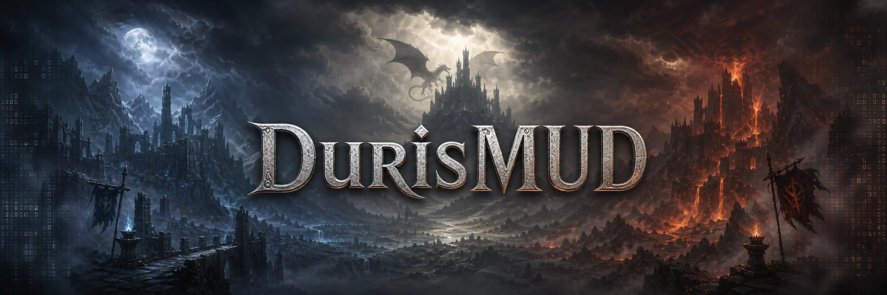
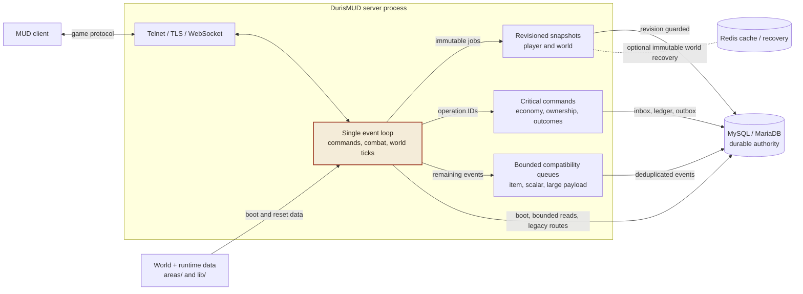

# DurisMUD

**Version: 1.81.99** | [Versioning policy](docs/guides/VERSIONING.md)

[![Build status][build-badge]][build]
![C++20][cpp20-badge]
![g++ compiler][compiler-badge]
![Linux platform][linux-badge]
![MySQL and MariaDB][database-badge]
![Optional Redis integration][redis-badge]
![GnuTLS][tls-badge]
![RFC 6455 WebSocket support][websocket-badge]
[![clang-format code style][format-badge]][formatting]
[![Last commit][commit-badge]][commits]
[![Open issues][issues-badge]][issues]



## FORK OF: [https://github.com/Community-Duris/DurisMUD](https://github.com/Community-Duris/DurisMUD)

DurisMUD is a long-running dark-fantasy MUD built around a global race war
between good and evil. Its text world combines full player-versus-player
conflict with exploration, quests, ships, crafting, guilds, and powerful
artifacts.

This repository contains the game server, world data, area-building toolchain,
database schema, regression tests, and operational scripts.

## Architecture



The C-style sources under `src/` are compiled as C++20. Network I/O and mutable game
state remain on one `select()`-driven pulse loop. Immutable revisioned snapshots and
non-coalescing operation-ID commands cross typed worker boundaries; the older item,
scalar, and large-payload queues retain only bounded compatibility roles. MySQL or
MariaDB is the durable authority for snapshots, ledgers, current rows, inbox/results,
outbox state, migration history, and lifecycle evidence. Redis is optional and limited
to reconstructible caches plus validated world-recovery generations. See the full
[architecture guide](docs/reference/ARCHITECTURE.md) and [database guide](docs/reference/DATABASE.md).

## Quick start

The maintained setup path is Debian/Ubuntu, matching the CI workflow and the
repository's build-dependency manifest.

After setup, one command builds every maintained target and runs the complete safe
regression gate:

```bash
make test-all
```

### 1. Install dependencies

```bash
sudo apt update
sudo apt install equivs
make build-deps-package
sudo apt install ./bin/packages/duris-build-deps_1.0_all.deb
```

`equivs` is only the bootstrap tool used to build the metapackage. The manifest
then installs Git, Python, dos2unix, the compiler, GNU Make, GDB, Valgrind,
clang-format, MariaDB-compatible client and server packages, and the XML,
compression, TLS, JSON, Redis, BSD, and MySQL/MariaDB development libraries
required by the repository. The compiler supplies the ASan/UBSan runtimes used
by the sanitizer build. Redis itself is optional.

On another Linux distribution, use
[`packaging/duris-build-deps.equivs`](packaging/duris-build-deps.equivs) as the
authoritative dependency list.

### 2. Configure the server

```bash
cp .env.example .env
chmod 600 .env
```

Edit `.env` and set the explicit environment role, listener address, database
host/port, user, password, name, and exact `DB_ALLOWED_TARGETS` entry. There are
no database credential defaults. The server rejects a `.env` that is not an
owner-controlled regular file with mode `0600` or stricter. It loads this file
at boot, and the migration scripts use the same values. `.env` is ignored by
Git and must never be committed. See the
[configuration reference](docs/operations/CONFIGURATION.md) for precedence, Redis
recovery, proxy handling, and diagnostic switches.

Set `REDIS=TRUE` with `REDIS_HOST`, `REDIS_PORT`, and an explicit `REDIS_DB` to enable
caches and recovery integration. Local development may use shared
`REDIS_USERNAME`/`REDIS_PASSWORD` ACL authentication. Production requires distinct world,
presence, cache, maintenance, and, when enabled, donation ACL identities. Verified
`REDIS_TLS=TRUE` transport applies to every runtime connection; non-loopback production
endpoints require TLS. `REDIS_WORLD_STATE=TRUE` additionally enables immutable world
recovery.
Player saves do not depend on Redis. If a DurisWeb backend will authenticate
through WebSocket or GMCP, give it a private `DURISWEB_SECRET` and follow the
challenge-response contract in the
[DurisWeb API reference](docs/reference/api/durisweb.md). Production browser
traffic must terminate TLS at a local reverse proxy. The remaining switches in
`.env.example` are documented inline and are intended primarily for local gameplay testing.

External donation notices are off by default. They require the separate
`REDIS_DONATION_SUBSCRIBER=TRUE` opt-in and an independent HMAC key; see the
[donation event envelope](docs/reference/api/donation-events.md).

### 3. Create a development database

The following uses `duris_dev` as an example. Set that database name, the new
user password, and `DB_ALLOWED_TARGETS=127.0.0.1/duris_dev` explicitly in
`.env`.

```sql
CREATE DATABASE IF NOT EXISTS duris_dev
  CHARACTER SET utf8mb4
  COLLATE utf8mb4_unicode_ci;
CREATE USER IF NOT EXISTS 'duris'@'localhost'
  IDENTIFIED BY 'CHOOSE_A_PASSWORD';
ALTER USER 'duris'@'localhost'
  IDENTIFIED BY 'CHOOSE_A_PASSWORD';
GRANT ALL PRIVILEGES ON duris_dev.* TO 'duris'@'localhost';
```

Load the authoritative fresh-database baseline:

```bash
set -a
source .env
set +a
MYSQL_PWD="$DB_PASSWD" mysql \
  --host="$DB_HOST" \
  --port="${DB_PORT:-3306}" \
  --user="$DB_USER" \
  "$DB_NAME" < migrations/bootstrap_multithread_safe.sql

# Record the exact sealed baseline, then apply immutable post-baseline steps.
python3 scripts/migration_runner.py adopt --kind fresh_bootstrap
python3 scripts/migration_runner.py run

# Confirm the exact runtime contract before first boot.
./migrations/verify_runtime_compatibility.sh
```

> [!IMPORTANT]
> `bootstrap_multithread_safe.sql` is for an empty database. To upgrade an
> existing populated database, back it up, restore a clone, and run
> `./migrations/run_migration.sh` against the clone. Never test schema changes
> on a live database.

### 4. Build and start

```bash
make
./scripts/start_mud.sh
```

The root build places every compiled artifact below `bin/`: the staged server
is `bin/server/dms_new`, the editor is `bin/areas/editor/de`, and the
area-generation tools are under `bin/areas/tools/`. The startup supervisor
promotes the server to `bin/server/dms`, rotates prior executables under
`bin/server/history/`, regenerates combined `areas/world.*` files, applies
pending immutable migrations for an allow-listed local database, verifies the
exact runtime schema on every restart, and only then starts it. Production
startup performs the verification read-only; use the migration runbook to
upgrade production. Without a configured user service it runs in the
background and writes console output to `logs/duris-console.log`.

For a foreground development session on port 4000, use this instead of
`start_mud.sh`:

```bash
./scripts/cycle_mud.sh --dev
```

For a fast development boot using only the tracked world data in `areas_mini/`,
run:

```bash
./scripts/cycle_mud.sh --minimal
```

`--minimal` implies development mode and port 4000. It validates the minimal
dataset, skips full `areas/world.*` generation and full-world runtime systems,
but keeps the player load/save and critical-command pipelines available so a
configured test character can log in, play, and disconnect cleanly. Use
`./scripts/start_mud.sh --minimal` for the corresponding background launcher.

## Troubleshooting

If the server stops during boot, inspect `logs/log/status` and
`logs/duris-console.log`. The most common checks are:

- **MySQL initialization failed:** confirm `.env` values, that the selected
  database exists, and that the account can connect on `DB_HOST:DB_PORT`. The
  server logs the effective database target during boot and aborts when the
  required schema is missing.
- **Redis connection failed:** Redis is optional; set `REDIS=FALSE` or remove
  the setting to run without Redis caches and world recovery. Player checkpoints remain
  available through their local coordinator and journal. If Redis is required, check
  `REDIS_HOST`, `REDIS_PORT`, and that the service is reachable.
- **Missing world files or tools:** run `make build-area-tools` followed by
  `make world`, then restart. Combined `areas/world.*` files are generated
  outputs and should not be edited by hand.
- **Port already in use:** choose a different development port, or stop the
  existing local instance. Keep development on a non-`7777` port.

Operational log locations and restart behavior are documented in the
[runbook](docs/operations/RUNBOOK.md).

## Connect

```bash
telnet localhost 7777
```

| Listener | Standard start | `--dev` start |
| --- | ---: | ---: |
| Plain telnet | 7777 | 4000 |
| TLS telnet | 7778 | 4001 |
| WebSocket and HTTP health | 4050 | 4050 |

The WebSocket port can be overridden with `DURIS_WEBSOCKET_PORT`. Once the game is
running, `scripts/healthcheck.sh` verifies both process and database-pool readiness.

For local TLS, run `./scripts/generate_localhost_cert.sh`. It creates an ignored,
machine-local self-signed keypair under `certs/`; that fallback is accepted only
when `ENVIRONMENT=local` and `LISTEN_ADDRESS` is exactly `127.0.0.1` or `::1`.
For a networked deployment, provide the ignored root files `duris.crt` and
`duris.key`; every private key must be owned by the server user and mode `0600`
or stricter. Startup fails if that deployment certificate boundary is not met.

## Development workflow

Run the complete developer/CI gate before handing off a change:

```bash
make test-all
```

During development, run the smallest relevant regression directly:

```bash
make -C src
python3 tests/async/test_wear_all_regression.py
```

Tests under `tests/async/` are focused Python regression or source-contract
checks. The root harness generates required world data and runs these tests in
bounded parallel workers. Docker/MySQL suites remain an explicit `make test-db`
step, while externally provisioned migration checks must target a development
clone. See [Testing](docs/guides/TESTING.md) for target details and focused-test
controls.

Format only touched C/C++ lines so legacy diffs stay reviewable:

```bash
./scripts/format.sh
./scripts/format.sh --check
```

Install the repository's pre-commit hook with `./scripts/install-hooks.sh`.
Sanitizer and Valgrind workflows are covered in
[Building](docs/guides/BUILDING.md) and [Valgrind](docs/guides/valgrind.md).

## Repository map

| Path | Purpose |
| --- | --- |
| `Makefile` | Root build, world-generation, and test entry points. |
| `bin/` | Ignored compiled artifacts: executables, objects, packages, tests, and runtime history. |
| `src/` | Server sources and `Makefile`; builds `bin/server/dms_new` with `g++`. |
| `areas/` | World sources, compilers, and generated `world.*` boot files. |
| `lib/` | Runtime configuration, help, boards, descriptions, and game data. |
| `migrations/` | Fresh schema, upgrade runner, and schema-contract tools. |
| `scripts/` | Launch, backup, formatting, debugging, and maintenance helpers. |
| `tests/async/` | Focused regression, source-contract, and DB-backed tests. |
| `src-migrate/` | Standalone legacy player/account conversion tools. |
| `docs/` | Architecture, operations, database, test, and builder guides. |

Runtime state belongs under `Players/`, `Accounts/`, `Ships/`, and `logs/`.
Do not commit player data, credentials, logs, generated binaries, or backup
archives.

Project releases use Semantic Versioning. The canonical version is stored in
the root [`VERSION`](VERSION) file.

## Documentation

| Guide | Covers |
| --- | --- |
| [Architecture](docs/reference/ARCHITECTURE.md) | Process model, boot gate, game loop, typed persistence, recovery. |
| [Codebase](docs/reference/CODEBASE.md) | Module-by-module map of the server sources. |
| [Building](docs/guides/BUILDING.md) | Build flags, areas, sanitizers, verification. |
| [Database](docs/reference/DATABASE.md) | Connections, reads, typed writes, reconciliation, schema, migrations. |
| [Configuration](docs/operations/CONFIGURATION.md) | Environment variables, Redis, networking, and diagnostics. |
| [Runbook](docs/operations/RUNBOOK.md) | Restarts, logs, backups, recovery, operations. |
| [Testing](docs/guides/TESTING.md) | Test layout, commands, and conventions. |
| [Immutable migrations](docs/persistence/IMMUTABLE_MIGRATIONS.md) | Baseline adoption, ordered checksums, exact resume. |
| [Runtime compatibility](docs/persistence/RUNTIME_COMPATIBILITY.md) | Pre-mutation boot verification and lookup publication. |
| [Data lifecycle](docs/persistence/DATA_LIFECYCLE.md) | Store inventory, pending policy, archive/export/erasure boundaries. |
| [Critical commands](docs/persistence/CRITICAL_COMMAND_PIPELINE.md) | Operation identity, journal, inbox/results, outbox, replay, fences. |
| [Formatting](docs/guides/formatting.md) | Style, changed-line formatting, and editors. |
| [Help system](docs/content/HELP_SYSTEM.md) | Help sources, database import, and rendering. |

The complete index, including builder references and standalone diagrams, is
in [`docs/README_docs.md`](docs/README_docs.md).

[build]: https://github.com/LuminariMUD/DurisMUD/actions/workflows/build.yml
[build-badge]: https://img.shields.io/github/actions/workflow/status/LuminariMUD/DurisMUD/build.yml?branch=master&style=flat-square&logo=githubactions&logoColor=white&label=build
[commit-badge]: https://img.shields.io/github/last-commit/LuminariMUD/DurisMUD?style=flat-square&logo=github
[commits]: https://github.com/LuminariMUD/DurisMUD/commits/master
[compiler-badge]: https://img.shields.io/badge/compiler-g%2B%2B-A42E2B?style=flat-square&logo=gnu&logoColor=white
[cpp20-badge]: https://img.shields.io/badge/C%2B%2B-20-00599C?style=flat-square&logo=cplusplus&logoColor=white
[database-badge]: https://img.shields.io/badge/database-MySQL%20%2F%20MariaDB-4479A1?style=flat-square&logo=mysql&logoColor=white
[format-badge]: https://img.shields.io/badge/style-clang--format-262D3A?style=flat-square&logo=llvm&logoColor=white
[formatting]: docs/guides/formatting.md
[issues]: https://github.com/LuminariMUD/DurisMUD/issues
[issues-badge]: https://img.shields.io/github/issues/LuminariMUD/DurisMUD?style=flat-square&logo=github
[linux-badge]: https://img.shields.io/badge/platform-Linux-FCC624?style=flat-square&logo=linux&logoColor=black
[redis-badge]: https://img.shields.io/badge/Redis-optional-DC382D?style=flat-square&logo=redis&logoColor=white
[tls-badge]: https://img.shields.io/badge/TLS-GnuTLS-386892?style=flat-square&logo=gnu&logoColor=white
[websocket-badge]: https://img.shields.io/badge/WebSocket-RFC%206455-010101?style=flat-square
