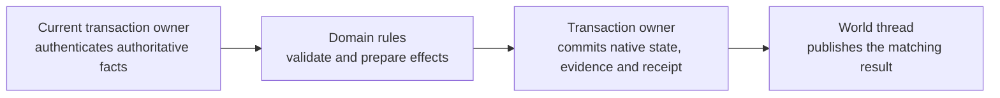

# Architecture review - 2026-10-07

**Status: source assessment and recommendations for review.** This document
records the approved architecture investigation. It does not accept a runtime
redesign, qualify a release, activate accounting or daily quests, or integrate
another branch. Subsequent documentation corrections were approved and completed
on `codex/docs-cleanup`; the main [architecture guide](../reference/ARCHITECTURE.md),
diagrams, README, module map and related operational references now describe this
checkout's source boundaries. The proposed sequence below records the review's
original plan. Its runtime design and qualification decisions remain separate work.

The recommended foundation remains one world thread owning live simulation,
with bounded workers receiving owned inputs and returning revisioned results.
The immediate need is to describe the actual authority and publication
boundaries, address remaining blocking paths deliberately, and measure the
tradeoffs of recent scheduling changes. Moving durable gameplay authority into
RAM would be a separate design and migration project.

## Evidence and revision boundary

The investigation used recent repository chats from September 16 through
October 7, 2026 to locate active work, then inspected source, Git history,
contracts, and committed qualification reports. The chat survey screened 113
repository entries and read 17 relevant conversations in detail, including
accounting, domain separation, networking, copyover, account loading, watchdogs,
runtime identities, maintenance, telemetry, quest preparation, and daily quests.
Chat completion claims are leads to evidence; they do not establish integration
or release qualification.

These are frozen review inputs, not claims about subsequent branch tips:

| Stream | Reviewed revision | Interpretation |
| --- | --- | --- |
| Documentation branch, `codex/docs-cleanup` | `9a52ec9e4c0c1748a6c030d6e82d90b1e32c4c07` | Baseline for this review; includes the three approved documentation batches. This local commit has not been published. |
| Documentation branch's implementation base | [7f3da9c3a1b2b423da85a24abab603d8cdbee149](https://github.com/Community-Duris/Duris/commit/7f3da9c3a1b2b423da85a24abab603d8cdbee149) | October 3 implementation snapshot; newer branch behavior must not be described as already present here. |
| Local `origin/master` reference | [f45d71accb83e1e864bf75b910693790b765d4df](https://github.com/Community-Duris/Duris/commit/f45d71accb83e1e864bf75b910693790b765d4df) | Observed reference, not a live remote query or deployment inventory. |
| Accounting, `origin/experimental-accounting` | [71e421d12def1171f5538a30f14bee7c18452974](https://github.com/Community-Duris/Duris/commit/71e421d12def1171f5538a30f14bee7c18452974) | Source for the newer loop, transport, loading, recovery, and accounting assessment below. |
| Domain separation, `codex/accounting-domain-separation` | [c84786260d3eb7e2ea041f461bbb5450c91542ec](https://github.com/Community-Duris/Duris/commit/c84786260d3eb7e2ea041f461bbb5450c91542ec) | Separately delivered preparation work; adoption must be checked on the eventual combined candidate. |
| Accounting Plan 5 | [05092810201d73342ea4b296550e473a389b54d1](https://github.com/Community-Duris/Duris/commit/05092810201d73342ea4b296550e473a389b54d1) | Additional audit, authority, and recovery context; individual qualification slices remain bounded. |
| Quest preparation | [9c14df4183e6633b0a6e99b563dc6b7451792817](https://github.com/Community-Duris/Duris/commit/9c14df4183e6633b0a6e99b563dc6b7451792817) | Independent preparation and journey evidence; does not close primary native quest acceptance. |
| Telemetry, `codex/telemetry-balance-expansion` | [7b3e8c29b93e1b531a7edbbbca24ff168d855569](https://github.com/Community-Duris/Duris/commit/7b3e8c29b93e1b531a7edbbbca24ff168d855569) | Delivered and unfinished expansion work must be distinguished using its implementation status. |
| Daily quests, `codex/discovered-zone-dailies` | [8e4b6d9222259f187c62b64cf794df80ceed910d](https://github.com/Community-Duris/Duris/commit/8e4b6d9222259f187c62b64cf794df80ceed910d) | Separate implementation and content stream; accounting readiness and activation gates still apply. |

Source links for newer files are pinned to these revisions because those files
are not all present in this checkout. A missing ancestor is not sufficient proof
that an equivalent change was never cherry-picked or adapted. Import decisions
need an actual source comparison, owner coordination, and combined-candidate
validation. Schema heads also differ between streams; the eventual integration
must use its own migration and runtime compatibility manifests.

## What the main architecture guide needs to distinguish

[ARCHITECTURE.md](../reference/ARCHITECTURE.md) describes the documentation
checkout's older process and loop. Its approved help-cache correction remains
valid and should survive later integration. The guide needs a fresh source pass
for port/environment rules, SQL versus flat-file operation, casting/input gates,
worker ownership, and shutdown/recovery ordering.

The following newer behavior is present in the accounting review snapshot. It
must be identified as branch work when discussing this documentation checkout:

| Area | Newer implementation | Architectural consequence |
| --- | --- | --- |
| Readiness and loop phases | `poll()` services bounded network turns between nominal 250 ms simulation pulses; the world loop has named ordered phases. | Network readiness, command eligibility, durable publication, and logical ticks are different boundaries. See the [phase contract][phases] and [readiness evidence][readiness]. |
| Persistent transport | Optional parent owns physical sockets, TLS, Telnet/MCCP state, WebSocket framing/compression, and writes; child owns authentication, simulation, and persistence workers. | The deployment has both a default single-process mode and an opt-in two-process mode. See the [transport contract][transport]. |
| Copyover | Portable v18 format uses explicit bounded records, checksums, and atomic durable publication; checked legacy readers remain. | Runtime handoff format and durable player/economic recovery have separate responsibilities. See [COPYOVER_FORMAT.md][copyover]. |
| Interactive account loading | Bounded worker returns an owned snapshot; game thread validates and publishes it. Password verification and later player hydration are separate pipelines. | Account reads have a busy response without synchronous fallback; this does not prove player hydration has the same property. See [ASYNC_ACCOUNT_LOAD.md][account-load]. |
| Runtime identity and maintenance | Non-owning game-thread runtime-ID lookup plus per-character maintenance timers replace repeated discovery and the older four-slice population sweep. | Process-local runtime identity differs from persistent player IDs and transport session IDs. Maintenance changes need their own cost assessment. See the [maintenance report][maintenance]. |
| Watchdog and queue bounds | External watchdog observes completed world-loop progress; session input/output and IPC queues have explicit admission and backpressure rules. | Socket liveness does not establish world progress. Watchdog recovery does not prevent synchronous stalls. |
| Workers and caches | Account, password, help/info/catalog refresh, journals, saves, critical commands, maintenance, mail, world recovery, and telemetry have distinct lifecycles. | The guide should map ownership and drain order instead of implying that all asynchronous work shares one queue. |

## Current authority and operation lifecycle

The reviewed design is a hybrid. Live simulation belongs to the world thread;
durable mutations use the implemented SQL or flat-file transaction owner for
each admitted route. The `economic_gameplay_authority` projection provides
lifecycle and admission information. Its name does not establish that every
economic fact is already authoritative in RAM.

| Responsibility | Owner and boundary |
| --- | --- |
| Mutable characters, objects, combat, command eligibility | World thread. Workers must not retain borrowed live pointers. |
| Reserve conflicting durable work | Critical coordinator and domain admission/publication fences, using operation identities and affected entity keys. |
| Recover an accepted operation | Durable journal and its recovery owner retain the original identity and payload. Queue acceptance alone is insufficient. |
| Apply native durable effects, accounting evidence, and receipt | The admitted domain's SQL transaction or flat-file authority. A derived audit/report is not a replacement mutation authority. |
| Publish a committed result into the live world | World-thread domain handler validates operation identity, revisions, and live identity before applying the matching result. |
| Retain unresolved publication | Domain continuation and publication gates preserve the original receipt/operation. Coordinator execution and live publication can have different lifetimes. |
| Save ordinary player checkpoints | Immutable revisioned snapshot/journal path and keyed save workers; this is separate from non-coalescing critical operations. |
| Recover optional world generations | Redis publisher/reader validates world recovery generations; protected item custody must reconcile with native durable authority. |
| Report and reconcile evidence | Audit and telemetry consumers derive results from their stated sources. They do not silently become gameplay writers. |

The [critical command contract][critical] distinguishes admission awaiting
durability, journal durability, execution, retry/uncertainty, retained completion,
and live publication. Documentation must also distinguish a domain's durable
receipt, publication acknowledgement, transport input acknowledgement, and bytes
sent to a client. None is a universal synonym for successful gameplay.

An ambiguous result must retain its original operation identity and applicable
fences while the responsible owner recovers it. A stale or failed delivery is
not permission to submit a new operation, grant a second reward, or discard the
evidence. Quarantine preserves unproven state for review. Existing
[player-save](../persistence/PLAYER_SAVE_PIPELINE.md) and
[world-recovery](../persistence/WORLD_RECOVERY_PIPELINE.md) contracts remain the
detailed references for those distinct paths.

## Findings and recommended decisions

### 1. Interactive player hydration can still block the world thread

At the accounting pin, account character confirmation calls
`player_load_pipeline_execute_sync()` when asynchronous submission is not
accepted. Legacy login has a corresponding fallback. The synchronous API invokes
the selected repository directly, and its SQL implementation acquires a pool
connection and executes repository reads on the caller. Other retry paths can
also reach synchronous loading. See [account character loading][account-source],
[legacy login][nanny-source], and the [player-load implementation][player-load].

This is a source-confirmed blocking path, not a reproduced incident or a latency
measurement. Under worker saturation or database trouble, a fallback intended to
help one login can stall all simulation. Keeping physical sockets in a parent
does not let the blocked world execute commands or combat. The newer account-name
worker's busy policy should not be generalized to character hydration.

**Recommendation for a separate implementation decision:** interactive admission
failure should return a bounded busy/retry result through the existing login
state machine. Review synchronous callers individually for boot, staff, and
maintenance requirements. Preserve full snapshot, degraded-payload, quarantine,
and recovery-gate semantics while changing admission behavior.

Required proof would include held-worker saturation, worker unavailability,
SQL timeouts, account and legacy login, all transports, close/socket reuse,
cancellation, and continued world progress. Exercise applicable SQL and flat-file
recovery gates. This review neither changes the fallback nor claims those
runtime tests were executed.

### 2. Faster network servicing does not remove gameplay publication latency

In the reviewed [loop source][loop-source], critical completion consumption is
inside `run_recurring_persistence_phase()` under `pulse % 2`. Output precedes
events and recurring publication. Worker wakeups service networking promptly but
do not publish results between simulation phases. The nominal interval is
250 ms per pulse and about 500 ms between every-two-pulse publication boundaries;
these are cadences, not hard latency guarantees under slow callbacks.

**Recommendation:** document these clocks explicitly. If completion latency is a
product concern, measure operation admission, durable completion, live
publication, output framing, and physical delivery separately. Moving publication
earlier requires a deliberate behavior change with traces for input eligibility,
events, snapshots, prompts, and copyover. A readiness change alone cannot justify
that reordering. Overruns discard missed wall-clock slots and schedule the next
full interval; they do not run a burst of catch-up simulation ticks.

### 3. Per-character maintenance trades peak work for more scheduling work

The corrected [maintenance report][maintenance] compares five runs per mode with
30,000 NPCs and 120 PCs over 200 simulated seconds. Maintenance bodies fall from
301,200 to 2,400, while callbacks increase from 40 to 1,201,200. In its unprofiled
control, median process CPU rises from 58,677 to 252,623 microseconds: 4.31 times,
or another 0.194 seconds over that simulation window. There is one maintenance
timer per live character.

This supports a tradeoff, not a whole-server CPU improvement. The fixture uses
heap allocation and stubbed collaborators on a shared WSL host; production has
its event pool and actual gameplay work. Some peak measures improve while the
highest profiled pulse does not. Production p99 remains unproven.

**Recommendation:** retain the implemented design pending a representative
comparison. Before further scheduling redesign, measure world p95/p99/max pulse
time, overdue events, total CPU, timer memory, and persistence pressure on matched
populations. State whether the intended benefit is lower peak work, cheaper
discovery, or lower total cost, and assess each separately.

### 4. Transport continuity and durable recovery need separate promises

The [persistent transport contract][transport] preserves eligible playing
sessions across a planned, authenticated world replacement. It uses a private
inherited Unix socketpair, versioned bounded messages, logical session identities,
sequence frontiers, and per-attempt handoff barriers. Non-playing or otherwise
ineligible sessions can veto replacement. Protocol upgrades require a cold
restart of both roles.

An arbitrary backend crash has uncertain command outcomes, so affected sessions
are retired and are not replayed into a cold world. Frontend failure and rejected
restoration also do not promise transparent continuation. Ordinary authentication
and durable recovery remain necessary. Component tests or flat-file journeys
cannot qualify an unexecuted SQL deployment.

**Recommendation:** retain the optional process split and document its exact
planned-handoff scope. Keep command acknowledgement, durable operation recovery,
world restoration, and client receipt separate in the main guide and diagrams.

### 5. Domain preparation is useful now; authority conversion is separate

The independently reviewed preparation deliveries connect owned-input rules to
existing production callers: Collector collection images
([3d2b85b0688684721f8db559cb3ea35b1830a1cc](https://github.com/Community-Duris/Duris/commit/3d2b85b0688684721f8db559cb3ea35b1830a1cc)),
crafting/forge quotes
([48cdf9cb0893873651216f7940aae2691d060e58](https://github.com/Community-Duris/Duris/commit/48cdf9cb0893873651216f7940aae2691d060e58)),
and currency deltas
([24fa551ae16900b41e509f79fe4685762e0fb2e9](https://github.com/Community-Duris/Duris/commit/24fa551ae16900b41e509f79fe4685762e0fb2e9)).
They preserve the existing transaction, accounting, publication, and recovery
owners. The [inventory review][domain-inventory] and
[completion audit][domain-audit] distinguish scoped implementation, independent
verification, primary adoption, and remaining whole-project qualification.

**Recommendation:** continue small extractions connected to real callers, with
the existing owner authenticating the facts and committing effects. Use this
conceptual boundary where a route's source and tests support it:

This is a recommended separation, not a claim that every route already has it.
The first Collector delivery has component/build evidence without native runtime
journeys; crafting has additional SQL/flat-file recipe journeys; currency has
selected numerical/completion evidence while broader shared-runner failures and
physical-coin qualification remain recorded. Preserve those limits when choosing
imports. Complete the current accounting qualification under its existing owners
without replacing shared execution machinery during a milestone.

### 6. Telemetry and daily quests are active, gated streams

Telemetry keeps bounded value capture, a private SQL writer, external rollups,
and read-only reports. Its expansion adds battle/progression context, control
observations, identity history, and canonical reward publication. Use the pinned
[implementation status][telemetry-status] and [canonical reward contract][rewards]
to distinguish delivered coverage from the broader accepted plan. Derived
observations do not authorize gameplay mutations, and telemetry shutdown must
reap its writer before database teardown.

The [daily-quest implementation contract][dailies] requires active, verified
accounting for discovery, private journals, and new tracking. Daily eligibility
has an additional switch and remains disabled by default. Reading a journal does
not assign a quest, complete it, or grant a reward. Native quest completion and
exact receipt recovery remain the authority; mapping content into a dossier
does not qualify actual source renewal, reward settlement, or recovery.

**Recommendation:** show these streams in the architecture as consumers and
participants with explicit gates and owners. Keep proposed coverage, implemented
coverage, qualified routes, and activation distinct. Resolve integration and
migration compatibility on a combined candidate before describing either branch
as part of the default deployed system.

## Future option: RAM authority for durable gameplay

The recent accounting discussions propose having the world owner prepare the
exact durable outcome from owned state, reserve the affected keys, durably record
the outcome and ordering, publish it, and project it into SQL asynchronously.
Crash-safe positive acknowledgement would still need the relevant durable record
first. Recovery would reconstruct from a checkpoint plus later records, establish
revision/catch-up readiness before login, and prevent late projections from
overwriting newer state. SQL would not independently recompute a different
gameplay result.

This is a proposed execution contract. The current preparation extractions do
not implement it. Before accepting a conversion, decide:

1. Which coherent domain owns all writers and coupled effects? Wallet, custody,
   shops, auctions, and death can cross the same operation; converting a single
   command cannot establish domain-wide authority.
2. Which journal is authoritative, when is an outcome acknowledged, and how are
   ambiguous appends, recovery, compaction, and quarantine handled?
3. What bounded backlog and outage policy applies when SQL projection is slow or
   unavailable, and which login/gameplay routes stop at each limit?
4. How do external staff tools, offline writers, and recurring maintenance route
   through the owner or a stopped maintenance boundary?
5. How do cold boot, copyover, crash recovery, existing receipts, migration,
   rollback, and projection catch-up preserve exact outcomes and revisions?

Keep this future decision separate from documenting current behavior and from
finishing current accounting acceptance. No performance gain or delivery estimate
is established by this review.

## Proposed documentation sequence

1. Rewrite the main architecture guide against the documentation checkout's
   actual source. Cover world ownership, backend selection, operation lifecycle,
   phase ordering, workers, and recovery. Correct the remaining configuration and
   input-gate claims, preserving the approved help-cache description.
2. Add a concise section identifying newer branch work and link this dated
   assessment. Keep `select()` versus `poll()` and default versus persistent
   transport tied to their implementation revisions until integration is real.
3. After the guide is approved, reconcile its visual overview with the same
   source boundary. Follow up separately on README/module-map or operational
   claims that need changes; do not silently expand that batch.
4. Request separate design decisions for interactive load admission, publication
   latency, representative maintenance measurement, and any RAM-authority
   conversion. Each implementation needs its own scope and validation.

Choose the combined implementation revision before promoting branch-specific
behavior into the main description. Recheck actual files, migration manifests,
feature gates, and qualification reports at that boundary instead of carrying
forward this review's branch names as evidence.

## Verification limits

This review inspects source and historical evidence. It does not execute server
builds, migrations, gameplay, database-outage journeys, transport replacement, or
performance benchmarks. Reported runtime results belong to their linked, pinned
qualification documents and retain those documents' fixture and backend limits.
Documentation validation uses the existing documentation contract suite, pinned
Git-object/path checks, and staged whitespace checks. These checks establish
document consistency and reference existence, not runtime correctness or remote
URL availability for unpublished commits.

[phases]: https://github.com/Community-Duris/Duris/blob/71e421d12def1171f5538a30f14bee7c18452974/docs/network/GAME_LOOP_PHASES.md
[readiness]: https://github.com/Community-Duris/Duris/blob/71e421d12def1171f5538a30f14bee7c18452974/docs/network/NETWORK_READINESS_VALIDATION.md
[transport]: https://github.com/Community-Duris/Duris/blob/71e421d12def1171f5538a30f14bee7c18452974/docs/network/PERSISTENT_TRANSPORT.md
[copyover]: https://github.com/Community-Duris/Duris/blob/71e421d12def1171f5538a30f14bee7c18452974/docs/persistence/COPYOVER_FORMAT.md
[account-load]: https://github.com/Community-Duris/Duris/blob/71e421d12def1171f5538a30f14bee7c18452974/docs/persistence/ASYNC_ACCOUNT_LOAD.md
[maintenance]: https://github.com/Community-Duris/Duris/blob/71e421d12def1171f5538a30f14bee7c18452974/docs/testing/CHARACTER_MAINTENANCE.md
[critical]: https://github.com/Community-Duris/Duris/blob/71e421d12def1171f5538a30f14bee7c18452974/docs/persistence/CRITICAL_COMMAND_PIPELINE.md
[account-source]: https://github.com/Community-Duris/Duris/blob/71e421d12def1171f5538a30f14bee7c18452974/src/account/account.c#L2782
[nanny-source]: https://github.com/Community-Duris/Duris/blob/71e421d12def1171f5538a30f14bee7c18452974/src/account/nanny.c#L2791
[player-load]: https://github.com/Community-Duris/Duris/blob/71e421d12def1171f5538a30f14bee7c18452974/src/player/player_load_pipeline.c#L514
[loop-source]: https://github.com/Community-Duris/Duris/blob/71e421d12def1171f5538a30f14bee7c18452974/src/net/comm.c#L2371
[domain-inventory]: https://github.com/Community-Duris/Duris/blob/71e421d12def1171f5538a30f14bee7c18452974/docs/persistence/economy_accounting/domain-separation/INVENTORY_REVIEW_2026-10-07.md
[domain-audit]: https://github.com/Community-Duris/Duris/blob/71e421d12def1171f5538a30f14bee7c18452974/docs/persistence/economy_accounting/domain-separation/WORKSTREAM_COMPLETION_AUDIT_2026-10-07.md
[telemetry-status]: https://github.com/Community-Duris/Duris/blob/7b3e8c29b93e1b531a7edbbbca24ff168d855569/docs/telemetry/IMPLEMENTATION_STATUS.md
[rewards]: https://github.com/Community-Duris/Duris/blob/7b3e8c29b93e1b531a7edbbbca24ff168d855569/docs/telemetry/CANONICAL_REWARDS.md
[dailies]: https://github.com/Community-Duris/Duris/blob/8e4b6d9222259f187c62b64cf794df80ceed910d/docs/reference/ZONE_STORY_QUEST_DAILY.md
