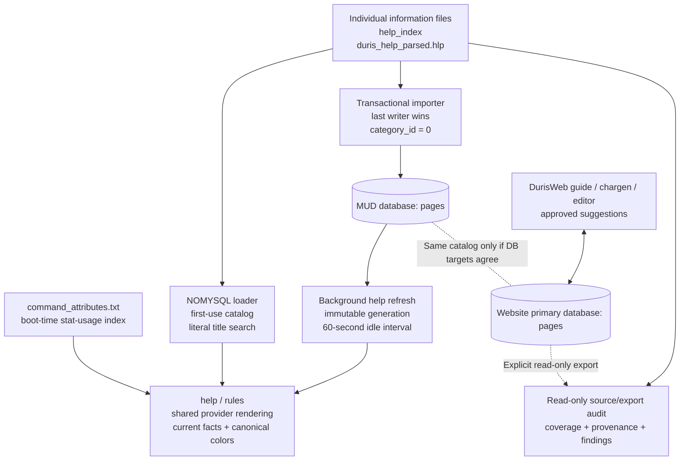

# Help-system audit and implementation plan

Audit date: 2026-10-02. MUD baseline: `db2822706` on
`experimental-accounting`. Website inspection:
[`Community-Duris/DurisWebApp` at `c0982794`](https://github.com/Community-Duris/DurisWebApp/tree/c0982794e75d19b4cef303ec656650e3c585c3d8).
These are source findings, not a claim about the deployed production catalog.
The coverage snapshot and local qualification were refreshed after merging
`experimental-accounting` through `baee2528e`.

## Decision and PR scope

Keep narrative explanations authored and reviewed. Generate changing facts from
the existing game registries/properties, and derive discovery/audit indexes from
the effective catalog. First make coverage and ownership visible; preserve the
current bounded, asynchronous MySQL loader. A replacement search service or
automatic prose publication would add cost without addressing the current source
collisions, lost categories, or disconnected publication paths.

This PR implements the audit increment: a reproducible source/export auditor,
complete registered-keyword coverage snapshot, exact-match selection beyond the
result cap, whitespace normalization, a real 100-title display limit, actionable
search feedback, focused regression tests, and corrected operating documentation.
It also connects existing live providers through a shared renderer in both
builds: exact registry bindings for category-zero/flat topics, canonical colors,
current creation choices, replacement of captured generated sections, and
generated facts for exact registered topics whose narrative is missing.
It adds a shared stored/live discovery index, paginated family browsing, bounded
typo suggestions, and seven handler-reviewed source pages. It does not change
storage/schema, perform an operational content import, or modify the separate
website repository.
The TCP walkthrough also exposed a final-output bug: generic terminal mode did
not suppress ANSI attributes. The PR honors that setting before terminal
encoding, retaining the normal CRLF conversion and configured colors for ANSI.

## Current data flow and hooks



| Surface | Implementation and contract |
| --- | --- |
| Player command | `src/cmd/interp.c` registers `help`; `actinf.c::do_help` sends `wiki_help` output and optionally appends `attrib_help` stat usage. It imposes no wait/cooldown. `rules` calls the same help path. |
| MySQL lifecycle | `src/net/comm.c` requests help refresh after world boot, polls publication during the game loop, and joins the worker before pool shutdown. `help_cache.c` uses the pool/thread context, one bounded SELECT, and `refresh_cache`. Reads/rendering perform no SQL. |
| Staff refresh | Greater gods use `page help` / `page help status`; queued work and published generations are distinct. Automatic loads run every 60 seconds when idle, preserve old content on failure, and require a default `help` page for initial publication. |
| MySQL search | Shared stored/live topic index with ASCII title equality and LIKE-style substring matching with `%` and `_`. Exact hits render first, followed by up to 100 related titles. Up to five bounded typo suggestions appear on unresolved queries. There is no body search, token ranking, or per-character command filtering. |
| MySQL rendering | `wiki_help_single` follows category-1 `Redirect: ` text, bounded to eight lookups. Explicit categories 25/9/16/10 select live race/class/spec/skillset providers; category 0 also binds exact registry subjects. `Races`, `Multiclass`, and `Index` bind case-insensitively. Captured provider sections and legacy plain tables are replaced at render time. |
| Flat-file build | `make -C src PERSISTENCE_BACKEND=flatfile` defines `__NO_MYSQL__`. `flatfile_help_catalog.c` reads individual files, the index, then parsed help; ASCII-normalized duplicates overwrite. `wikihelp.c` loads narrative on first use and keeps it until restart. It uses literal substring search, then the same live renderer/registry bindings as MySQL. |
| Information commands | MOTD/news/wizmotd use the boot/`page` path. Credits/FAQ/wizlist use the separate background `information_cache` and `page info`. These are not all the same help cache. `mud_info.rules` is not the `rules` command's authority. |
| Command attributes | Boot loads a separate legacy text table with a 1,024-entry cap. It can append stat usage even when narrative help is absent. It carries no command syntax, explanation, publication revision, or permission context. |
| Demand evidence | Unresolved searches with no stored title match or exact live provider append timestamp/query to `lib/etc/help`; there is no identity, structured term normalization, ambiguous-search counter, result selection, or usefulness signal. Review aggregated counts privately before choosing authoring priorities. |
| Historical wiki code | `src/sql/sql.c::perform_wiki_search` still references old `wikki_*` tables. There is no caller in the current server tree, and NOMYSQL has an empty stub. It is not the active help backend. |

MySQL limits are 20,000 pages, 256 title bytes, 128 KiB per complete record,
and 32 MiB of source data. The flat loader limits each source file to 8 MiB,
the catalog to 4,096 titles, titles to 255 bytes, and entry text to 1 MiB.
Their collation, validation, redirect failure feedback, and reload semantics
remain different. None of those differences should be concealed by a report
that merely checks whether a string appears somewhere in a file.

## DurisWeb connection and publication gaps

The inspected website implements:

- [`help.ts`](https://github.com/Community-Duris/DurisWebApp/blob/c0982794e75d19b4cef303ec656650e3c585c3d8/backend/src/routes/help.ts): `/api/help/:type/:name`, exact race/class title lookup with an underscore-to-space retry; stored text only.
- [`guide.ts`](https://github.com/Community-Duris/DurisWebApp/blob/c0982794e75d19b4cef303ec656650e3c585c3d8/backend/src/routes/guide.ts): paginated/category-filtered public listings, title LIKE search, and page-by-ID fetches. Quick search requires two characters, unlike game help.
- [`content.ts`](https://github.com/Community-Duris/DurisWebApp/blob/c0982794e75d19b4cef303ec656650e3c585c3d8/backend/src/routes/content.ts) and [`contentService.ts`](https://github.com/Community-Duris/DurisWebApp/blob/c0982794e75d19b4cef303ec656650e3c585c3d8/backend/src/services/contentService.ts): permission-controlled CRUD, edit metadata, and coarse admin-action logging. The log does not retain full old/new page bodies.
- [`helpSuggestionService.ts`](https://github.com/Community-Duris/DurisWebApp/blob/c0982794e75d19b4cef303ec656650e3c585c3d8/backend/src/services/helpSuggestionService.ts): contributor submissions and reviewer approval/publication. Review status is updated before page publication, without one transaction around both operations. A publication error can therefore leave approval status ahead of the actual page.
- [`connection.ts`](https://github.com/Community-Duris/DurisWebApp/blob/c0982794e75d19b4cef303ec656650e3c585c3d8/backend/src/db/connection.ts): explicit shared/separate MUD database mode. All inspected help paths use primary `pool`, while separate MUD reads elsewhere can use `mudPool`.

The following are source-based implications that still need deployment checks:

1. Website help writes reach the MUD only if both processes address the same
   `pages` catalog. Separate database mode needs a deliberate ownership/pool
   decision; changing a connection setting alone does not synchronize help.
2. Website read views do not run the server's category-driven renderer or redirect
   resolver. The chargen modal also retains fetched text in a component-local
   cache without a generation/version invalidation mechanism.
3. Suggestions build an edit header into the stored body. That duplicates the
   MUD's metadata header and prevents `Redirect: ` from being at the start of
   a suggested redirect's text, even when category 1 is selected.
4. The [hook registry](https://github.com/Community-Duris/DurisWebApp/blob/c0982794e75d19b4cef303ec656650e3c585c3d8/backend/src/hooks/registry.ts) has no help-fetch, help-change, or help-publication hook. Existing bridge authentication/event toggles and flat-file builder parsers do not provide help synchronization.
5. Database edits have no reverse export into the tracked catalog. The importer
   can replace those edits, and `--clean` removes database-only additions.
6. The checked-in `pages` schema has only its primary-key index, with no title
   uniqueness or title/full-text index. Duplicate titles can coexist; SQL
   `ORDER BY title` does not determine a winner among equal titles.

The configured workstation `.env` reported `ENVIRONMENT=local`, but the
read-only MySQL connection attempt returned error 2003 (connection unavailable).
No deployed pages or credentials were exported. The website's actual deployed
database ownership and current page/category counts remain unverified.

## Reproducible gap map

The committed [help-coverage.csv](../reports/help-coverage.csv) contains all
2,939 source-discovered terms, including their declaration locations, matching
titles, body mentions, and spelling candidates. Reproduce it with:

```bash
python3 scripts/audit_help.py --format csv --output docs/reports/help-coverage.csv
python3 scripts/audit_help.py --output bin/help-audit.json
```

The effective flat catalog has **2,168 titles from 2,905 source entries**, with
**737 overwrite events**. The Python reconstruction is checked against the
production C++ loader, including complete title/body equality. The raw help
capture and area-editor help files are intentionally outside this runtime map.

| Keyword source | Exact title | One partial match | Ambiguous matches | No title match |
| --- | ---: | ---: | ---: | ---: |
| Registered non-staff commands | 224 | 28 | 45 | 54 |
| Staff commands | 114 | 0 | 0 | 4 |
| Item/proc trigger commands | 8 | 2 | 3 | 11 |
| Social commands | 153 | 9 | 19 | 171 |
| Unregistered command-table names | 6 | 2 | 0 | 12 |
| Spells | 635 | 0 | 0 | 1 |
| Skills, excluding songs | 172 | 0 | 0 | 2 |
| Songs | 19 | 0 | 0 | 0 |
| Innates | 84 | 9 | 2 | 82 |
| Player races | 37 | 0 | 0 | 0 |
| Class table names | 30 | 0 | 0 | 0 |
| Class skillset titles | 30 | 0 | 0 | 0 |
| Specializations | 52 | 2 | 0 | 17 |
| Attribute-file keywords | 530 | 42 | 67 | 257 |
| Quoted help hints in game messages | 4 | 0 | 0 | 0 |

These are retrieval classifications, not counts of mandatory new documents.
Source registration does not prove that a feature is available to a player,
and legacy class/command/attribute names remain in the tables. Source extraction
excludes comments but does not preprocess build flags or evaluate permissions.
A body mention does not make `help <term>` discoverable. An exact title does
not prove that its explanation is adequate or its numbers are current.

Concrete authoring/indexing priorities:

- The PR adds exact `Named Equipment` and `Racewar` pages for the two broken
  game hints, plus `Namedreport`, `Introduce`, `Refine`, `Soulbind`, and
  `Prestige`. All seven pages survive import/flat precedence and have exact
  related links. Non-staff command gaps drop from 59 to 54. The command pages
  describe their feature gates; source registration alone does not enable them.
  Reviewing `do_refine` also exposed a legacy implementation follow-up: it can
  consume multiple carried ores while charging the platinum route, and reads
  extracted objects when calculating ore quality or formatting failure output.
  The page explains the ore/platinum behavior. Repairing and qualifying that
  gated gameplay handler belongs in a separate change before enabling legacy
  refining; this help PR does not change its item or money transactions.
- Remaining missing command names include `boon`, `collector`, `dummy`,
  `protocol`, `outpost`, `divineclaim`, `relic`,
  `itemmana`, and the dragoon attack verbs. Inspect each registered handler and
  its feature gates before writing syntax, requirements, failures, and examples.
- The four missing staff command names are `audit`, `restitution`, `difficulty`,
  and `pulse`. These deserve explicit operational explanations before use.
- The 17 missing specialization titles are Controller, Dragon Hunter, Dragon
  Lancer, Dragon Priest, Earth Reaver, Ice Reaver, Inquisitor, Medium, Naturalist,
  Ruiner, Scourge, Shadowlord, Storm Bringer, Tempest Magus, Templar, Thaumaturge,
  and Violator. Their names often occur inside class/race pages, but that is not
  an authored dedicated entry. The shared runtime index now discovers these
  generated topics, including Mentalist and Shadow Archer; their missing
  narrative remains visible in this authored-content report.
- The apparent remaining skill/spell gaps are `charge cooldown.`, `throat crush
  cooldown.`, and `Auctions Disabled`. The registrations represent cooldown or
  state effects; they are not evidence that three player-facing explanations
  need to be invented. Review them as exclusions or cross-references.
- Short/compound aliases, socials, legacy unregistered names, and attribute-only
  entries should be triaged separately. Reusing a handler suggests a relationship
  but does not prove identical syntax/permissions; do not generate redirects by
  handler equality alone.

## Content quality and readability

The full JSON report provides source locations for every finding:

| Finding | Count | Meaning |
| --- | ---: | --- |
| Captured search-result text | 287 pages | Old `The following help topics...` output is stored as body content, so live searches can display stale related-title lists beside current matches. |
| Embedded edit headers | 1,363 pages | Parsed captures include `Title - Last Edited:` in the body. MySQL prepends metadata again, potentially with a new import date above an old capture date. |
| Nonexact cross-reference candidates | 747 references | 550 have no title match, 100 are ambiguous, and 97 have one partial match. These include wiki links, `See also:` lines, and `==See also==` sections, including colored headings/links. |
| Flat prefix-redirect problems | 0 | No effective tracked entry starts with the recognized redirect marker. This does not establish that database redirects are healthy. |

Cross-reference findings need review: legacy captures can put combat messages
or prose directly below a `See also` section, so some apparent link targets are
capture artifacts. For example, Acid Blood includes a wear-off message there.
The captured Hellspawn page contains `No data found` / `No entries found`
sections despite its title being present. Existing race/class section-presence
tests do not detect these semantic failures or stale runtime values.

Most importantly, every importer section assigns category 0. The SQL-backed
baseline renderer supported live facts only through category metadata, which
the imports did not retain. The PR now binds exact registered subjects in
category 0 and in NOMYSQL, and replaces the provider's captured sections before
appending current facts. Existing captured sources are retained for auditability;
the website still receives their captured text until its publication/rendering
path is updated. Explicit metadata/source cleanup remains useful for ownership,
aliases, revision history, and less ambiguous publication.

The live layer is centralized in `dynamic_topic`, `help_narrative`, and
`render_help_content`; it is not a new persistence or search service. Existing
racial properties, creation policy, specialization admission, and ability-list
helpers remain the authorities. Current Rogue specializations take precedence
over retired Assassin/Thief class names for untyped pages; an explicit SQL class
category can still select the historical subject. Generated-only facts do not
claim to fill the missing narrative measured by this report. `help_index` now
combines these registry subjects with stored titles for partial discovery and
`HELP INDEX` browsing. It follows the successful MySQL cache generation, keeps
stored metadata, deduplicates ASCII-equivalent subjects, and bounds display and
typo work. The captured 2007 `Index` body is superseded at render time.

For readability, use one display header, clear Syntax / Requirements / What
happens / Failure feedback / Example sections for commands, and named links
to exact topics. Preserve hand-authored explanations, colors, and useful examples
while separating metadata, captured display chrome, and generated facts.
Use the existing [style guide](../content/HELP_STYLE_GUIDE.md) for narrative voice;
do not rewrap alignment-sensitive lists blindly or remove headings in bulk.

## What can be generated reliably

| Information | Existing authority | Recommended use |
| --- | --- | --- |
| Available command names and aliases | `command[]`, `CMD_*` registration, permission evaluator | A current command index and contextual discovery hints; shared handlers can propose aliases for review. Argument grammar still needs handler-specific documentation. |
| Race stats and pulse values | Runtime properties and race tables | Live facts using `wiki_racial_stats`; show current values rather than frozen exports. |
| Race/class/spec compatibility | `class_table`, allowed race/spec tables, specialization registry | Generate allowed choices and related-topic links with the existing helper functions. |
| Innate unlocks | Innate definitions and class/race unlock tables | Generate the live innate list; author the ability's meaning and practical use separately. |
| Class/spec skill, spell, song lists | Runtime skill registry, `list_skills`, `list_spells`, `list_songs` | Reuse the existing live lists and unlock information. Do not infer narrative effects from an identifier. |
| Skill/spell targeting and cast timing | Registration flags/handlers and current runtime state | Candidate structured metadata, after checking exceptions and player context. Damage, duration, stacking, and failure rules often require handler-specific review. |
| Help title/category index and related topics | Effective catalog plus typed references | Rebuild an index when a generation is published; keep exact lookup separate from discovery ranking. |
| Coverage and authoring queue | Source registrations + effective titles + privately aggregated misses | Prioritize genuinely missing explanations and nonexact links; generate review templates, not plausible prose. |

## Next increments and acceptance criteria

1. **Content authority and metadata.** Recommend reviewed tracked narratives
   with explicit typed category/alias metadata and reproducible SQL/flat
   publication. Keep DurisWeb as the contributor/reviewer interface, but reconcile
   its edits back to the reviewed source before imports overwrite them. Decide
   and document catalog ownership first; an alternative SQL authority requires
   full revision history and versioned exports for NOMYSQL. Acceptance: one
   title/category/body round-trip preserves metadata and reports drift/collisions;
   no unreviewed database-only content is lost.
2. **Dynamic publication parity.** Runtime parity is implemented in this PR
   using exact registry subjects and existing SQL categories. Next, separate
   authored narrative from captured sections in the publication format and
   preserve explicit provider metadata through SQL/flat exports. Acceptance:
   a changed property/skill unlock updates output in both backends, each section
   appears once, metadata round-trips, and the website can obtain equivalent
   current facts without frozen capture data competing with them.
3. **Discovery and feedback.** This PR implements a shared stored/live index,
   paginated family browsing, exact priority, and bounded typo suggestions with
   exact read commands. Next, preserve explicit alias metadata and add token
   ranking where useful. Acceptance: compound/short aliases, exact hits past a
   cap, typos, and broad searches behave consistently without per-command SQL
   or unbounded output.
4. **Website publication parity.** Confirm `pool`/`mudPool` ownership; make review
   status, content mutation, and full revision recording one transaction. Store
   narrative/redirect bodies without display headers, render categories/redirects
   consistently, and invalidate cached text by revision/generation. Acceptance:
   approved content either publishes completely or leaves review status unchanged;
   the same topic/category/alias resolves in the game and website.
5. **Authoring workflow.** Use this CSV and aggregate miss queries to review the
   high-value command/spec/innate gaps. Add hand-verified pages in small batches,
   with `--require-term` checks for introduced keywords and gameplay journeys for
   documented behavior. Acceptance: each page has accurate syntax, requirements,
   success/failure examples, and exact cross-links; intentional exclusions are
   reviewed rather than hidden to improve a coverage percentage.

Title/alias lookup should stay deterministic even if body search is later added.
[MySQL FULLTEXT](https://dev.mysql.com/doc/refman/8.4/en/fulltext-natural-language.html)
provides relevance ranking, but stopwords and minimum token lengths make it a
poor sole authority for short command terms. Start with the existing in-memory
catalog; consider body search only after content and ownership are clean.
[Python's `difflib`](https://docs.python.org/3/library/difflib.html#difflib.get_close_matches)
supplies spelling candidates in the offline audit, where suggestions do not
change retrieval or publish content.

The plan-ablation review removed a new search service, bulk generated prose,
automatic category guessing, and schema changes from this PR. Their omission
keeps this PR independently reviewable and useful without prematurely
choosing another storage/authoring system.

## Validation and limits

- `python3 tests/async/test_help_audit.py`: parser/provenance, exact vs partial vs
  ambiguous vs absent classification, redirects/cycles, commented registrations,
  read-only JSON/JSONL imports, duplicate SQL titles, and keyword exit-code gates.
- `python3 tests/async/test_help_cache.py`: the actual MySQL help lookup/render
  bodies and cache state machine, including held workers, failure retention,
  live render changes, zero command SQL, repeated reads, whitespace, caps, and
  an exact title beyond the candidate batch.
- `python3 tests/async/test_flatfile_help_catalog.py`: the production C++ loader
  vs auditor title/body equality, bounds, flat runtime/help aliases, information
  reads, and a synthetic capped search with a late exact hit. It also compiles
  the actual shared renderer through both SQL and NOMYSQL branches against
  production race/class/color tables, creation configuration, and spec admission.
  Tests cover 37 race pages, 30 class skillsets, all registered specs, live
  property changes, correct list-provider arguments, colors, creation overrides,
  missing-topic generation, legacy-name precedence, and captured-section removal.
  Legacy colon-labeled race/class blocks and plain specialization headings are
  replaced as well; equipment/weakness narrative and related links are retained.
  Shared discovery checks include live-only partial matches, family filtering,
  50-topic pagination, malformed page requests, typo limits, and generation
  refresh/removal with a stable fixture catalog address.
  SQL cache and ability-list boundaries are isolated fixtures; this is not a
  substitute for a live gameplay journey.
- `test_reported_latency_contract.py`, `test_help_import_live_parser.py`,
  `test_race_helpfiles_complete.py`, and `test_class_helpfiles_contract.py`:
  existing adjacent contracts passed.
- `test_creation_availability_contract.py`, `test_creation_all_races_toggle.py`,
  and `test_creation_all_classes_toggle.py`: creation policy contracts passed.
- Existing `help_cache_mysql_harness.cpp` and `test_help_import_atomic.py` passed
  against a disposable MariaDB 10.6.23 instance bound to `127.0.0.2`, then stopped.
  This verified the real periodic refresh, SQL payload bounds, failure retention,
  no extra connection acquisition during reads, transactional rollback, and
  old/new reader visibility. It did not access the configured game database.
- `scripts/validate_colorization_journey.py` passed against the completed flat
  build over real TCP/Telnet with GMCP: 83 checks and 16 captured frames. It
  creates a disposable world and two synthetic accounts without reading `.env`
  or existing player data. Help checks read a racial Strength property changed
  to 137 in the copied boot data, verify canonical Human/Warrior colors, replace
  the plain captured class list, traverse the pager, discover Mentalist without
  an authored page, browse the current index, suggest Human for `huamn`, render
  bard songs and all seven new pages, suppress ANSI in generic terminal mode,
  and restore canonical colors after switching back. Existing independent
  chat-color, save/reconnect, room/pager, protected-art, combat/prompt, and clean
  shutdown checks also pass. Reproduce after building the inspector:

  ```bash
  python3 tests/async/test_flatfile_player_repository.py --build-inspector bin/tests/color-inspector
  python3 scripts/validate_colorization_journey.py \
    --server bin/server/dms_flat_help_ready --inspector bin/tests/color-inspector \
    --report bin/help-colorization-journey.json
  ```

- ANSI and Telnet/MCCP transport regressions passed, together with output
  profiles/preferences, color-command, and production output-integration tests.
  The latter hardcode `g++`; an ignored local PATH shim selects `g++-12`, matching
  the full build. The workstation's default `g++-11` rejects the existing
  `atomic<shared_ptr>` output-profile declaration. No compiler/test source or
  global toolchain setting was changed.
- Complete MySQL and flat-file server builds passed under WSL using `g++-12`
  and the existing Hiredis 1.4.1 headers/libraries. The workspace path contains a space, requiring
  `BIN_ROOT=../bin`; no build products are committed. Hiredis headers are treated
  as external system headers to avoid vendor-only pedantic diagnostics. Commands:

  ```bash
  make -C src -j2 BIN_ROOT=../bin CC=g++-12 \
    EXTRA_CFLAGS=-isystem/home/wsl/.local/duris-build-deps/hiredis-1.4.1/include \
    'EXTRA_LDFLAGS=-L/home/wsl/.local/duris-build-deps/hiredis-1.4.1/lib -Wl,-rpath,/home/wsl/.local/duris-build-deps/hiredis-1.4.1/lib'

  make -C src -j2 BIN_ROOT=../bin CC=g++-12 \
    PERSISTENCE_BACKEND=flatfile DMS_BINARY=../bin/server/dms_flat_help_ready \
    EXTRA_CFLAGS=-isystem/home/wsl/.local/duris-build-deps/hiredis-1.4.1/include \
    'EXTRA_LDFLAGS=-L/home/wsl/.local/duris-build-deps/hiredis-1.4.1/lib -Wl,-rpath,/home/wsl/.local/duris-build-deps/hiredis-1.4.1/lib'
  ```

The configured local database remains unreachable, and `.env` has no
`GAME_ACCOUNT_*` test credentials. A configured MySQL gameplay journey therefore
remains unverified; the isolated flat-file TCP journey does not certify deployed
SQL content, collation, cache generation, or website database ownership.
The new authored pages require the reviewed operational import on a MySQL
deployment; runtime provider/index fixes do not require that import. No
production import, migration, restart, or website mutation was performed.
The authored-content report still identifies 54 missing non-staff command
titles, 17 missing specialization narratives, and 747 nonexact related-link
candidates. Those findings require individual review rather than automatic prose
publication; they are follow-ups to this bounded PR.
