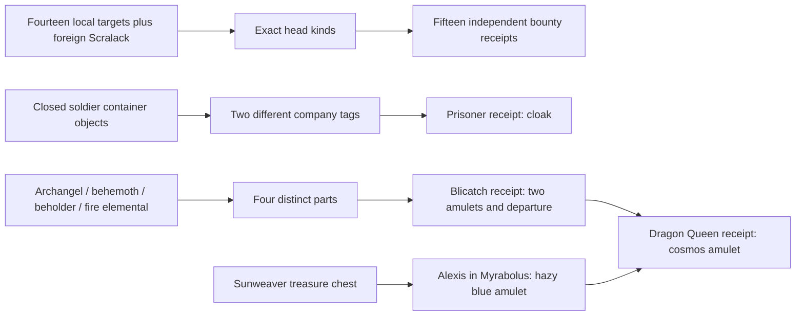

# The Caverns of Armageddon: comprehensive source map

Reviewed October 4, 2026. Zone 133, `hunt`; roadmap priority 56.
**Source review is comprehensive; live gameplay qualification remains pending.**
Active, ready accounting is required for discovery, visible encounters, journals
and new achievement/daily credit. Frozen obligation recovery remains separate.

The [schema-three journal](../../../areas/story/hunt.story.json) covers all
eighteen native exchanges as eighteen named outcomes: fifteen independent
bounties, the prisoner's two-company tags, Blicatch's four creature parts and
the Dragon Queen's two-amulet upgrade. Forty local contacts and 27 optional
checks (26 current carried items, one personal producer receipt) explain
preparation without inventing personal kills, original acquisition or a global
campaign terminal. All eighteen retain native daily shape; reset mode one makes
Blicatch's D1 repeatable in classification. Actual supply, difficulty, renewal
and player suitability still need qualification.

## Reviewed evidence

- All 33 [native blocks](../../../areas/qst/hunt.qst): eighteen Q and fifteen M,
  including full prose, exact inputs, duplicate reward quantities and D1.
  Each dialogue family has `orc orcs`. Markam's additional empty S record
  defines no accepted quest or dialogue and is not counted as a block.
- All 149 [rooms](../../../areas/wld/hunt.wld), full prose, headers,
  non-exit metadata and exits: 108 exact prose groups, 27 headers, 27 non-exit
  metadata groups and 124 exit families. Physical interval 13300–13448;
  registry interval 13299–13448. Header `13448 1 0 40 50 2` stays unchanged.
- All 94 [mobiles](../../../areas/mob/hunt.mob), 69
  [objects](../../../areas/obj/hunt.obj) and 393
  [resets](../../../areas/zon/hunt.zon) in 187 exact families:
  M270/D36/O26/E23/G23/R7/P5/F3. No local shop, ACT_TEACHER, inn or arena
  property. All active referenced prototypes and targets resolve; resolution
  does not establish admitted generation or actual presence. Ordered F/R
  ownership, trap fields, secret objects, container flags and key breakage
  were traced rather than inferred from comments.
- There are no literal local special assignments or shipped local trigger
  records. `areas/world.trg` is absent in this checkout; its generic loader's
  missing-file behavior is idle. The numeric tail of the race/class line is
  size/specialization data, not a custom procedure identifier. The imported
  rune 359 is bound to `epic_stone`; imported fountain 72 is bound to
  [`spell_pool`](../../../src/specs/specs.heavens.c#L963). Soulsword 67278 has
  encoded weapon effects, not an assigned local campaign callback.
- Relevant shared quest acceptance, reset generation/admission, movement,
  OPEN/GET, trap, portal, normal lock/key break, item provenance and existing
  epic settlement were reviewed. Global active source/consumer scans and
  bounded foreign prototypes include Scralack, Myrabolus treasure/monkey
  recipients and the Sky City of Ultarium's demon-heart recipient. The
  [generated index](../../reference/zone-story-audits/hunt.md) supplies
  navigable source evidence; this dossier supplies the semantic conclusions.

## Exact accepted outcomes

| Q line / recipient | Exact loose-carried roots → reward | Journal / retirement |
| --- | --- | --- |
| 10 / Wicks 13300 | Grue head 13354 → earring 13333 | `wicks-grue`; D0 |
| 28 / Valquin 13301 | Chowza head 13355 → band 13334 | `valquin-chowza`; D0 |
| 47 / Shix 13302 | Endosa head 13347 → shield 13317 | `shix-endosa`; D0 |
| 67 / Mastiff 13303 | Greeef head 13346 → warclub 13319 | `mastiff-greeef`; D0 |
| 84 / Clond 13304 | foreign Scralack head 76613 → medallion 13368 | `clond-scralack`; D0, blank exchange prose |
| 98 / Drimble 13305 | Jigoog head 13343 → totem 13351 | `drimble-jigoog`; D0 |
| 114 / Kantara 13308 | Veannan head 13345 → shard 13344 | `kantara-veannan`; D0 |
| 133 / Roland 13309 | Maximas head 13357 → longbow 13320 + four arrows 13321 | `roland-maximas`; D0, one receipt |
| 158 / Engleton 13310 | Renatta head 13342 → Starlight 13326 | `engleton-renatta`; D0 |
| 174 / Maveriss 13311 | Maverick head 13352 → eyepatch 13309 | `maveriss-maverick`; D0 |
| 194 / Xavier 13312 | Krazzi head 13358 → robes 13337 | `xavier-krazzi`; D0 |
| 208 / Dragon Queen 13313 | kilospanatis 13303 + hazy blue amulet 13318 → cosmos amulet 13361 | `dragon-queen-cosmos-amulet`; D0, blank exchange prose |
| 223 / Ajax 13317 | Graiven head 13356 → bracelet 13327 | `ajax-graiven`; D0 |
| 242 / Berelain 13318 | Argophel head 13353 → cloak 13332 | `berelain-argophel`; D0 |
| 262 / Redana 13321 | Zeelnar head 13348 → collar 13316 | `redana-zeelnar`; D0 |
| 282 / Rudamuse 13322 | Hackzen head 13362 → boots 13315 | `rudamuse-hackzen`; D0 |
| 294 / prisoner 13351 | Myrabolan guard tags 13359 + Wild Card tags 13330 → cloak 13329 | `prisoner-two-company-tags`; D0 |
| 310 / Blicatch 13364 | wings 13335 + eyestalk 13349 + tendril 13350 + tooth 13336 → both amulets 13303/13318 | `blicatch-four-creature-parts`; D1 |

All inputs are items; no local coin fee is declared. The largest offering is
four roots, within the existing fourteen-root durable offering limit. Every
kind in a bundle is different. Two Myrabolan tags cannot replace a Wild Card
tag; a wyvern wing cannot replace archangel wings. Worn, held or nested objects
do not satisfy loose-carried acceptance. Supplied matching proof is valid
without personal kills, first recovery or earlier producer receipts. Optional
keys explain a normal route and do not change any native offering.

Arrows describe producers and uses, not enforced personal-history dependencies.
Blicatch is the declared producer of kilospanatis; his pair can be handed to
another player. Alexis supplies only the hazy blue kind. Earlier Blicatch
history does not reserve or restore either physical amulet. His D1 retires
him; the Dragon Queen's receipt leaves her in place. The two receipts remain
separate outcomes, and no campaign-wide ALL condition is synthesized.

## Sources, locks, traps and escape

| Proof | Reset actor / starting room |
| --- | --- |
| Renatta 13342; Zeelnar 13348; Grue 13354 | Renatta 13361 at 13377; Zeelnar 13368 at 13379; Grue 13349 at 13380 |
| Hackzen 13362; Jigoog 13343; Graiven 13356 | Hackzen 13386 at 13381; Jigoog 13374 at 13382; Graiven 13362 at 13393 |
| Veannan 13345; Chowza 13355; Krazzi 13358 | Veannan 13347 at 13396; Chowza 13342 at 13412; Krazzi 13357 at 13414 |
| Greeef 13346; Endosa 13347; Maverick 13352 | Greeef 13365 at 13418; Endosa 13328 at 13426; Maverick 13326 at 13431 |
| Maximas 13357; Argophel 13353 | Maximas 13378 at 13437; Argophel 13382 at 13438 |
| Foreign Scralack 76613 | Scralack 76631 at Jade Empire 76799 |
| Wings 13335; tooth 13336; eyestalk 13349; tendril 13350 | F-loaded archangel 13343 at 13446; behemoth 13355 at 13415; small beholder 13344 at 13416; Krazzi's F-loaded fire elemental 13345 at 13414 |

These are G-loaded proofs on live NPC inventory, generally cap one and
nominal 100 percent. No custom sever/cut-on-death transformation is established.
The ordinary death/corpse/get journey and any player transfer need separate
qualification. Most named targets are sentinel; Jigoog and Veannan can move.
Clond, Redana and the prisoner can also move. Actual visibility and encounter
matter; a reset placement alone does not reveal an actor or prove a kill.

Roland 13309 and cave viper 13360 have no active declared M/F/R placement in
the scanned world. Roland's native Maximas bounty and two dialogue aliases
remain defined, but actual recipient availability is unresolved. Keep its
native daily classification distinct from assignable current supply; select a
builder-approved location and lifecycle before a separate placement repair.
The unused cave viper alone is not evidence of an unfinished quest.

The steel key 13314 is carried by elite orc 13370 at 13375. It opens the locked
DOWN shaft 13375 ↔ 13376 UP. Chipped rock key 13313 is P-loaded inside blood
basin 13325 at Graiven's Hall of Altars 13393. The basin is a closed, unlocked
container (flags five); OPEN, then GET the actual key. It fits locked EAST
13396 ↔ 13397 WEST beyond Veannan. Stone key 13312 is carried by guard captain
13390 at 13406, **not Veannan**. It fits locked EAST 13419 ↔ 13420 WEST into
the general cavern. The 13418 DOWN / 13419 UP steps list the key but have
door flags zero; the key field alone does not make a lock. All three keys have
normal-unlock break chance zero.

The wounded Myrabolan soldier object 13340 at 13384 and dying Soldier of
Fortune object 13338 at 13397 each contain Myrabolan guard tags 13359, with a
shared cap two. Dying Wild Card object 13323 at 13395 contains tags 13330,
cap one. All three are closed, unlocked container objects, without takeable
container wear flags. Recover their contents; do not describe healing a live
NPC as the producer. Tags have the secret-object flag, so perception is part
of the actual journey. The Soldier of Fortune containing Myrabolan tags may
be intentional mixed-company salvage; retain it until builder intent is
selected. Prisoner 13351 starts at 13408, accepts both kinds and has **no D**:
the promise to return to comrades does not implement departure or escort.

Archangel wings declare `T 2 0 1 50`: GET/PUT trigger, **sleep** effect, one
charge, level 50. [`checkgetput`](../../../src/combat/trap.c#L452) invokes the
trap and causes that pickup attempt to fail before transfer. Its charge is
decremented; sleep and subsequent successful recovery are different facts.
This is not a movement trap, poison or immediate successful acquisition.
Trap triggering/charge mutation and item transfer require accounting-aware
qualification before source or hazard objectives are published.

Blicatch's peaceful interlude 13349 is reached from secret SOUTH 13413.
Its NORTH return is reset blocked (state eight), while SOUTH continues to
Greeef's station 13418. The collapse description reflects a static asymmetric
route; there is no established actor-triggered collapse procedure. Argophel's
lair 13438 uses the secret grate DOWN from 13387. Maximas' chamber 13437 is
reached through secret waterfall 13428 NORTH → 13348, then DOWN through
13434. These are access clues, not separate accepted quest receipts.

Tent portal 13302 at 13313 uses ENTER to the mercenary recovery room 13350;
that room's SOUTH exit returns to 13313. Xavier's portal 13363 at 13341 uses
ENTER to Myrabolus 82627, an observatory backroom whose ordinary NORTH door
remains sealed by key 82538. Rift portal 13339 at 13426 uses ENTER to 13429;
the spiral leads DOWN through 13432/13433/13435, EAST from 13436 and onward
to throne 13431. No ordinary reverse rift is declared at 13429. These three
local portal kinds have command seven and unlimited charges.

The throne has secret UP `rescue` to 13439, then the Sunweaver bridge 13441
via 13440. Its reverse DOWN into the throne is blocked. Sunweaver 13443
DOWN → 13445 DOWN → forest 13355 is a separate one-way disembark route.
Markam is already placed at 13441; no kill, victory or timed rescue callback
was found to create the ladder or summon the ship. Ordinary secret revelation,
OPEN where applicable, movement and actual arrival must be qualified.

Abbadon 13327 at 13431 carries cosmos key 13311 and heart 13366. The key's
normal-unlock break chance is **100 percent**. It is used by the secret,
pickproof temple vault wall 13368 SOUTH ↔ 13371 NORTH and by locked,
pickproof statue container 13306 at 13355 (flags 29), holding ring 13308.
The vault holds Soulsword 67278. A single successful normal unlock can consume
the key; do not assume one physical key opens both locks. Renewal, already
open shared state, trade or another allowed route needs actual qualification.
This may be intentional repeated-group loot design, not a demonstrated broken
quest. No balance/key-lifetime change ships in this checkpoint.

The forest SOUTH 13307 ↔ surface 650096 NORTH is reciprocal. Forest WEST
13307 → surface 649693 differs from the inbound surface 649695 EAST → 13307.
Confirm intended terrain placement and return before a separate boundary fix;
do not silently rewrite a world-map edge based only on expected reciprocity.

## Foreign follow-ups and shared effects

Four O placements of treasure 13364 occupy two Sunweaver rooms, twice at
13442 and twice at 13444, under global cap four. Despite “chest,” the prototype
is ITEM_QUEST eight, **not a container to OPEN**. In Myrabolus (`mira`), Rico
82515 at 82589 accepts a chest for vest 13324; Random 82516 at 82591 for
ribbon 13322; Decker 82522 at 82601 for neckguard 13328 and departure;
Alexis 82537 at 82625 for hazy blue amulet 13318. Four placements are not a
guarantee that four currently available objects exist or belong to one player.
Each acceptance belongs to the real Myrabolus definition and journal; the
local dossier explains the continuation without duplicating credit here.

Lost monkey 13365 is a secret quest object at redwood top 13448, reached UP
from forest 13319 via 13447. Myrabolus monkey hunter 82543 at 82570 accepts
it for C20000. Abbadon's heart goes to dwarven trapper 76243 at Sky City of Ultarium
76255 for emblem 76243. Neither has a local `hunt` acceptance. Foreign trips,
fees and competing source allocations remain independent of local receipts.

Imported memory 55449 and epic rune 359 are placed at the general's rift
chamber 13426. The rune's existing committed epic-touch settlement, eligible
group/reset policy and accounting guards should provide future evidence; do
not add another reward path. The existing `epic_stone_absorb` lifetime finding
remains a shared pending repair, not a reproduced Caverns crash.

Imported fountain 72 at throne 13431 is assigned `spell_pool`: initialization
selects one of nine spells; a later invocation after forty minutes can rotate
it; DRINK casts the selected spell at level sixty. It is not an escape portal,
quest terminal or proof of immortal status. The callback ignores its argument;
target selection and effect application deserve a focused native dispatcher
fixture before any buff objective. Do not infer a successful effect from a
command string or invent a proc binding from race/class/size fields.

## Capability additions and balanced repair backlog

| Finding / limit | Integration or repair plan | Evidence and scope |
| --- | --- | --- |
| Current item kind fits without original-source acquisition | Commit UID, source actor/container, admitted generation, first recovery and player-transfer distinctions; bind provenance requirements explicitly per builder objective | All loaded heads/parts/tags; supplied proof remains native-valid unless a separately selected objective requires more |
| Keys and snapshots do not establish access | Publish accepted reveal/open/unlock, committed key-break outcome, actor/mount, room arrival and episode/shared-door scope | Three retained route keys; cosmos key can break; secret and asymmetric escape routes |
| Loaded proof is not a personal defeat | Separate committed death participation, corpse/container custody and acquisition; retain completion-only bounty acceptance | F-loaded part sources, roaming targets and foreign Scralack |
| Prisoner/Markam/immortal Hunters/exorcism/campaign restoration are prose | Builder-selected actor state, escort/departure, scoped ALL and episode ownership; use accepted state changes with clear group rules | Prisoner D0, Markam empty block, static ship/ladder; no active local campaign procedure found |
| Blicatch and Alexis offer different producer paths | Explicit material allocation, branch/attempt identity and optional producer history; preserve supplied two-kind acceptance | Two local amulets consumed together; hazy kind has a foreign alternative |
| Wings sleep and block first pickup | Native GET/PUT/trap mutation/accounting/replay fixture; distinguish hazard activation from later committed recovery | `T 2 0 1 50`, actual shared sleep and rejection paths |
| Legacy reset item issuance is refused under active accounting | Retain guard; implement and qualify admitted generation/source custody before promising daily stock | All O/P/G/E declarations require owned generation; cap/chance alone does not certify usable supply |
| Roland's bounty is defined but he has no active declared reset placement | Select intended placement and lifecycle, then qualify encounter, offering, renewal and daily admission in a separate fix | Global M/F/R scan finds no source; native recipe is retained, availability is unresolved |
| Cosmos key is used at two pickproof locks and breaks on normal use | Qualify repeated/shared supply and choose builder intent before a separate key-lifetime or route repair | Demonstrated fields, no reproduced impossible campaign or selected balance change |
| Soldier of Fortune carries Myrabolan tags; prisoner narrates leaving | Review mixed-company salvage and actor intent before changing tokens or D; add exact before/after fixtures if selected | Both are concrete source findings, not automatic proof of broken builder design |
| Forest west boundary is nonreciprocal; generic prose has incidental directional/grammar inconsistencies | Confirm intended terrain/layout, then separate narrowly tested world/prose fix if warranted | Native edges preserved; no claim that every nonreciprocal edge is erroneous |
| Spell pool argument routing and shared epic lifetime remain unqualified | Focused dispatcher/effect and pooled-object lifetime/accounting tests; separate `fix:` commits if reproduced and repaired | Imported active procedures are distinct from local journal completion |

No native world, mobile, object, quest, reset or special-procedure repair ships
in this checkpoint. The journal, source dossier and future capability plans
are additions. Every selected actual native repair must have a separate `fix:`
commit and a prominent PR/news record identifying zone, interaction, trigger,
before/after behavior, validation and remaining live limits. Keep the previously
shipped Tempest, Moonhollow, Desolate, Shadow of Sin and Halfcut repairs intact
and visible; none of these pending findings is release-news repair wording.

## Validation and remaining qualification

Focused source assertions and actual C++ journeys verify exact bindings,
four repeated output arrows, two distinct tag kinds, all four creature parts,
loose versus worn supplies, optional three-key guidance, supplied amulets
without personal producer history, a spent pair versus recorded history,
eighteen independent outcomes, read-only rendering, idempotent receipt replay
and cold recovery. Full production catalog/audit, daily, tracking and feature
regressions and the maintained build are part of the checkpoint validation.

Live source admission, perception/search, corpse/container recovery and transfer,
sleep traps, unlocking/key break, portal/ladder escape, boss combat, actor
retirement/renewal, group epic settlement and played persistence remain
unqualified. No DB, account activation, migration, server operation, deployment
or merge is performed. Native definitions/fingerprint/revision two/registry and
all prior 76 journals remain unchanged. Catalog after this addition: 77 maps,
1637 achievement units, 1464 potential daily units and 2211 projected rows.
Original roadmap: 56/220 complete, 164 pending; Tribal Forest (`tribal`) is next.
