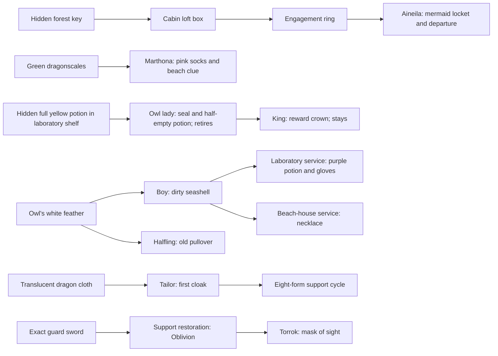

# City of Torrhan: comprehensive source story map

Priority 35, source area `torrhan`, canonical zone 666, bounds 66563–66903,
reset mode one. This is a complete source review; played qualification remains
pending. Discovery, encounters, player journals, achievements and new daily
eligibility require active, ready economic accounting. **This checkpoint ships
journal guidance and tests. No native zone, quest, reward or procedure repair
is shipped.** Proposed repairs below are pending and need a distinct fix/news
handoff when implemented.

The [revision-one journal](../../../areas/story/torrhan.story.json) maps all
26 exchanges into six stories, two requests, fourteen services and four
explicit refusals. Twenty-three contacts cover all eighteen addressed dialogue
families and source/service leads. Twenty-eight optional checks explain current
materials and earlier producer history without making supplied materials fail.
Eight achievement/potential daily units replace 26 baseline achievement units
and 22 baseline daily candidates. Native contracts and historical receipts
are preserved; support exchanges and refusals receive no new achievement credit.

## Evidence and review boundary

Read all 46 [native blocks](../../../areas/qst/torrhan.qst): 23 Q, three QA,
twenty M. Eighteen dialogue families are addressed, from eleven recipients;
Nirrel's two `qc_action` blocks are ambient. Read all 289
[rooms](../../../areas/wld/torrhan.wld), including 202 exact prose groups,
36 numeric headers, 39 non-exit metadata groups and 224 exit families; all
152 [mobiles](../../../areas/mob/torrhan.mob), 125
[objects](../../../areas/obj/torrhan.obj), six
[shops](../../../areas/shp/torrhan.shp), and 447
[reset commands](../../../areas/zon/torrhan.zon) folded into 324 source families.
The [reproducible index](../../reference/zone-story-audits/torrhan.md) binds
every exchange and addressed family to its source.

Resets comprise 227 M, 68 D, 65 E, 45 G, 21 F, nineteen O and two P. Chance
fields comprise 436 at 100, three each at 60 and 70, two at 80, and one each
at 95, 90 and 40. Reserved arguments are zero. Declared caps, preceding
conditional results, follower parents, current appearances and source admission
can change availability. These counts do not prove active spawning, custody
or repeatable daily delivery. Twelve local mobile prototypes have no local
M/F declaration: 66614–66616, 66618–66621, 66644, 66667, 66675, 66722 and 66748.
They are unused source leads, not automatically missing quest endpoints.

The two literal [special assignments](../../../src/specs/specs.assign.c#L2400)
are crew hall 66735 and ship store 66689. Complete local source searches find
no separate Torrhan procedure implementation or local `_proclib_` handler.
Bounded shared review covers Q/M dispatch and retirement, shop loading,
containers, search/custody, reset caps/followers, ordinary key break/unlock,
the automatically bound throne switch, item teleport, teachers/specialization,
epic practice, fishing and ship/crew entry and settlement requirements.

Fourteen guild mobiles 66728–66741 carry ACT_TEACHER; thirteen, 66728–66740,
also carry ACT_SPEC_TEACHER. Default teacher binding handles class-matched
level/runestone hints; specialization selects its own eligible teacher and
player state. Thurdorf 66671 separately appears in the
[epic teacher table](../../../src/classes/epic_skills.c#L215) for epic
constitution, installed by [epic initialization](../../../src/world/epic.c#L1368).
Paid epic practice is explicitly unavailable while accounting is active.
Nirrel's ambient blizzard/Mimir thoughts do not install a new teaching quest.
The local fishing pole 66709 is accepted by the
[shared fishing lookup](../../../src/economy/tradeskill.c#L573); fishing has
its own skill, source and accounting requirements. None creates a static Q
achievement. Inn of Oceans 66899 has ROOM_INN; rental and ordinary shop
hospitality remain separate services. Ship/crew ownership, docking, alignment,
money/epics/frags, mutation/save and interruption need coordinated qualification.
Torrhan's crew room is absent from the explicit good/evil refusal arrays;
do not infer an alignment restriction from city lore.

## Progression stories and exact terminals

These are possible routes, not mandatory producer history or a universal order.

Arrows identify sources and competing consumers. They do not duplicate a
spent shell or feather, require personal kills, create all-stage campaign
credit or prevent supplied material from satisfying an independent terminal.

| Outcome | Exact native terms | Progression and closure |
| --- | --- | --- |
| Aineila's engagement ring | 66631 accepts ring 66721 → mermaid locket 66722; D | Aineila at pier end 66673 describes the lost sailor. Wounded grey elf 66754 in cabin loft 66765 discusses `name`, `box`, `aineila`; stationary locked box 66719 contains the ring. Hidden key 66720 lies at 66748. Delivery retires Aineila, narrating reunion; no escort, healing, box-ownership or wounded-elf terminal is checked. |
| Marthona's green dragon proof | 66646 accepts scales 66611 → socks 66634 | `story`/`yes`, then `continue`, explain suspicious king behavior. Green dragon 66648 at forest 66724 carries scales. Acceptance keeps Marthona and supplies a secret-beach clue. Cloth 66637 is returned as wrong proof. Neither actual clue learning, beach travel nor royal finale is recorded. |
| Boy's owl feather | 66668 accepts feather 66668 → shell 66654 | Boy loads on forest path 66701, not a city street. `owl`/`lady`/`owllady` explain the request. Owl lady 66701 at hollow tree 66721 carries the one-cap feather. Boy stays; shell is shared support material. |
| Halfling's owl feather | 66678 accepts feather 66668 → pullover 66669 | Halfling loads deep in forest 66725 and responds to `owl`/`owllady`/`lady`, not `feather`. The same feather is consumed independently. One source cap and owl retirement do not implement a durable exclusive branch. |
| Owl lady's yellow potion | 66701 accepts full potion 66666 → seal 66667 + half-empty potion 66673; D | Hidden potion is P-loaded in stationary shelf 66657 at laboratory 66809. `princess`/`continue`/`potion` describe the request. Blue and purple potions are returned. Acceptance retires this owl; no Rhithel princess replacement, cure effect, escort or Zrilxa defeat is checked. |
| King Torrhan's potion | 66692 accepts half-empty 66673 → reward crown 66705 | King at throne 66801 stays. Full yellow and half-empty are distinct kinds. Owl receipt is optional for a supplied half-empty potion; seal is not an input. Worn crown 66652 shares the output name but is a different prototype. Speech narrates healing without persisted NPC cure state. |
| Tailor's translucent cloth | 66698 accepts cloth 66637 → first cloak 66638 | Tailor at underground workshop 66816 responds to work/tailor/cloth/translucent. Translucent dragon 66699 at holding room 66900 declares the cloth. Connected room/roaming availability needs play evidence. First crafting is an outcome; subsequent forms are support services. |
| Torrok's restored Oblivion | 66721 accepts Oblivion 66718 → mask 66717 | Torrok in office 66831 responds to sword/longsword/oblivion. Guard 66758 declares raw sword 66715 in holding room 66901; Thurdorf makes Oblivion. Supplied Oblivion bypasses restoration history. Similar steel swords are not equivalent. Mask use and shop purchases are separate. |

Both retiring recipients require episode/reappearance qualification before a
repeatable daily claim. The king, tailor, Torrok, Marthona, boy and halfling
stay; that alone does not prove all current sources permit daily repetition.

## Support recipes, refusals and item identity

| Service | Exact terms and source | Important distinction |
| --- | --- | --- |
| Thurdorf's bracelet | 66614 → 66621; captain 66658 wears input in warehouse 66690 | Recover/carry the actual wrist item, or supply it. New output kind; no same-UID repair claim. |
| Thurdorf's helmet | 66707 → 66708; wounded elf wears input in loft | Ring story is independent; no required sailor harm or healing history. |
| Thurdorf's sword | 66715 → 66718 | Patrolling guard's exact raw kind; ordinary 66606/66608–66610/66616/66617 longswords share lookup aliases but fail this binding. Producer is optional for supplied Oblivion. |
| Laboratory shell | 66654 → 66665 + 66688 | Scowling half-elf 66693 is a follower declaration in laboratory 66809. Dialogue answers potion/mixing/formula topics. Output is fixed purple potion plus gloves, despite random-potion wording; no yellow producer here. |
| Fisherman's shell | 66654 → necklace 66674 | Old fisherman 66708 loads in small beach house 66841, not the lighthouse. Laboratory consumes the same shell for different outputs. |
| Fisherman's tooth | 66619 → 66675 | Rogue 66685 at Tower of Choices room 66782 wears input. Thurdorf returns the original tooth with a clue; polished output is different. |
| Eight cloak reworkings | 66638 → 66639 → 66640 → 66641 → 66642 → 66643 → 66644 → 66645 → 66638 | Eight exact one-input/one-output services. Mostly identical aliases and identical short names do not imply cosmetic equivalence. Input is consumed and output created; recovery needs exact lineage. |

The cloak prototypes differ in flags, restrictions, weight, value and affects.
The following builder references retain native affect IDs rather than inventing
player-visible colors or translating unqualified stat presentation:

| Journal form / prototype | Native affects | Next form |
| --- | --- | --- |
| 1 / 66638 | A4 +10; A3 +10 | 2 |
| 2 / 66639 | A13 +20; A35 +4 | 3 |
| 3 / 66640 | A19 +2; A31 +3 | 4 |
| 4 / 66641 | A14 +30; A32 +5 | 5 |
| 5 / 66642 | A14 +20; A13 +20 | 6 |
| 6 / 66643 | A13 +10; A18 +1; extra `green` alias | 7 |
| 7 / 66644 | A34 +4; A5 +7 | 8 |
| 8 / 66645 | A27 +8; A37 +4 | 1 |

All fourteen services stay outside quest/daily achievement denominators. Four
same-kind return contracts are explicitly excluded: Marthona/cloth, Thurdorf/tooth,
owl/blue and owl/purple. Blue potion 66655 has no ordinary active reset source;
its own rejection is not a producer. This is an unused/incomplete source lead,
not a blocker for the actual full-yellow recipe. No local Q recipe charges
coins or mixed fees; money safety still applies to separate shops and services.

## Access, source episodes and cross-zone ownership

All positive boundary destinations resolve. City docks 66689 north/west reach
Surface waters 580480/580879; highway 66692 south reaches 581280; forest 66712
east reaches 580881. Ordinary reciprocal approaches resolve. WH's administrative
Incarnate dispersal room 55614 also points to 66600 and is not a normal entry or
discoverable foreign story. No foreign quest completion is awarded for local
delivery or optional source history.

Iron key 66618 comes from guard 66605 at entry 66612 and fits the northern
palace gate. Golden key 66653 is attached to the guardian 66700 declaration in
dark corridor 66807, not Zrilxa; it fits 66794 north / 66795 south. Black key
66679 follows only one of four troll 66712 declarations at 66791 and fits that
room's four tower-choice doors. Glowing key 66624 is carried by Zrilxa and fits
the Tower of Choices 66780's four locked doors. Blue key 66724 follows one
greater demon 66760 at queen's chamber 66859 and fits the eastern door to
66902. Other copies do not automatically carry the same key.

The [shared unlock path](../../../src/cmd/actmove.c#L3121) applies configured
key break chances: iron/gold 10%, glowing 40%, black 25%, blue 100%. The sailor
box key is zero. The “choose once” plaque is lore; glowing-key break is
probabilistic, not guaranteed single use or a persisted branch commitment.
Opening the unlocked door and passing through remain separate actions.

Throne 66633 is ITEM_SWITCH, not a teleport: values specify CMD_PUSH (270),
target 66804, north, wall movement. The [auto-binding](../../../src/world/db.c#L3166)
uses [item_switch](../../../src/specs/specs.object.c#L309), which requires a
blocked target. That hallway's north exit is unblocked, so `push throne`
returns “Nothing happens.” Throne room 66801's north raw state is 4; the
[loader masks to two bits](../../../src/world/db.c#L1510), leaving an ordinary
open connection, with no local D reset making it blocked. The hallway has no
south return. Portal 66646 at Zrilxa's room 66805 uses ITEM_TELEPORT with
destination 66780 and enter command; accepted movement needs separate evidence.
Do not publish a working throne-opening objective or silently rewrite this layout.

Hidden tree, cabin/loft, beach passage, falling ledges, cavern and palace
keys provide exploration routes. Ledges 66751–66753 have configured fall
chances 10/5/3; ladder exits provide return routes. Hidden source pickup,
current door/search state and travel need live tests. Rareload rooms 66900 and
66901 have actual exits to underground streets/cavern/pit; do not call their
cloth or sword unreachable just because the reset labels say rareload.

## Capability additions and pending repairs

Current schema safely expresses exact materials, optional producer history,
contacts/topics, services/refusals and independent accepted terminals. It cannot
prove first personal recovery versus gifts, successful topic responses, precise
recipient/source episodes, actual royal transformation, key choice or all-stage
campaign completion. Extend the shared plan with source generation/item UID,
committed acquisition cause, recipe consumption/output lineage, actor incarnation,
accepted dialogue/topic, access/travel result and explicit builder-owned branches.
Same-named cloak forms and crowns also need clear, permitted property presentation;
readiness must identify exact kinds without revealing implementation IDs to players.

| Finding | Balanced proposed repair | Required proof before fix/news announcement |
| --- | --- | --- |
| Throne switch targets already-open hallway exit; throne entrance loads open and has no reverse return | Builder must choose intended opening, initial blocked/reset state and one-way/return policy. Align switch target with that reviewed route. This is a demonstrated inert trigger, not proof the whole royal story is inaccessible. | Fresh boot/reset → push exact throne → intended near/return passage state → confirmed travel → repeated trigger/reset and interruption cases. Separate native fix commit; news should state the precise restored interaction after qualification. |
| Torrok assistant 66723's G reset and shop list reference missing object 6087 | Confirm intended stock, replace with a valid reviewed kind or remove both obsolete references. Other real stock and Torrok's sword hand-in remain independent; do not call the entire shop broken. | Active AREA lookup, successful reset and shop list/buy/stock persistence under accounting; dedicated fix commit and before/after stock statement. |
| Royal dialogue promises cure/return but only rewards and retirement execute | Preserve narrated closure in current journal. Builder may choose a real princess replacement, return/escort and king-state transition; this requires atomic actor/outcome events and persistence. | Accepted potion and exact actor replacement/state, item outputs, recovery/duplicate retry and supplied-route cases. No cure announcement until implemented. |
| Laboratory says random potion but produces fixed purple plus gloves | Align wording with intended fixed recipe, or explicitly design/qualify alternate outputs. Do not advertise this service as the yellow-potion source. | Exact native outcomes and refusal routing; builder approval of reward/prose intent. |
| Choice plaque says once, but key has 40% break chance | Clarify wording or implement a reviewed durable choice/attempt policy. Do not change to guaranteed consumption merely to match a plaque. | Every exit/choice, breaking/non-breaking result, restart and attempt ownership; explicit branch decision evidence. |
| Minor native prose/name artifacts, including Aineila/Ainelia and cloak stray characters | Make a separate wording cleanup if selected, preserving NPC/item lookup identity and rewards. Unplaced mobiles/blue potion alone do not justify new player quests. | Source/alias diff and presentation checks; report wording fixes separately from functional repairs. |

## Focused verification and remaining qualification

Production regression binds all 26 exact contracts, all addressed contacts,
twenty-eight optional checks, source parents/caps, crown/potion/sword identity,
eight cloak services, boundary resolution, throne masking/target mismatch and
missing shop stock evidence. Native executable fixtures verify full versus
half-empty readiness, supplied finales without invented producer history,
same-named wrong material rejection, service/refusal exclusion, independent
eight-outcome recovery and no invented Surface/Mini Zones credit. Journal reads
must leave durable state unchanged. These fixtures exercise projection and
receipt recovery; they do not simulate native spawning, actual acquisition,
accounting activation, effects, travel, the proposed repairs or a played rescue.

Qualify active sources and two retiring-recipient episodes, all feather/shell
consumers, raw/restored sword and all cloak lineage, hidden containers and
key routes, ship/crew/inn/teacher payments, and builder-selected native repairs
before claiming full gameplay coverage. Discovery itself remains independent
of clearing or completing every quest. Continue priority 36, Golden Hall of
the Crown, after this source-comprehensive checkpoint.
