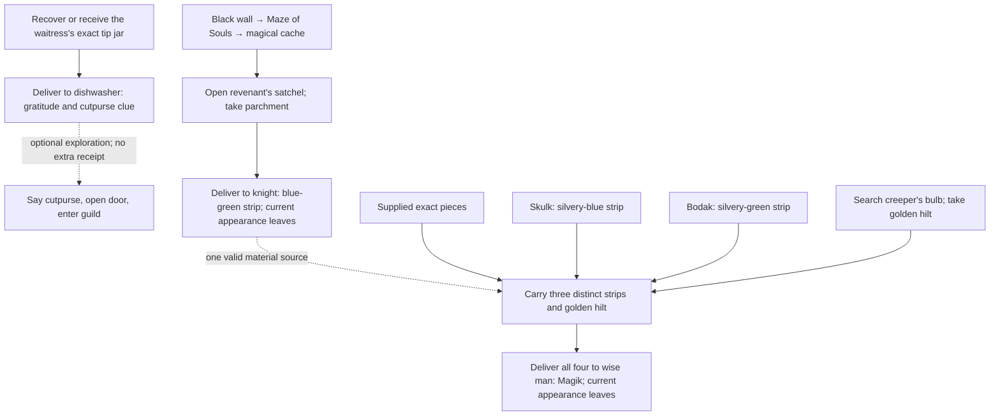

# Mini Zones: comprehensive source story map

Priority 34, source area `minizones`, canonical zone 57. The complete source
review is recorded here; played qualification remains pending. Discovery,
encounters, player journals, achievements and new daily eligibility require
active, ready economic accounting. This checkpoint adds journal guidance and
tests. **No native zone, quest, reward or procedure repair is shipped here.**

The [revision-one journal](../../../areas/story/minizones.story.json) covers
all seven exchanges with two stories, one request and four armor services.
Eighteen contacts cover all eleven addressed dialogue families and useful
source/service roles. Sixteen optional checks describe carried materials and
the knight's earlier receipt. Three achievement and potential daily units
replace seven baseline achievement units: the four paid recipes are support
services, preserving their native terms and historical receipts. Reset mode
two, generation, current recipients and repeatability still need qualification.

## Evidence and review boundary

Read all 21 [native blocks](../../../areas/qst/minizones.qst): seven Q,
twelve M and two MA. Eleven dialogue families are addressed; three Thrulmar
`qc_action` responses are ambient. Empty giver sections 5767 and 5786 contain
no implemented exchange. Read all 300 [rooms](../../../areas/wld/minizones.wld),
including 257 exact prose groups, 36 numeric headers, 71 non-exit metadata
groups and 180 exit families. Read all 125
[mobiles](../../../areas/mob/minizones.mob), 124
[objects](../../../areas/obj/minizones.obj), five
[shops](../../../areas/shp/minizones.shp) and 548
[resets](../../../areas/zon/minizones.zon), grouped into 358 families.
Commands comprise 245 M, 143 G, 90 D, 21 P, twenty O, nineteen F and ten E.
All have eight arguments and zero reserved fields. Chances are 541 at 100,
two at 75, two at 25, and one each at 33, ten and fifty. All local reset
prototype/room targets resolve and all declared mobiles have a placement.
Canonical bounds are 5679–5999; local rooms are 5700–5999.

Six literal [assignments](../../../src/specs/specs.assign.c) attach `dryad`
to 5701/5702, `navagator` to 5739, `world_quest` to 5755, `pet_shops` to
room 5783 and `sword_named_magik` to object 5805. Read the complete
[Mini Zones procedures](../../../src/specs/specs.minizones.c), shared
[pet/inn handlers](../../../src/specs/specs.room.c),
[random world-quest entry and callbacks](../../../src/specs/specs.world_quest.c),
[shop loading/purchase](../../../src/economy/shop.c),
[speech-door handling](../../../src/cmd/actcomm.c), world loading/reset
and the actual Magik combat call chain. There are no local ACT_TEACHER or
ACT_SPEC_TEACHER mobiles, `_proclib_` records or additional computed epic
teachers. Optional `areas/world.trg` is absent. Room 5865 receives the shared
inn procedure from its flag; Jenna's bar is not that rental room. Legacy
room metadata `M 0 30` at 5730 is not handled by the current world loader;
it cannot establish a scripted movement or quest objective.

The [reproducible source index](../../reference/zone-story-audits/minizones.md)
lists exact contracts, dialogue, assignments and reset coverage. Relevant
shared source/GET/search, global P parent selection, keys, portals, hazards,
native exchange and accounting policies remain as reviewed in earlier dossiers.
Bounded foreign review resolves actual surface/starting-room approaches,
administrative edges, the shared huge crystal and other referenced prototypes.
This does not certify deployment-only scripts, admitted resets, stock, player
acquisition, payment, spell effects or played travel.

## Independent progression stories

The dishwasher's request, knight's release and sword restoration are three
independent outcomes. Native acceptance permits supplied materials. Earlier
receipts explain possible preparation; they cannot substitute for spent items
or impose a personal acquisition requirement. The final sword receipt does
not prove the knight, maze, each carrier, access route or combat power.

| Outcome | Exact prerequisite and source | Accepted result and limit |
| --- | --- | --- |
| Dishwasher's missing tips | Tip jar 5750, G cap one on waitress 5759 at dining room 5831; the jar is hidden and closed. Ask the dishwasher `waittress`, retaining the actual source spelling. | Giver 5750 consumes the jar and provides gratitude/cutpurse information. No native item, money or XP reward; jar contents are not an additional Q requirement. No guild-membership change. |
| Forgotten knight's release | Parchment 5804, P cap one in satchel 5803, carried by revenant mobile 5803 at cache 5963. Satchel is closed rather than key-locked. | Giver 5800 at dead end 5892 issues blue-green strip 5794 and disappears. The parchment mentions Gaffin/Fields of Evermeet, but no implemented Gaffin encounter, escort or replacement is required. |
| Restore Magik | One each of silvery-blue 5793, blue-green 5794, silvery-green 5795 and golden hilt 5806, simultaneously carried. The three strips share generic aliases but are different kinds. | Wise man 5801 at hut 5904 joins sword 5805 and disappears. Optional knight/parchment history does not block supplied pieces. This does not defeat Driedel, restore the city or prove a triggered sword power. |

Blue strip 5793 is G cap one on skulk 5798 at destroyed shop 5879; green
strip 5795 is G cap one on Bodak 5802 at lair 5920. Blue-green 5794 has no
ordinary reset producer; the knight's exchange is its reviewed local source.
Hilt 5806 is hidden P cap one inside bulb 5807, G cap one on creeper 5804
at 5928. Searching reveals accessible hidden contents; taking them establishes
current custody. Yellow musk zombie followers are not the hilt producer.
Reset addresses are leads, not a guarantee that a roaming carrier stays there.

The secret downward passage at 5876 reaches 5938, whose south exit leads
to black wall 5788 at 5939. Its portal destination is 5940. The knight's
directions **east, south, east, east, west, south, east, east** follow actual
exits to secret passage 5960. Continue east, south, south to cache 5963.
White wall 5789 at 5942 returns to 5938. Side pits and crater falls remain
separate hazards; entering or reading a route is not confirmed travel credit.

Optional city preparation uses tiny golden key 5796 on the second F-loaded
unseen servant 5799 at 5882. The first servant has only a broom. Concealed,
locked panel 5798 holds clear potion 5799 and oil of etherealness 5800.
These aids are not sword prerequisites. Mob and object numbers occupy
different namespaces; the cache's revenant and satchel share 5803 legitimately.

## Four supporting armor services

Quartermaster 5812's shop at 5988 stocks ghostly pieces. Thrulmar 5813 is
in the loft 5989 above sparring hall 5987. Ask `hi`/`hello`, `blood`/`gem`/
`shards`, then the appropriate recipe topic. His three ambient thoughts are
not additional keyword objectives. All four recipes require **five separate
huge blood crystals 500025 plus 400 platinum / 400,000 copper** and one
matching ghostly base. Current mixed-fee guards keep these unavailable.

| Recipe topic | Exact ghostly base | Exact output |
| --- | ---: | ---: |
| `armplates` | Sleeves 5811 | Jagged blood crystal arm plates 5815 |
| `legplates` | Pants 5812 | Heavily-spiked blood crystal leg plates 5816 |
| `gloves` | Gloves 5813 | Razor-knuckled blood crystal gloves 5817 |
| `boots` | Boots 5814 | Spurred blood crystal boots 5818 |

Each six-item offering fits the existing item-count bound; the coin term,
not that bound, requires coordinated payment settlement. Twenty-four Surface
Realm ground declarations supply crystal 500025 with global cap 24. The
quartermaster uses ordinary coin shopping and production stock, despite room
prose about marks of honor. Buying, supplied material, four crystals and five
crystals must be distinguished. Neither a ready inventory nor a historic
service receipt pays a future fee or adds a quest/daily achievement.

## Access, custom behavior and quest-like lore

| Region / behavior | Actual reviewed behavior | Journal treatment / prerequisite gap |
| --- | --- | --- |
| Broken Blade guild | Reciprocal door 5833 east / 5834 west has key -2 and cutpurse keyword. Accepted speech removes locked/secret state; opening and passage remain separate. Tavern has a valid Surface 539287 approach through 5830. | Optional access guidance. Needs accepted phrase, exact door state/episode and confirmed arrival for personal milestones. |
| Ruined city | Valid reciprocal entry from Surface 517480 to 5868; maze, tower, servant panel and forest hut form actual sword routes. | Independent outcomes; no implemented king defeat or whole-city restoration. Record current NPC appearance and source/container lineage before all-stage policy. |
| Ruined outpost | Valid Surface 568229 entry through 5974. Storage niche 5975 holds key 5820; secret crawlspace from burnt cell 5997 leads through 5999. Torturer 5811 at 5998 carries hidden lockbox 5819, containing money, two wrath items and a chance-loaded wand. | Cache guidance remains independent of the armor services. Do not treat its loot as a recipe reward or personal torturer-kill proof. |
| Elvengrove tree | Traveller 5718 at wayhouse 5770 carries oaken key 5700 for tree doorway 5717. Princess 5701 at 5730 wears neck loop 5702; ancient desk 5701 uses that different key. | Optional exploration. Carried/HOLD key policy and worn-to-carried access need qualification; neither key is a sword prerequisite. |
| Dryad charm / relocation | Procedure attached to princess 5701 and enslaved human 5702; princess branch tests 5702, while ordinary dryad 5700 is unassigned. Destinations 5739/5744 are Darkmore forest rooms in the current file. Procedure charms males, creates pet/follower relations and restricts commands. | Revision mismatch, not a qualified rescue. Builder must choose intended identities/destinations; require safe actor/follower and charm/relocation outcomes before credit. |
| Navigator assignment | `navagator` attaches to insect swarm 5739; implementation refuses orders and checks foreign navigator identities 11101/11301 for shout/helper behavior. | No local sailing quest inferred. Review intended binding before removing or reassigning it. |
| Magik combat | `fight.c` calls `weapon_proc`; `attack_effects.c` forwards `CMD_MELEE_HIT` 1000 through `invoke_object_special`. This passes Magik's nonzero `cmd / 1000` gate; its one-in-thirty roll attempts dispel. | Dispatch is present. Add qualified spell result, actor/target and worn item UID only if power-use objectives are desired; acquisition alone earns none. |
| Inn / wayhouse / pets | Arlik stocks an obsidian upper-room key; actual inn rental room is 5865. Pet handler at 5783 uses next **real room index**, resolving barn 5784, rather than labelled storage 5782. Paid purchases/rentals/claims retain accounting guards. | Service guidance only. Claim code's pet restoration is commented out before fee/ticket consumption; restoration and recoverable ownership/payment must be repaired before enablement. |
| Separate generated tasks | `world_quest` is assigned to potash miner 5755 at Broken Blade bar 5832. Nearby elderly bartender 5751 has no such assignment. | Preserve the separate random world-quest system; no extra static story units or false bartender instructions. |
| Other mini-areas | Kejok monolith/ancient brownie, minotaur ritual glyphs, worms/nest, pond, inn bribery, companion plaques and Jenna's gambling furnishings have lore or ordinary mechanics but no reviewed additional static terminal. | Explain exploration without inventing ritual, win, escort, healing or region-clear achievements. Builder chooses an explicit supported endpoint before extending a story. |

Nine declared exits target absent rooms: 5700 north→209375, 5734 south→212971,
5794 north/east/south→153136/153237/153336, 5795 west→252703,
5829 south→232743, 5970 west→217219 and 5972 west→121632. World renumbering
removes unresolved edges. Several other mini-areas have valid ordinary
surface connections, so these findings do not mean all Mini Zones are
unreachable. Pond 5804's mist-room exit and 5806's valley exit resolve but
are nonreciprocal; review intended directionality, not an automatic defect.
Administrative arrivals are not ordinary player entry or discovery evidence.

## Capability and repair queue

**Everything in this table is planned, not a shipped zone repair.** Keep any
implemented native repair in a clearly named fix commit where practical and
in the PR's player-visible repairs section. State the zone, trigger, before /
after behavior and validation; link the commit so news can identify completed
fixes without promoting source findings or journal additions as fixes.

| Finding | Balanced implementation / repair plan | Qualification |
| --- | --- | --- |
| Actual source versus gifts; hidden nested materials | Extend existing first-source/GET events with object UID, committed reset/shop generation, actual P parent UID/location and accepted actor custody. Supplied exact items remain valid delivery inputs. | First/reset/recovered/forced sources, gifts, carried matching containers, search without GET, consumed/replaced pieces, retry/recovery and no fabricated personal history. |
| Spoken gate and maze | Emit accepted topic/examination/access/travel outcomes after actual handler success with target/exit/episode. Keep the reviewed route as guidance until then. | Cutpurse rejection/acceptance, unlock versus open versus arrive, pre-open doors, missing destination, portal movement, charm restrictions and recovery. |
| Recipient episodes and independent/full-stage history | Preserve three current exact receipts; separately define an opt-in all-stage knight/sword episode if builders want it. Freeze actor, NPC generation, source lineage and branch policy. | Supplied finale, each independent receipt order, retirement/reset/replacement, lost/spent proof and owned Surface crystal history. |
| Four mixed-fee recipes | Admit all six exact materials, wallet debit, output and receipt as one recoverable operation; keep guards until qualified. Preserve four recipes and existing prices/rewards. | Four/five crystals, worn base, insufficient/full fee, exact distinct UIDs, replay at every boundary and no service achievement. |
| Nine missing edges | Builder selects intended loaded approach/return targets; repair only approved edges, preserving valid alternate entries and difficulty. | Ordinary entry/return, key/secret constraints, reset state, administrative arrivals and missing destination refusal. |
| Dryad identity and unsafe string/follower handling | Choose intended mobiles, princess branch and local destinations from current area design. Use bounded message construction and stable validated actor/follower identities; review command restrictions and charm/ownership mutation together. | Male/other actor cases, master/follower changes, busy combat, valid/invalid arrival, no stale follower access, restart and consistent accepted state. |
| Navigator/miner assignment wording | Confirm intended identities before rebinding or removing specials. Miner currently provides real generated tasks; do not silently move its service to the elderly bartender. | Correct contact, periodic/order dispatch, foreign helper behavior and unchanged generated-task refunds/retry. |
| Pet claim restoration | Select approved mount/owner/ticket policy; restore a frozen pet successfully before publishing ticket/fee retirement, with recoverable joint settlement. | Missing pet, full room, wrong owner/ticket, payment failure and restart/retry; keep guarded until completion. |
| Lore mismatches and orphan endpoints | Thrulmar says five armor types but has four; native sword prose says Majik while object/procedure say Magik; quartermaster room promises marks of honor while shop takes coins. Builder chooses truthful prose or an explicitly balanced new mechanic. Decide legacy room M metadata and rituals/games separately. | Exact player terms and accepted outputs, all four recipe topics, normal shop pricing and deliberate endpoint policy; no guessed fifth recipe or token economy. |

## Validation and limits

Focused production tests check complete exact binding coverage, all contact
aliases/topics, seven classifications, source/reset parents, item quantities,
three achievement/daily candidates and the actual maze/cutpurse topology.
Native projection fixtures check distinct versus duplicate strips, worn versus
carried hilt, supplied pieces without a knight receipt, read-only readiness,
four versus five crystals, support exclusion and independent receipt recovery.
These are parser/projection/receipt fixtures, not live payment or source journeys.
The shared execution register records exact completed checks and build results.
Native world files, procedures, rewards, migrations and accounting activation
are unchanged in this checkpoint. All proposed repairs above remain pending.
