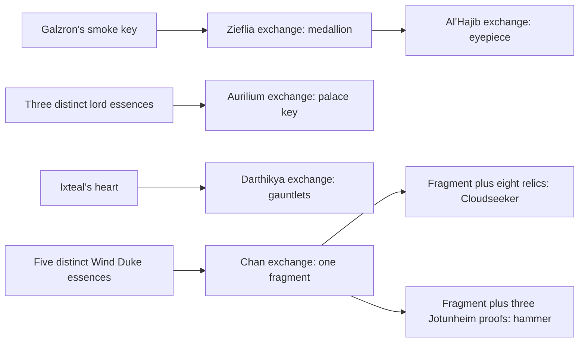

# The Tempest Court: comprehensive source map

Reviewed October 4, 2026. Zone 1316, `airp`; roadmap priority 55.
**Source review is comprehensive; live gameplay qualification remains pending.**
Active, ready accounting is required for discovery, encounters, journals and new
achievement/daily credit. Frozen obligation recovery remains separate.

The [schema-three journal](../../../areas/story/airp.story.json) covers eight
native contracts as **seven named outcomes**, with 21 contacts and 28 optional
checks: 25 current carried-material checks and three personal receipts. Both
Al'Hajib identities are equivalent recipients for one medallion-return outcome.
Five story units retain native daily shape. Zieflia and the north wind disappear;
with reset mode zero, their contracts remain story-only. This classification
does not certify actual supply, suitable difficulty or daily availability.

## Reviewed evidence

- All 26 [native blocks](../../../areas/qst/airp.qst): eight Q, seventeen M
  and one MA, including full prose, aliases, quantities, rewards and retirement.
  The MA family is addressed ASK/TELL with room-wide output, not an ambient
  trigger. The generated index sanitizes sixteen dialogue families: two raw M
  families contain `si'ciltron` and are omitted by its token filter. The journal
  keeps the valid `galzron`/`ecthius` aliases and explains the apostrophe topic
  in prose. No keyword achievement or learned-state event is fabricated.
- All 200 [rooms](../../../areas/wld/airp.wld), full prose, headers,
  metadata, extras and exits: 65 exact prose groups, fifteen headers, nineteen
  non-exit metadata groups and 216 exit families. Physical interval
  131600–131799; registry interval 131399–131799. Header
  `131799 0 0 40 50 3` and reset mode zero remain unchanged.
- All 52 [mobiles](../../../areas/mob/airp.mob), 63
  [objects](../../../areas/obj/airp.obj) and 307
  [resets](../../../areas/zon/airp.zon) in 135 exact families:
  M192/E39/D30/O17/G15/F8/R6. No local shop or ACT_TEACHER prototype.
  All referenced active prototypes/targets resolve; resolution is not runtime
  admission. F and R are traced in order, including the actual item owner.
- The sole literal special assignment is dagger 131616 →
  [`dagger_of_wind`](../../../src/specs/specs.underworld.c#L4416).
  Its full active procedure and the commented historical version were reviewed.
  There is no active literal local mob procedure. Encoded weapon effects are
  distinct from assigned callbacks. Relevant native quest, reset, movement,
  trap, portal, lock, epic-touch and item-provenance paths were reviewed.
- Active global source/consumer scans and bounded full foreign prototypes
  include the Cloudseeker relics, their two foreign quest producers, the actual
  dragon-hide/Kahir inputs, Jotunheim proofs and Mistweave's combat effect.
  The sole ordinary boundary is Cloudwalk 131600 DOWN ↔ Plane of Air courtyard
  24422 UP. The cloud portal's foreign target 1823 in Troll Hills also resolves.
  The [generated index](../../reference/zone-story-audits/airp.md) provides
  navigable evidence; this dossier supplies the semantic conclusions.

## Exact native outcomes

| Q line / recipient | Exact loose-carried roots → reward | Retirement / journal |
| --- | --- | --- |
| 205 / Zieflia 131635 | smoke key 131605 → medallion 131627 | D1; `zieflia-rescue` |
| 14 / Al'Hajib 131615; 261 / Al'Hajib 131651 | medallion 131627 → sapphire eyepiece 131628 | D0; one `alhajib-medallion-eyepiece` outcome |
| 152 / Aurilium 131618 | frost 131609 + smoke 131610 + mist 131611 → palace key 131612 | D0; `aurilium-palace-key` |
| 165 / Darthikya 131621 | Ixteal heart 131615 → frost gauntlets 131636 | D0; `darthikya-ixteal-heart` |
| 186 / Chan 131630 | 131642 + 131643 + 131644 + 131645 + 131646 → fragment 131647 | D0; `chan-maelstrom-fragment` |
| 98 / north wind 131616 | 55553 + 8735 + 70976 + 88304 + 97066 + 131617 + 138268 + 138515 + 131647 → Cloudseeker 131650 | D1; `north-wind-cloudseeker` |
| 240 / Fearfrost 131637 | fragment 131647 + Frostbite 96000 + Mistweave 96012 + token 96055 → hammer 131648 | D0; `fearfrost-thrym-hammer` |

Each input is one root of its own exact kind. Five copies of a single Duke's
essence do not satisfy Chan; carrying a similar frost essence cannot substitute
for smoke or mist. There are no coin inputs. The largest bundle is nine roots,
within the existing fourteen-root durable offering limit. Worn/held equipment
does not satisfy the native loose-carried offering search. A supplied proof is
valid without a personal kill, first acquisition, original-source custody or
earlier quest history. All preparation steps remain optional.

The older Al'Hajib has no active M/F/R source in the scanned inventory; the
current recipient is declared at 131654. The grouped outcome preserves both
native receipt identities without requiring two rescues or double credit.
His narration assumes rescue, but acceptance checks only the medallion kind.

Arrows describe ordinary producers, not enforced personal history. Chan's
fragment is consumed in either later recipe. Both outcomes can be completed
with separate supplies; no permanent faction choice or mutually exclusive
campaign is invented. A fragment receipt does not recreate a spent fragment.
Cloudseeker is an armor object, not a new pet/follower NPC. The native D1 removes
the old elemental; restoration, binding and divine blessing remain broader lore.

## Normal access and actual sources

Most local terrain is SECT_AIR_PLANE. Native movement requires flight or
levitation when entering; moving horizontally from that sector requires flight,
whereas levitation supports up/down. The acting mount is checked as applicable.
Air-plane movement does not itself implement gravity falling. Visibility,
combat, darkness and current custody still govern encounters and recovery.

| Portal / placement | ENTER destination |
| --- | --- |
| 131600 at 131605; 131601 at 131610 | 131610; 131605 |
| 131603 at 131720; 131604 at 131736 | 131736; 131720 |
| 131606 at 131730; 131607 at 131751 | 131751; 131730 |
| 131613 at 131647; 131614 at 131768 | 131768; 131647 |

All eight have command seven, unlimited charges. Named ENTER must select the
actual portal. Arrival at palace top 131768 does not bypass its downward door:
131768 DOWN ↔ 131769 UP uses palace key 131612. D resets lock the DOWN side
and merely close the reverse. The key's normal-unlock break chance is zero.
Current key possession remains an optional access aid, not a durable travel fact.

Si'Ciltron 131611 starts at war chamber 131628, carrying mist 131611.
Closed mist door 131627 WEST ↔ 131628 EAST gives the real approach/return.
Galzron 131631 starts in smoky chamber 131748 with smoke 131610 and prison
key 131605. Smoke wall 131745 SOUTH ↔ 131748 NORTH has asymmetric D1/D5
reset secret states; discover/open the actual side rather than assuming both
remain hidden. Prison 131740 NORTH ↔ Zieflia 131741 uses key 131605; the
south cell 131742 has key zero and no native captive exchange. Normal use of
the smoke key preserves it, while Zieflia's accepted exchange consumes it.

Ecthius 131636 starts in cold chamber 131767 with frost 131609. Steel frost
key 131608 is granted in barracks 131759 to the **second F-loaded aerial
servant**, after the leading guard and two follower loads. It is not on Ecthius
or every servant. It fits office 131754 EAST ↔ 131760 WEST; normal use has a
two-percent break chance. Raw world door state two still creates a real door:
`setup_dir` maps nonzero low state bits to EX_ISDOOR, and D resets set lock state.

Ixteal 131619 starts at 131613 with heart 131615, nominal M50%; Darthikya
131621 starts at 131634, M75%. Chan starts at 131772, M100%, naturally
invisible. Fearfrost starts there at M50%, sentinel. The north wind starts at
131643, M100%. Starting rooms are not current locations for mobile actors.

All five Wind Dukes start at guest room **131633 in the mist fortress**, each
nominal M50% and cap one. Amophar 131623 wears Four Storms 131642 at neck;
Icosiol 131625 wears Winds of Fate 131643; Zosiel 131624 wears Great Maelstrom
131644; Uriel 131626 wears Unseen Breeze 131646; Emoniel 131627 carries
Boundless Blue 131645. Their object admissions are 100%, cap one. These are
five item kinds despite shared quest-item type and descriptive motifs.

Akadi starts at 131792 with north-wind cloak 131617, dagger 131616, encoded
Air Attack 131653, sword 131658 and imported epic rune 359. Six R loads also
put swords 131658 on living-tempest mounts 131605: after R, the E/G target is
the mount, not the preceding rider. The wind dagger's 1-in-15 melee effect
stops combat and can deflect opponents; the old extra-attack version is commented
out. Neither effect publishes a story completion. Existing epic touch already
settles rewards/participants durably; use that committed result for future
story integration, with no second payout or credit for merely typing TOUCH.

## Foreign proofs and competing use

| Proof | Active declared supplier / producer |
| --- | --- |
| wisp of wind 55553 | Winterhaven Lancer 55151 Q2619 accepts gem studded dragon hide 93011 and gives all five wisp kinds. Treasure Caves red dragon 93017 equips the hide. |
| living breeze 8735 | Lair of the Gibberling King Blood Horde archer 8748, E at feet; reset equipment attached to one archer load in room 8792. |
| four-winds boots 70976 | Hall of Knighthood Zephron 70920, E feet, starting room 70920. |
| imperceptible cloak 88304 | Charcoal Palace Aeolyn 88312, E back, starting room 88426, nominal M50%. |
| ethereal-winds shroud 97066 | IceCrag Castle O at icy vault 97121; cap one/100%. The room has no ordinary exits; foreign access/return needs its own qualification. |
| north-wind cloak 131617 | Akadi, local E back. Supplied cloak fits without a personal defeat receipt. |
| North Wind katana 138268 | Mitashi/Jade Empire Lord Hanyo 138239, E wield, starting room 138354. |
| ageless-wind cloak 138515 | Savannah Watcher 138545 Q513 accepts Kahir essence 138514, then departs. Ghostly Kahir remnants 138546 carry the essence. |
| Frostbite 96000 | Jotunheim Thrym 96027 at 96191, E wield, nominal 40% item admission/cap one. |
| Mistweave 96012 | Jotunheim Utgard-Loki 96040 at 96287, E wield/cap 999; active smoke-combat callback, separate from delivery. |
| allegiance token 96055 | Jotunheim high priest 96067 at 96191, E/cap two; secret object flag affects perception. |

The wisp also feeds three duplicated brewing services, Alatorin arcanum and
Surface Mini Zone services. The katana also feeds the Jade sword bundle and
Savannah music exchange. These consumers are separate foreign outcomes, not
mandatory Cloudseeker prerequisites. No foreign Q consumer of the local key,
medallion, essence, fragment, eyepiece or named reward kinds was found in the
bounded scan. Object prototype ownership, source-area ownership and the local
accepting recipient are distinct; a later receipt cannot infer the current UID's
origin or a personal foreign journey.

## Supply and capability expansion

Current `reset_zone` refuses O/P/G/E and table item issuance during active
accounting because those commands lack a durable generation identity. Preserve
this guard. Plan admitted source/reset generation, limits, custody, NPC death
containers, rare selection and replacement/recovery before claiming replenishment.
Normal unforced M resets also admit only 100% declarations; nominal 50/75/10%
mobile sources are rolled through forced/initial resets, not guaranteed ordinary
renewal. Reset mode zero and durable epic-triggered reset scheduling are not
proof that rare sources or spent items are restored. Test explicit successful,
refused, interrupted and recovered generations with accounting active and ready.

Extend the universal plan with:

- Accepted item UID/prototype, actual M/F/R/reset owner and generation, source
  custody, corpse/container extraction, first personal recovery and player handoff.
  Supplied proofs stay valid delivery routes; source achievements need separate
  builder predicates and durable events.
- Accepted unlock, key retention/destruction, hidden-side transition, controller
  and actual travel arrival, including flight/mount/perception restrictions.
  Current possession does not prove an already used or broken key's access history.
- Material allocation and branch attempts for a consumed fragment and shared
  foreign wisp/katana. Allow separate later supplies; do not retroactively force
  an exclusive faction decision or require earlier personal producer receipts.
- Scoped ALL, actor departure/escort/restoration, boss defeat, divine effect and
  terminal campaign transitions. Define participants, owner zone, episode,
  retries and replay before crediting Aurilium's release, Zieflia's arrival home,
  Chan's visibility or restoration of Yan-C-Bin. Deliveries alone prove none of
  those effects. Reuse the committed epic-touch result and its existing payout.
- Lossless dialogue-family auditing and punctuation-capable builder topics.
  Preserve native addressed MA semantics; don't infer learning from typing a word
  or let the index's sanitized count imply complete raw-topic coverage.

## Native repairs shipped separately; pending findings

**Shipped fix:** [dc586e34c](https://github.com/Community-Duris/Duris/commit/dc586e34c75fea9dc4016416cc95bd1637499e63)
changes exactly two direction words. Inspecting Si'Ciltron's return mist door
now says **east**, matching 131628 EAST →131627. Looking at prison 131740
now describes cells **north and south**, matching its real reciprocal exits.
The [focused regression](../../../tests/async/test_airp_directions.py) fails
each original clue and passes after correction; byte comparison preserves all
other native content. Live LOOK/traversal remains unqualified.

**Player news:** “The Tempest Court's war-chamber return door and prison-cell
directions now match their actual exits.” Journal additions are a separate commit.

| Pending finding | Evidence, balanced repair plan and qualification |
| --- | --- |
| Promised eyepiece upgrades | Current Al'Hajib reward mentions the right gemstone; 131659–131662 define three- through six-point eyepieces, but active producer/consumer/reset/assignment scans establish no upgrade implementation. Builder must choose gems, transformations, reward balance and accepted accounting effect before adding recipes/credit. The base eyepiece exchange is implemented. |
| Empty cloud portal | O131641 at 131652 declares Troll Hills 1823, command zero and zero charges. Shared teleport dispatch cannot interpret it as normal ENTER. Confirm intended destination/command/charge/return policy, then fix and test actual travel/refusal/arrival. The ordinary Plane of Air boundary remains separate. |
| Lightning trigger configuration | Eight O131602 generators carry `T 3576 5 500 31`: direction bits/reserved bits, energy damage, 500 charges, level31. MOVE1 is absent; shared movement trap dispatch requires it. Builder should decide whether to restore the hazard or revise its intent, then test actual damage, audience, accounting/destruction and balance. Lightning prose is not proof of a triggered trap. |
| Rare staging and empty cells/branches | 131797/131799 have no exits and load six named actors; 12%/3% titles are not the M100% admission or an active dispersal implementation. 131798 is an empty trap room. Southern key-zero cell and Chamber of Choices' described east route have no corresponding native captive/exit. Confirm intended staging, capture and route design before repair; ordinary source wandering requires real exits. |
| Unfinished wider planar campaign | Divine sparks 131651/131652 and extra Air Attack prototypes 131654–131656 have no declared source or established live transition; quasiplane dead ends do not implement melting, god restoration or summoned-army stages. Active Akadi equipment/combat still exists. Design selected actor/effect/episode endpoints instead of declaring the entire encounter broken. |
| Wind-dagger lifecycle | The procedure keeps raw actor/victim/room iteration around combat stops and deflection. Qualify actual lifetime, movement, target text and room iteration before any shared combat repair or story event; no live crash was reproduced in this source audit. |

The preceding Tower dossier's shared epic-absorption lifetime finding remains a
separate proposed repair. Do not couple it to these two direction corrections.
Any later native repair needs its own clear `fix:` commit and PR entry naming
zone, player trigger, before/after, tests, remaining limits and shipped news.

## Verification and boundary of completion

Focused source fixtures verify all contracts, exact preparation/history,
equivalent recipients, native repeatability, local key/portal/trap/reset ownership,
foreign producers and the two corrected clues. Actual C++ journal journeys cover
encounter visibility, loose versus worn proof, five different essences, both
fragment consumers, optional history without invented sourcing, supplied final
acceptance, independent outcomes, receipt replay and cold recovery.
Full production catalog/index, daily evidence, tracking/feature regressions,
maintained server build and changed/staged formatting are checkpoint checks.

These are source/parser/projection checks. Actual accounting admission, item
acquisition, combat, traps, search, perception, lock/portal travel, recipient
retirement/rare renewal, epic group settlement and played persistence need
separate gameplay qualification. No DB/account/server operation, migration,
deployment or merge is part of this source checkpoint.

The original roadmap now has **55/220 complete source maps, 165 pending**;
The Caverns of Armageddon (`hunt`) is next. Catalog projection becomes 76 maps,
1637 achievement units, 1464 potential daily units and 2211 rows. Grouping two
equivalent Al'Hajib recipients removes one duplicated outcome/daily unit. All
2668 native definitions, revision-two fingerprint, registry and previous 75
journals remain unchanged.
