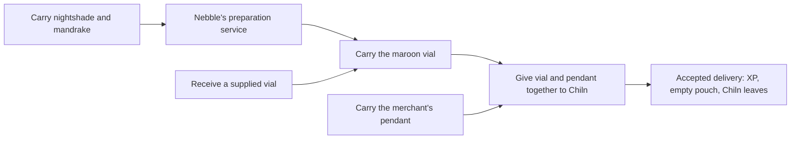

# Tharnadia: comprehensive source story map

Priority 33, source area `tharnadia`, canonical zone 1325. Complete source
review is recorded here; active-world qualification remains pending. Discovery,
encounters, journal publication, achievements and new daily eligibility require
active, ready economic accounting. This work does not activate accounting,
run migrations or change native world content.

The [revision-two journal](../../../areas/story/tharnadia.story.json) explains
all nineteen native exchanges: eight independent story outcomes, eight support
rows covering ten contracts, and one excluded typed-food request. Zech's two
same-named two-handed inputs share one service; the two brothel alternatives
share another. Twenty-six contacts cover all twenty-four addressed dialogue
families, recipients and useful source/service roles. Twenty-three optional
checks distinguish live material from earlier preparation receipts. Eight
achievement and potential daily units replace the baseline's eleven; service
receipts remain preserved. Reset mode two, source availability and telemetry
must still be qualified before promising live daily availability.

## Evidence and review boundary

Read all 44 [native blocks](../../../areas/qst/tharnadia.qst): thirteen QA,
six Q, twenty MA and five M. Twenty-four M/MA families are addressed; the
knight's `qc_action` advice about holy ascent is ambient. Read all 584
[rooms](../../../areas/wld/tharnadia.wld), including all 480 exact prose
groups, 53 numeric headers, 120 non-exit metadata groups and 331 exit families.
Read all 176 [mobiles](../../../areas/mob/tharnadia.mob), 206
[objects](../../../areas/obj/tharnadia.obj), nineteen
[shops](../../../areas/shp/tharnadia.shp) and 1,480
[resets](../../../areas/zon/tharnadia.zon), grouped into 661 families.
Commands comprise 531 M, 431 E, 234 G, 118 D, 111 O, 43 P, eleven F and one R.
All declarations have eight numeric arguments, chance 100 and zero reserved
fields. Canonical bounds are 132069–133083; local rooms are 132500–133083.
All positive outgoing room targets resolve. Reset line 1052 references missing
**mobile** 132677; the same-numbered map **object** exists in its own namespace.

Thirty-one literal [assignments](../../../src/specs/specs.assign.c) attach
town flavor, dice, welfare, janitor, retired money exchange, two random-world
quest bartenders, cleric, locker, inn, three pet rooms, ship/crew, tradeskill
and guild services. Read the complete local
[Tharnadia implementation](../../../src/specs/specs.tharnadia.c), including
the dice procedure and outpost captain. The captain's literal assignments are
foreign 150115–150140, so its realm-defense behavior is not a local inn quest.
Read applicable welfare, janitor, cleric, locker, inn, pet/claim, money-changer,
teacher, tradeskill, guild and ship/crew entry handlers. Existing bounded shared
accounting and reward/XP reviews remain applicable; random bartender quests
remain excluded from this static native catalog.

Computed roles include sixteen ACT_TEACHER mobiles: 132612, 132631, 132648,
132649, 132653, 132656, 132659–132661, 132665–132669, 132672 and 132673.
Melmba 132656 also has ACT_SPEC_TEACHER. None has a local epic-teacher table
entry. The default [teacher](../../../src/classes/epic_skills.c#L424) handles
matching-class level advice, without turning every practice command into a
quest. Checked bootstrap teacher assignment, specialization dispatch, item
switch binding and room properties. There are no additional local inn/arena
flag assignments or `_proclib_` records. Optional `areas/world.trg` is absent;
deployment scripts need separate review if introduced later.

Shared source review covers exact native acceptance/reward settlement, reset
parents/caps/slots, global container selection, ordinary shops, keys, hidden
contents, secret/blocked doors, item switches, teleports and falling rooms.
Read foreign input/reward/support prototypes, their relevant source and shared
roles, including administrative paper, starter weapons, Tezcat dagger,
raven-feather quill, disguise kit, armor effect and epic/PvP services. Bounded
foreign review includes the dagger's actual Tezcazul/reset/altar and every
loaded Surface/Braddistock/administrative entrance room. Ailvio's already
reviewed certificate producers supply several weapons; this does not make
Tezcat, limbo or any other foreign area newly comprehensive. The
[reproducible index](../../reference/zone-story-audits/tharnadia.md) retains
raw anchors separately from interpretation.

## Independent outcomes and exact terms

This is suggested progression, without enforced campaign order. Cash amounts
are copper, and native XP retains the existing actor/group policy. QA response
broadcasting does not imply an all-stage prerequisite or an actor-state mutation.

| Outcome / service | Exact native input | Actual accepted result | Progress meaning |
| --- | --- | --- | --- |
| Xero 132665 | Bread 132552 | Boots 132687; recipient stays | Local meal delivery, without hunting/trap history. |
| Arkelyn 132661, alias `arkeln` | One each of toys 132682/132683/132684 together | 10,000 cash and 1,500 XP; recipient stays | Three distinct toys, without a weapon lesson or musical performance. |
| Leodra 132666 | Large blank book 132685 | Autographed book 132686; recipient stays | Actual recipe has no quill or class requirement. |
| Rhed 132673 | Wolf-pup item 132700 | Belt 132701 and cloak 132702; recipient stays | Phobos delivery, without a living pet/follower or revival event. |
| Chiln 132667 | Maroon vial 132697 and pendant 132699 together | Empty pouch 132698 and 3,000 XP; recipient retires | Medicine-and-pendant finale; earlier gathering/production is optional. |
| Zaberetornaz 132613, note | Note 132624 | Spellbook 132622 and glowing quill 132623 | Independent from the two other wizard commissions. |
| Zaberetornaz, magical text | Text book 132664 | Raven-feather quill 99412 and tome 132620 | Foreign reward prototype does not relocate city credit. |
| Zaberetornaz, foreign dagger | Tezcat dagger 98928 | Disguise kit 500, robe 132629 and potion 132630 | Supplied proof works without personal Tezcat combat or reward-power use. |
| Nebble 132669 medicine service | Nightshade 132694 and mandrake 132695 together | Vial 132697; recipient stays | Producer history explains Chiln's route, without another achievement. |
| Ithilin 132659 map service | Paper 5 | City map 132705 | Valid administrative prototype; no performance or exploration completion. |
| Menae 132672 wand service | 1,000 cash | Practice wand 132703 | Coin-only settlement currently refused under active accounting. |
| Brothel 132587 ticket alternatives | Ticket 132600 alone, or ticket plus sheath 132601 | Penalty item 132602, or three XP | One service row; two exact receipts, without recorded disease state. |
| Zech 132660 long-sword service | 1108 | Sharpened sword 132681 | Exact ordinary input, without generic weapon or lesson credit. |
| Zech two-handed service | 1110 **or** 1111, one per branch | Sword 132678 | Same-name alternative inputs grouped as one service. |
| Zech thin-dagger service | 1112 | Sharpened dagger 132680 | Not the foreign bloody dagger. |
| Zech short-sword service | 1113 | Short sword 132679 | Independent equipment service. |
| Homeless child 132581, excluded support | Any ITEM_FOOD type 19 | 33 XP; recipient retires | Typed selection is unsupported by the current durable offering path. |

The two-item brothel branch precedes the ticket-only branch after native list
prepending. Preserve selected binding and actual inputs rather than inferring
an invented player choice or disease episode. Native acceptance of paper
matches prototype 5, not blank text or a custom claim-ticket payload; builder
review should choose whether later semantic input validation is warranted.

The medicine route illustrates optional preparation and a supplied final:

The final delivery completes one story. The producer receipt explains the
optional route; it neither creates current ingredients nor proves the player
personally searched or gathered them. A later all-stage campaign would need
explicit authored semantics and accepted objective evidence.

## Actual supplies, search and optional preparation

| Material | Reviewed source and exact identity | Qualification consequence |
| --- | --- | --- |
| Bread 132552 | Ground O cap two at inn kitchen 132834; baker 132530 G cap two at 132612 and shop production | Shop and ground supply are alternatives. Other food does not satisfy Xero. |
| Three toys | G cap one each on elf 132664/flute 132682, human 132663/mandolin 132683, halfling 132662/lyre 132684, at 132517 | Two child descriptions swap flute/lyre. Actual reset/object identity governs delivery. |
| Ordinary instruments | Six P cap-one kinds 132689/690/691/692/693/704 in sack 132688 after O at bard room 132824 | None is a valid toy substitute. Borrowing or playing has no accepted quest endpoint. |
| Blank book 132685 | Hidden P cap one in desk 132657 after O at library 132631 | Search reveals; GET collects. Desk prose says locked, but reset container flags are closeable/open. |
| Paper 5 | Ten P declarations, cap eleven, in desk 132657 at library sequence; G cap eleven on Jelian 132570 at 132761 | Prototype is loaded from `limbo.obj`; live container/sale stock still needs qualification. |
| Plants and pup | P cap one each of 132694/132695/132700 in sack 132688 after O at Thera room 132835 | Sack is closeable/closed; contents are ITEM_SECRET. Rhed's under-bed clue differs from actual declaration. |
| Vial 132697 | Nebble's two-herb Q output | Earlier recipe receipt cannot replace a spent vial. A supplied vial skips the personal preparation route. |
| Pendant 132699 | E cap one, neck slot three, merchant 132670 at 132836, with two F bodyguards 132671 | Conversation refuses rather than handing it over. Worn item must become a valid carried proof. |
| Note 132624 | P cap one in glowing shelf 132621 after O at first twisted-tower room 132501 | Portal at sorcerer stair bottom 133010 enters 132501; return portal targets park 132919. |
| Text 132664 | P cap three in shelf 132663 at conjurer room 133018; two P declarations in chest 132653 at royal bedroom 133050 | Shelf and chest are source alternatives. Chest starts closed/locked with key zero. |
| Dagger 98928 | G cap one on Tezcazul follower 98920 at Tezcat altar 98922 | Distinct from Zech's steel dagger; foreign source/gift lineage needs accepted evidence. |
| Ordinary weapon inputs | Heavens prototypes, several Ailvio certificate 29319 rewards | 1111 has no reviewed ordinary reset/Q producer. Preserve valid supplied copies and investigate legitimate computed/starter supply before promising repeatability. |
| Ticket and sheath | G cap 999 / cap one on brothel manager 132551 at 132766 | Availability, shop stock and competing uses are support policy, without story credit. |

Native [P execution](../../../src/world/db.c#L3716) resolves the container
through the global first matching live prototype in
[get_obj_num](../../../src/world/handler.c#L2370). It does not bind a P command
strictly to the immediately preceding O instance. On an ordinary fresh reset,
the newest Thera sack follows the bard's sack; at caps or with carried/moved
containers, contents can land in another matching instance. Desk instances
have the same ambiguity. These declared rooms are leads, not guaranteed live
stock. An accepted reset adapter should freeze the actual parent UID/location
and deliberately preserve or revise this legacy selection policy with builders.

[Search](../../../src/cmd/actobj.c#L9583) requires an accessible/open container,
uses discovery chance and normally reveals one secret object per successful
command. It neither creates the proof nor transfers it into carried custody.
Player search, content reveal, GET, first source acquisition and final native
acceptance are separate evidence. Current optional checks report actual carried
materials; they do not manufacture any of these histories.

## Access, services, lore and custom mechanics

- Five ordinary outward boundaries lead to Braddistock 135001 and Surface
  570424/570422/570823/570023. Mesa and bay exits are reciprocal. Surface's
  incoming north/south links reach 133066/133056 rather than the outgoing road
  endpoints 133070/133064; qualify directed journeys before changing topology.
  Administrative room 24 also enters the city fountain at 132573.
- The western temple gate declares imported key 2999; its reset closes it
  without locking, so the key is not an enforced entry prerequisite. The jail
  stairs use die 132570 as a key. Native `has_key` compares VNUM in carried or
  HOLD inventory, without ITEM_KEY type restriction; the unusual key is valid
  under current rules. Dungeon key 132652 has one jailor source. Some reverse
  doors use key zero; qualify actual lock/open state rather than calling every
  asymmetric key declaration broken.
- Brick 132526 is an ITEM_SWITCH targeting the stair landing 132619's eastern
  secret/blocked exit. Its command is **push** (270), not pull (340). The shared
  switch clears blocked state; ordinary search can then reveal the secret
  route to 132809. Switch success, search and confirmed movement have no
  accepted journal objectives today. Rooftop air/drop rooms retain real falls.
- Inn, guilds, practices, public hospital, bank, locker, ferry, ship, crew and
  pet locations are town support. Tharnadia's money changer explicitly redirects
  exchange to the bank. The crier calls Kabanon a map seller, but no ordinary
  shop record is attached to that mobile; declared maps/default teaching do
  not establish a working public purchase. Preserve it as a content decision.
- Cleric purchases, pet buy/rent/claims and paid locker admission have explicit
  active-accounting guards. Legacy pet claim code has no restoration call.
  Shared ship/crew helpers still need the already-recorded coordinated payment,
  ship mutation/save and interruption work. Tradeskill/epic/PvP paths use their
  own accepted policies; no generic practice/store command is a quest receipt.
- [Dice](../../../src/specs/specs.tharnadia.c) checks the selected held/wielded
  object, rolls its positive face count and directly unequips/drops it. This
  needs accepted custody/result publication before a gambling or rolled-result
  objective. It grants no native quest reward here.
- Holy ascent, Xero's hunting trap/deer stories, Leodra's missing quill, Arkelyn's
  promised lesson, Nebble's foreign drider medicine, Chiln's healing/escape,
  stolen heirloom dispute and Rhed's animal rescue are explanatory prose.
  Existing receipts implement only their exact stated exchanges. The empty
  pouch is explicitly described as a swindle, so its lack of money is a
  narrative twist rather than evidence of a missing reward.

## Balanced repairs and capability additions

| Finding | Proposed decision / repair | Required proof before broader credit |
| --- | --- | --- |
| Inventory called paper 5 missing because negative administrative zones were excluded from its lookup | Correct the audit lookup to use every active prototype source while keeping discoverable output/ownership unchanged. Reclassify Ithilin's real barter as a service. | Regression covers limbo paper and absence of a limbo discovery row; refresh affected evidence indices. Native definitions and fingerprints remain unchanged. |
| Missing mobile 132677 reset | Builder chooses the intended mobile, restoration or retirement. Do not substitute same-numbered map object or guess another NPC. | Validate namespace/loaded prototype, reset parent and intended encounter difficulty; play admitted source/reset cases. |
| Child flute/lyre swap and pup under-bed versus sack clue | Choose accurate prose or deliberate reset placement, retaining all three distinct toys and Phobos's native proof identity. | Exact carrier/room/cap/search and supplied routes; no guessed personal theft/rescue requirement. |
| Desk locked prose, text chest key zero and global P parent ambiguity | Separate misleading prose from real inaccessible stock. Qualify the accessible shelf and live container parent; select targeted lock/source correction if desired. | Cap-hit/moved/carried containers, refused/reset grants, nested source and opening/search/GET/restart cases. |
| Coin-only wand and typed-food offering | Extend exact wallet/reward and typed durable selection/recipient settlement, keeping current refusals until qualified. | Freeze actual item UID/type or coin amount, output/reward, actor/recipient appearance and continuation; rejection, capacity, duplication and restart cases. |
| Claimed lessons, healing, animal recovery, performance and ascent have no durable semantic endpoint | Keep current delivery outcomes; builders choose truthful prose or real accepted actor/NPC/world transitions. Optional producer history is not an all-stage campaign. | Accepted dialogue/examination/access/skill/health/pet/travel events with owned attempts and recovery; supplied terminals never fabricate personal history. |
| Dice direct custody movement; guarded/shared town services | Extend existing item movement and paid-service continuations. Deliberately restore or retire pet claims; fix denied crew debit before mutation. | Freeze draw/target/custody and price/effect/save terms; publication only after accepted settlement, with interruption/concurrency/replay fixtures. |
| Kabanon's map-sale claim and weapon 1111 supply uncertainty | Confirm intended shop/producer policy before adding stock or a new purchase. Preserve legitimate existing/supplied copies. | Live source/price/eligibility and actual accepted outcome, without changing starter gear or town balance silently. |

## Qualification

Focused production fixtures check all nineteen bindings/classifications, all
topics/aliases, exact toys/medicine inputs, shared paper, grouped alternatives,
source parents and the preserved missing-mobile finding. Native projection
fixtures cover encountered-giver reveal, borrowed-versus-toy identity, duplicate
versus distinct materials, carried-versus-worn readiness, supplied finale without
producer history, support exclusion, consumed supplies and eight-outcome receipt
recovery without foreign source credit. Parser and projection checks do not
certify played collection, combat, search, payment, travel or recipient availability.

Active reset issuance, container identity, live approaches, foreign materials,
all optional preparation branches, retirement and telemetry remain pending.
Accounting activation, migrations, database operations and live server journeys
are separate authorized work. The full roadmap continues with Mini Zones and
the City of Torrhan; this dossier completes Tharnadia's source story map only.
