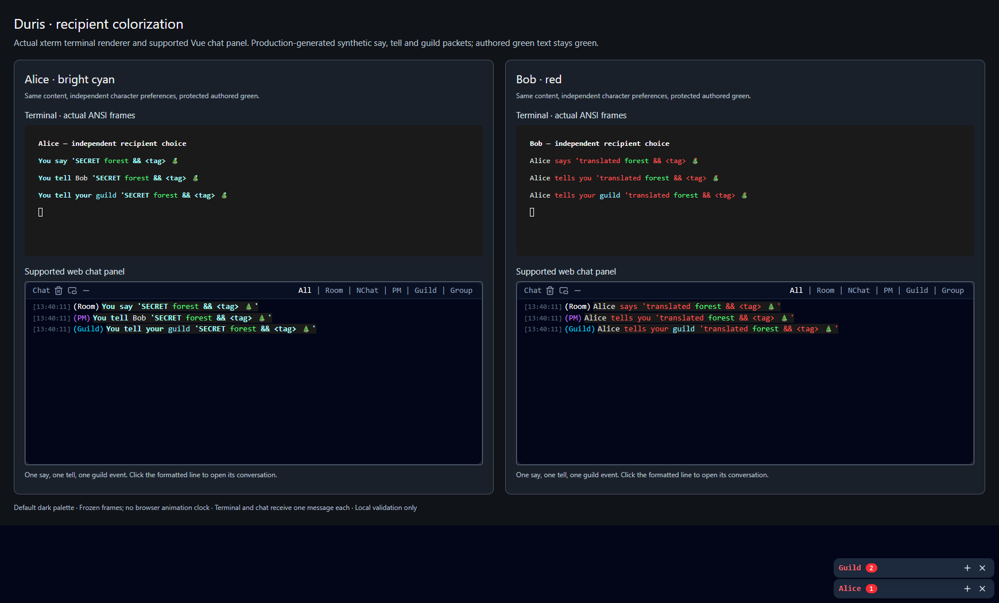
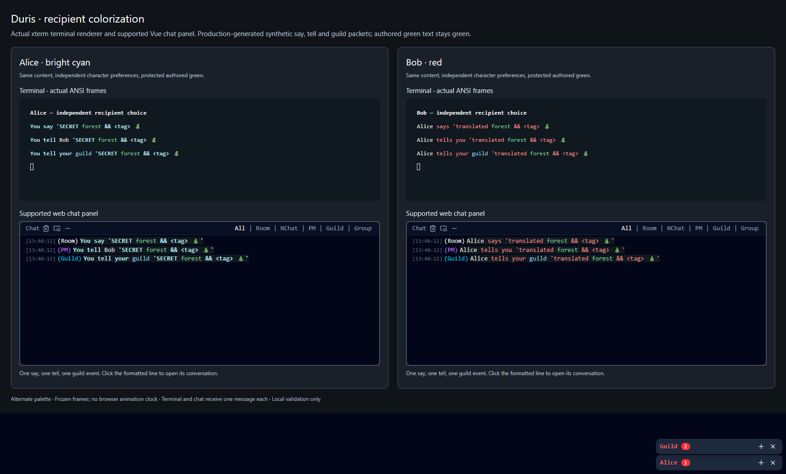
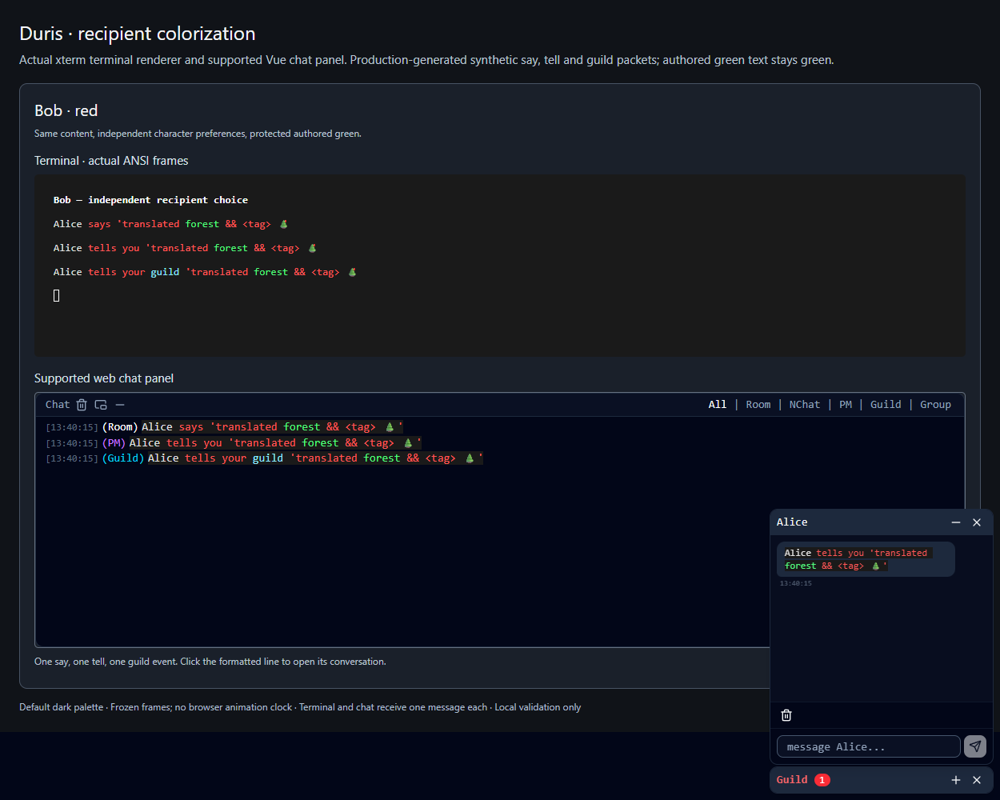
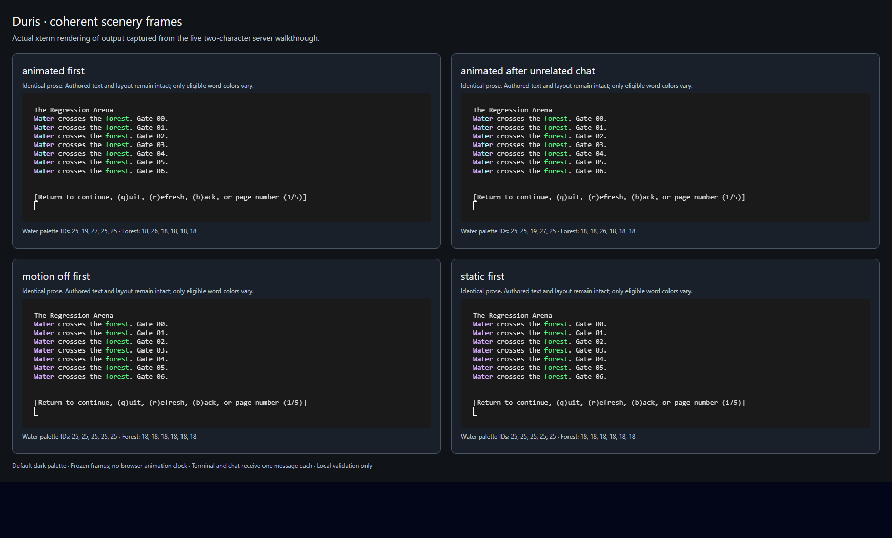
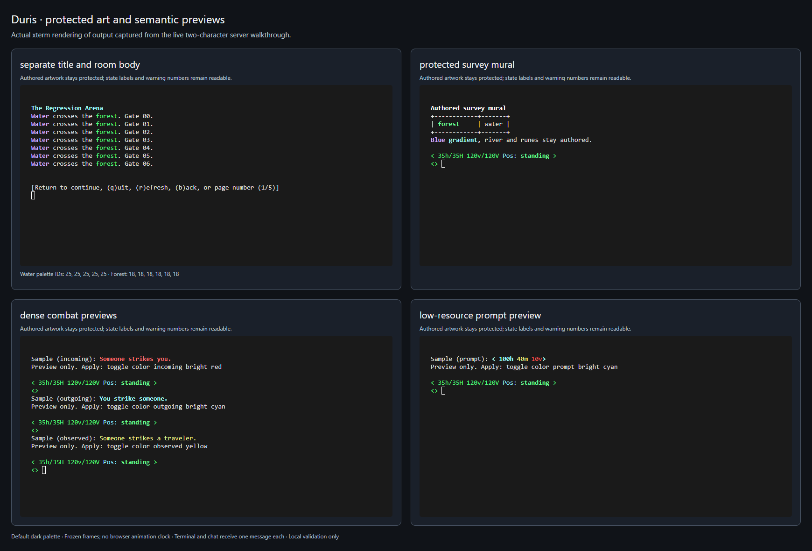

# Colorization release validation and rollout

This report covers the feature tracked by [#279](https://github.com/Community-Duris/Duris/issues/279):
bounded word styling, configurable recipes, per-character preferences, self-guiding controls,
world/combat/prompt adoption and the supported Vue client's structured chat. Measurements and
screenshots were collected on 2026-09-13 using synthetic fixtures. No production service, database,
account or world file was changed during validation.

## Player walkthrough

Start with `toggle color`; its output lists channels, choices, previews, reset and motion controls.

```text
toggle color tell
toggle color tell bright
toggle color preview tell bright cyan
toggle color tell bright cyan
toggle color say yellow
toggle color tell chartreuse
toggle color reset tell
toggle color reset all
toggle color room animated
toggle color motion off
save
```

Incomplete input supplies the next valid choices. Unknown colors and extra arguments change nothing.
Preview does not mutate saved settings or advance animation. An accepted change says **save pending**;
the ordinary save acknowledgement confirms completion. A failed save admission retains the previous
choice. Changes apply only to future output for that recipient. Resetting one channel leaves all other
channels intact; resetting all also restores motion-on. Authored colors remain authored in every mode.

The maintained [live walkthrough](../../scripts/validate_colorization_journey.py) boots the real server
against a temporary flatfile authority, creates two synthetic accounts on separate loopback addresses,
selects cyan/red chat colors, previews a third color, checks invalid/incomplete input, saves, reconnects,
and verifies independent terminal/GMCP choices and reset-one/all. It uses a 30-line repeated room and a
12-line screen to force paging: refresh replays the same frame, new looks move water one position,
unrelated chat does not consume a room step, foliage drifts coherently, and Static/motion-off stay fixed.
The completed run passed **65 checks and 15 captured frames**; its
[synthetic report](../data/colorization/live-journey.json) includes actual ANSI output.

Run from a Linux development checkout with the documented build dependencies:

```sh
make -C src -j6 PERSISTENCE_BACKEND=flatfile
python3 tests/async/test_flatfile_player_repository.py --build-inspector bin/tests/color-inspector
python3 scripts/validate_colorization_journey.py --report bin/colorization-live-journey.json
```

The script has no existing-server connection option. It creates and removes its own state, certificate,
accounts and listeners, does not load `.env`, and reports only synthetic checks and rendered frames.
Guild membership and language/visibility edge cases use the compiled real-command harness below;
new characters in the live walkthrough are not promoted to fabricate a guild session.

## Runtime, transport and persistence evidence

The production runtime harness executes actual `say`, `do_tell`, `do_reply`, `do_gcc`, `act`,
`send_to_char`, queue/pager functions, world emitters, `dam_message`, `make_prompt` and the chat JSON
serializer. Existing game/database/socket boundaries are controlled in that harness; the separate
live walkthrough crosses real command dispatch, Telnet negotiation, GMCP and flatfile save/reload.

Coverage includes:

- Every recipe/key, exact word boundaries, case, static frames, sequence wrap, repeated maze prose,
  channel/recipient isolation, no-match and protected sends, preview and frozen pager/snoop replay.
- Authored and partially styled words, gradients, entity names, explicit white/backgrounds, intentional
  ASCII/Unicode art, malformed markup, Unicode and emoji, ampersands and literal dollar signs.
- Real recipient gates, one language transformation per permitted body, ignore/deafness, echo-off,
  self-tell deduplication, unchanged gameplay RNG and original messages/privacy flags in logs.
- Serializer worst cases, malformed/control input, 4,096-run and 16,384-code-point snapshot bounds,
  whole-message and accumulated-page expansion, original-output fallback and no color bleed.
- Resource thresholds and warning roles, hit/miss recipients, save success/failure, and unchanged
  editor/pager/confirmation prompts and deferred terminal/WebSocket output ordering.
- Independent saved preferences, failed/coalesced checkpoints, stale revisions, reset, malformed
  stored fields, old snapshot/journal readers and current normal/death snapshot round trips.

The local full gate completed **506 passing test entries and three outdated source-test failures**.
The three expectations were corrected for the output-preference SQL field and adopted room-title
send; all three passed on rerun. Thus all **509 entries** were verified across that run and the focused
rerun. Subsequent terminal-dollar/snapshot-bound fixes passed the actual runtime harness normally
and with ASan/UBSan, plus strict MariaDB and flatfile builds. This is not presented as a single clean
509-entry local run. Each merge also requires its current GitHub build/full suite, quality/flatfile,
disposable recovery and security checks to pass.

Focused reproduction commands:

```sh
python3 tests/async/test_word_output_style.py
python3 tests/async/test_output_profiles.py
python3 tests/async/test_scenery_animation.py
python3 tests/async/test_output_preferences.py
python3 tests/async/test_color_command.py
python3 tests/async/test_word_output_integration.py
SANITIZE=1 python3 tests/async/test_word_output_integration.py
python3 tests/async/test_ansi_runtime.py
python3 tests/async/test_unicode_runtime.py
python3 tests/async/test_telnet_output_runtime.py
python3 tests/async/test_item_movement_prompt_runtime.py
make -C src -j6
make test-all -j6 TEST_JOBS=6
```

Migration `0015_output_preferences` and actual SQL repository save/load behavior passed on disposable
**MariaDB 10.11 and MySQL 8.0** databases, including reapplication, independent characters, reconnect,
revision guards and rollback. The additive field advances the schema manifest to version 184.
See [persistence and binary rollback compatibility](OUTPUT_PREFERENCES.md).

## Measured presentation cost and acceptance budgets

The [raw three-run CSV](../data/colorization/presentation-benchmark.csv) records CPU and wall time,
allocation calls/requested bytes, terminal bytes and GMCP JSON bytes. The benchmark compiles production
delivery, profile lookup, builder, queue, ANSI and JSON code with GCC 13.3, C++20 and `-Og`, matching
the maintained server's optimization level. The host is an Intel i7-12700K running Ubuntu 24.04 in
Docker/WSL2. Other validation workloads may share the host; these are local presentation measurements,
not production latency or total game-tick capacity claims.

Each room mode sends 500 descriptions of 4,216 visible bytes. Chat/combat modes send 200 batches to
64 recipients (12,800 messages), alternating recipient foregrounds. The legacy path uses the original
send/template and legacy JSON builder. Preserve uses the adopted path without new terminal styling.
Static/Animated include recipient selection and applicable decoration. Timing excludes setup,
gameplay/language decisions, database/file I/O and the real network. Allocation counting includes C
allocations, C++ `new` and cJSON hooks; requested byte totals are cumulative transient allocation,
**not peak resident memory**. JSON byte counts exclude the common Telnet envelope/package name.

| Scenario | Mode | CPU median (us/message) | CPU range | Allocations/message | Terminal bytes | GMCP JSON bytes |
| --- | --- | ---: | ---: | ---: | ---: | ---: |
| 4 KB room | Legacy | 13.78 | 13.77–14.87 | 14 | 4,216 | 0 |
| 4 KB room | Preserve | 14.16 | 14.15–16.35 | 14 | 4,216 | 0 |
| 4 KB room | Static | 132.18 | 130.38–148.93 | 39 | 6,664 | 0 |
| 4 KB room | Animated | 160.26 | 159.60–166.00 | 39 | 10,133 average | 0 |
| Chat | Legacy | 0.84 | 0.82–0.87 | 11 | 147 | 0 |
| Chat | Preserve | 1.03 | 1.03–1.05 | 12 | 147 | 0 |
| Chat | Static | 4.48 | 4.45–4.86 | 44 | 153 | 0 |
| Chat + GMCP | Legacy | 1.21 | 1.21–1.23 | 26 | 147 | 180 |
| Chat + GMCP | Preserve | 5.29 | 5.23–5.34 | 80 | 147 | 466 |
| Chat + GMCP | Static | 9.19 | 9.13–9.63 | 117 | 153 | 475 |
| Combat | Legacy | 0.32 | 0.31–0.32 | 7 | 39 | 0 |
| Combat | Preserve | 0.42 | 0.42–0.45 | 7 | 39 | 0 |
| Combat | Static | 1.50 | 1.50–1.56 | 18 | 50 | 0 |

Animation costs about 146 additional microseconds and 2.40 times the terminal bytes for the selected
4 KB corpus. A 64-recipient colored chat batch with GMCP costs about **0.588 ms** of presentation CPU
versus **0.078 ms** on the legacy path. GMCP snapshots add 295 JSON bytes to this static message;
even Preserve adds snapshot metadata for compatible clients. These overheads are deliberate and
must remain visible when selecting defaults for a larger audience.

Before broad rollout, use these provisional budgets on comparable hardware and the same fixtures:

| Workload | CPU budget per recipient/message | Allocation budget | Output budget |
| --- | ---: | ---: | --- |
| 4 KB animated room | 500 us | 64 calls | At most 3 times legacy terminal bytes |
| Static terminal chat | 15 us | 64 calls | At most 1.25 times legacy terminal bytes |
| Static chat + GMCP | 25 us (1.6 ms for 64 recipients) | 160 calls | At most 3 times legacy JSON bytes |
| Static combat | 5 us | 32 calls | At most 1.5 times legacy terminal bytes |

Every measured mode fits. The budgets allow roughly threefold CPU headroom over the measured maxima,
while exposing byte/allocation growth independently. They are release comparison thresholds, not hard
real-time guarantees or generic limits for arbitrary text. A different target CPU, corpus, audience or
profile requires remeasurement. Do not make timing-sensitive tests fail CI on shared-runner noise.

```sh
OUTPUT_BENCHMARK=1 python3 tests/async/test_word_output_integration.py > bin/colorization-benchmark.csv
```

Rendering/resolution performs no file/DB reads, environment lookup, clock lookup or gameplay RNG draw.
The benchmark clock is instrumentation only. Configuration is loaded and validated once into bounded
immutable snapshots (256 KiB input limit). Cosmetic state is 36 `uint64_t` counters, **288 bytes per
descriptor**, and a 36-choice/bool preference value, **37 bytes per character**, with a 512-byte maximum
serialized representation. Queue/serializer capacities are checked before accepting new styling;
fallback preserves the original output instead of truncating more visible text.

## Actual-client visual evidence

The supported [DurisWebApp implementation](https://github.com/Community-Duris/DurisWebApp/pull/44)
passed **178 tests in 39 files**, formatting, lint, type checking, config validation and the production
frontend build. Both its frontend and backend CI checks passed. The fixture corpus contains 18 packets
generated by the server's real say/tell/guild harness, covering two recipients, selected colors,
reconnection and reset. Tests exercise actual Vue rendering, the chat store, WebSocket dispatch,
floating windows and persisted history; stored presentation is revalidated on rendering.

The images below were captured and visually inspected in headless Microsoft Edge using the actual
xterm renderer and production `MudChatPanel`/floating-window components, loaded by local Vite. The
terminal bytes are exported by the real `AnsiString::term`; the chat packets come from the same frozen
frames. This browser preview feeds synthetic frames directly to the store; it is **not a claim of a
live browser-to-game WebSocket session**. The independent live walkthrough verifies the server transport.









The [alternate scenery image](../assets/colorization/scenery-alternate.png) shows the same captured
room bytes under the alternate theme. The first two panels differ by one eligible room send even
though chat occurred between them; the lower panels show the stable fallback palette.



The [alternate semantic preview](../assets/colorization/semantic-alternate.png) repeats these views
under the alternate palette. These are real in-game preview commands, plus a synthetic survey mural
read through the adopted inspection path. An explicit red inspection preference leaves its layout,
plain `water`, authored green `forest` and blue/cyan gradient unchanged. The selected cyan prompt
frame retains yellow `40m` and red `10v` warnings; combat recipient labels and outcomes remain text.

To reproduce the browser preview, install the supported client's frontend dependencies using its
documented pnpm workflow, then run these commands from this server checkout (Node 22 supported):

```sh
CHAT_PRESENTATION_FIXTURE="$PWD/bin/colorization-chat-frames.json" python3 tests/async/test_word_output_integration.py
node scripts/preview_colorization_client.mjs /path/to/DurisWebApp/frontend \
  bin/colorization-chat-frames.json bin/colorization-live-journey.json
```

Open the printed loopback URL. Add `?alternate=1`, `?recipient=Bob` to open a single-recipient
conversation, `?scenery=1` for room frames or `?examples=1` for artwork/combat/prompt examples
(add `&alternate=1` to either). The launcher uses
maintained [preview components](../examples/colorization-client-preview), creates a temporary
directory beneath the explicitly supplied frontend, serves only on loopback, replaces preview API
requests with synthetic empty responses, and removes its temporary files on Ctrl-C. It does not
start a game connection or load the client's environment file.

The browser checks observed six styled panel messages for two recipients, no console/page errors,
and one additional history entry with the real input focused after opening a tell. The alternate
theme remaps numeric color IDs through CSS variables and applies the same values to xterm. The default
palette matches the client's existing `useTerminal.ts` palette, including its lavender-tinted blue,
with readable green/cyan/red variants on dark backgrounds; black remains reserved
for authored content and is not offered as a player foreground. See the exact BGR IDs and palette
contract in [structured chat](STRUCTURED_CHAT_COLORIZATION.md).

Channel labels, sender names, resource numbers and save success/failure wording remain readable text;
required meaning does not depend on color alone. Motion advances only when new eligible output is
sent, never on a browser timer. `toggle color motion off` supplies a stable presentation. Existing
authored blink is shown steadily in web chat; the underline preference is represented explicitly.

## Staged adoption and rollback

1. Deploy compatible readers and the additive preference migration through the normal release process.
   Keep `DURIS_OUTPUT_PROFILES_FILE` unset initially. Existing characters inherit Preserve and retain
   their appearance. Installing this feature does not enable the scenery sample globally.
2. Let individual players select supported foregrounds and use previews/reset. Validate a small
   audience with the controls, persistence, transport and runtime checks above.
3. On a development/canary instance, opt into the maintained
   [64-word scenery configuration](../examples/scenery-profiles-v1.json). Start Static, inspect both
   palettes and measure the target workload, then allow Animated with player motion-off available.
   Mapping a server profile changes the inherited appearance of that channel and is an explicit
   operator rollout decision. The [source-corpus audit](SCENERY_COLORIZATION.md#repeatable-source-corpus-audit)
   records exact methodology and coverage; source records are not active traffic estimates.
4. Broaden only within measured budgets. Rendering code has an explicit Preserve veto for each caller;
   unadopted output cannot acquire decoration merely because a similarly named channel exists.

To disable added presentation without changing binaries, remove configured routes (or set their policy
to Preserve), publish a validated configuration through the explicit registry reload API, or unset the
configuration path and restart through the normal process. There is no player file-reload command.
An operator profile change alone does not erase explicit player foregrounds: those players use
`toggle color reset all`. Confirm both configuration and overrides when diagnosing a rollback. New
structured messages request Preserve; historical snapshots keep their historical colors. Do not blindly
downgrade a binary across snapshot versions 5/6; follow the compatibility guidance in
[OUTPUT_PREFERENCES.md](OUTPUT_PREFERENCES.md).

## Exact adoption boundaries and optional future work

The [world guide](WORLD_COLORIZATION.md), [combat/prompt guide](COMBAT_PROMPT_COLORIZATION.md) and
[structured client guide](STRUCTURED_CHAT_COLORIZATION.md) identify the adopted calls. This release
includes long room prose, separate title/inspection/exits/auras/occupants/room-items/inventory, social
messages and weather; player say/tell/reply/guild/shout/yell/whisper/ask/petition; `dam_message`'s three
recipient views; the standard resource prompt; and manual-save result feedback. Say/tell/guild also
carry structured presentation to the supported web client.

Unadopted raw damage/death/proc text, automatic guild announcements, smart-infobar and auxiliary
prompts, raw containers/notes and artwork keep their existing behavior. Registering a channel name
does not adopt every emitter or revive retired channels. Quest/loot/help-specific profiles require a
separate routing audit. Player-authored dictionaries, NLP/phrase matching, timer-driven redraw,
room-stable identity themes and fine-grained sender/body commands remain optional future work, as
explicitly scoped out in #279. No completion claim here extends to those paths.
