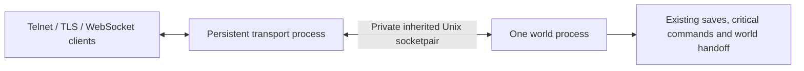

# Persistent transport and world replacement

Start the opt-in mode with `./scripts/cycle_mud.sh --dev --persistent-transport`
(or `--minimal --persistent-transport`). `start_mud.sh` forwards the same option.
The executable can also be run directly:

```sh
bin/server/dms --persistent-transport --minimal -s 4000
```

The initial process becomes the persistent transport supervisor. It opens the
existing configured Telnet, TLS Telnet and WebSocket/HTTP listeners and starts
one world child. The parent does not boot areas, load accounts, start database
workers, or mutate characters. Both processes use the existing executable and
protocol implementations; no additional library, database schema, reverse proxy,
or network service is required. WSS continues to use the existing trusted local
TLS proxy boundary.



Client sockets, GnuTLS sessions and interrupted record writes, Telnet partial
input and negotiation, MCCP streams, WebSocket HTTP upgrade/fragmentation,
permessage-deflate streams and control frames belong to the parent. It uses the
existing protocol functions. The child uses logical descriptors and emits
unframed text, binary Telnet data or WebSocket application frames over IPC.
The parent alone performs framing, compression, charset conversion and physical
writes. Password verification, account ownership, service challenge/response,
character selection, command dispatch, events and persistence remain in the
world thread and its existing typed workers.

## Session and protocol contract

Each accepted connection receives a cryptographically random nonzero 64-bit
session ID and one of 256 logical slots. A slot may be reused only with a new
ID. Delayed events for a retired ID cannot attach to its replacement. An
authenticated socket reconnect remains an ordinary account authentication and
existing character takeover; clients cannot request restoration by supplying an
ID or player name.

The IPC endpoint is an inherited `AF_UNIX/SOCK_STREAM` socketpair with no
pathname or listening port. All other client/listener fds are close-on-exec.
Every received chunk requires kernel-supplied `SCM_CREDENTIALS` matching the
expected parent/child PID and effective UID. The child also verifies the
inherited endpoint's family/type and parent PID at boot. Descriptor numbers and
the parent PID in `DURIS_TRANSPORT_FD`/`DURIS_TRANSPORT_PARENT` are runtime
capabilities set by the supervisor, not operator configuration or public tokens.

Version 2 uses a 32-byte header: `DTP1`, a 16-bit version, a 16-bit message type,
64-bit session ID, 64-bit sequence, 32-bit payload length and 32-bit detail.
Integers are big endian; bounded length-prefixed strings carry metadata and
identities. No pointers or native structure layouts cross IPC. Login credentials
travel as client input over this private authenticated channel to the world's
existing authentication code; the transport never logs them.
The inherited IPC descriptor is polled and may exceed `FD_SETSIZE`; it is never
placed in a `select()` descriptor set.
Unsupported versions, inconsistent sequences, invalid peer credentials and
oversize frames fail the channel closed. Frontend/world protocol versions must
match; a protocol upgrade requires a cold restart of both processes.
Version 2 adds per-attempt barrier identities; upgrading a frontend from the
earlier version 1 development build therefore requires restarting both roles.

The trusted peer/proxy checks run against the real socket in the parent. Only
the existing configured immediate proxy can supply PROXY/forwarded addresses.
The resulting address is carried over authenticated IPC. The world never uses
the Unix peer address as the client identity. Account and service authorization
are produced by the world's existing authentication code and mirrored to the
parent only for protocol housekeeping such as stale unauthenticated WebSocket
cleanup.

## Ordering and replacement

1. The parent sequences each complete Telnet line, decoded WebSocket message or
   GMCP application message. It retains the event until acknowledged and sends
   at most one unacknowledged event per session. TCP reads stop at the input
   watermark; commands received during replacement stay queued in the parent.
2. The world accepts only the next sequence. Repeated in-flight input is ignored;
   input at or below the acknowledged frontier receives an acknowledgement
   without execution. A line is acknowledged after its generated command queue
   empties, following normal dispatch and output. Application messages with no
   queued command complete at that boundary. Asynchronous durable mutations are
   still fenced and drained by the existing copyover prerequisites.
   A reconnect completion can enqueue an automatic world command after a login
   event was acknowledged. The next client event waits in a bounded world-side
   queue until that command clears; it remains unstarted and retained by the
   parent. At most one such event per session and 16 MiB in total are admitted.
3. On copyover the world first requests a quiescence barrier. The parent stops
   input delivery and acknowledges the barrier after earlier IPC messages. The
   world accounts for any input already sent before that barrier. An unstarted
   event stays retained for the replacement; partially executed command
   expansions veto the operation until the queue empties. Application handlers
   that completed while waiting for the barrier are acknowledged before commit.
   Every attempt has a fresh random barrier ID in addition to the world epoch.
   PAUSE/PAUSED, COMMIT/COMMITTED and ABORT carry that pair in the session/sequence
   header fields. Delayed replies from an earlier attempt cannot approve the new
   attempt, and a stale abort cannot resume its input delivery.
4. The existing terminal saves, command/outbox, locker, ship, maintenance and
   Redis ownership drains must succeed. The existing world copyover record
   captures logical descriptors, world objects, combat, pets and recovery state.
   The upstream portable v18 copyover codec remains unchanged. A bounded opaque
   `DWS1` runtime record in the authenticated session manifest carries player
   posture, idle timers and remaining command delay. Only the world serializes,
   interprets and applies these bytes; the frontend retains them with the
   identity and sequence frontiers. Relative event deadlines are rebased onto
   the replacement world's clock.
   Pending output is placed before the commit boundary. The world fsyncs the
   owner-only handoff file and directory and sends its SHA-256 digest to the
   parent, which independently verifies the file before committing the session
   manifest.
5. The world execs the staged runtime executable, retaining only its private IPC
   endpoint. On boot it authenticates the parent and obtains the committed
   manifest. Each restored logical descriptor must match the manifest's slot,
   session, account, player ID and name, and the handoff file must match the
   committed digest. Player loading independently verifies durable account
   membership. Any missing or conflicting restoration rejects the handoff.
6. After complete world restoration the child declares readiness. Output resumes
   at the previous sequence and the parent delivers only retained input beyond
   the acknowledged frontier. Existing client compression/framing state is
   untouched. Client output may remain queued while sockets apply backpressure;
   delivery to the kernel is not represented as a client receipt acknowledgement.

Output has a separate strictly increasing per-session sequence. Duplicate output
is ignored, gaps reject the channel, and the commit barrier follows all previous
output. Old and new world text therefore enter the same live compression stream
and client queue in order. The acknowledged input and accepted output frontiers
belong to the committed session manifest and continue after exec.

Negotiated metadata has its own revision. Held input cannot rewind newer Telnet
negotiation, and stale world mirrors cannot overwrite later frontend metadata.
Authentication and world-selected output settings precede the output that uses
them; the latest frontend metadata is reconciled before retained input resumes.

A preservable session owns a live playing PC with a positive durable player ID
and an account, and has no incomplete authentication, load, editor or partially
executed command work. All non-playing sessions live at the quiescence barrier
explicitly veto replacement, including terminal selection, TLS/HTTP negotiation,
account menus, authentication, chargen, editors,
pagers, switched bodies and authenticated service connections. Playing sessions
with a pending password, account reload or player-load operation also veto
replacement. They keep their existing connection and state after refusal.
New connections accepted after the barrier may complete transport negotiation
and queue input, but do not enter
the world until it is ready. A disconnect racing with replacement becomes a
logical close after restoration, allowing the existing linkdead/reconnect rules
to reconcile the body. The original single-process mode retains its complete
refusal whenever any descriptor cannot survive the legacy plain-Telnet handoff.

During ordinary operation, a complete final input followed by Telnet EOF or an
orderly WebSocket close receives one world-pulse opportunity before link-loss
teardown, matching the native network boundary. This is not a drain of all queued
commands: at most one outstanding input is forwarded, and command delay or other
world prerequisites still apply. Transport/protocol failures retire the session
immediately. Close notifications are sent once, including when the world is slow;
a committed replacement reconciles any surviving close after restoration.
The frontend-to-world `CLOSE` detail is `0` for immediate retirement or `1` for
that one-pulse opportunity. A descriptor awaiting teardown is ineligible for
copyover until the world finishes closing it.

## Bounds and failure behavior

| Boundary | Hard bound / behavior |
| --- | --- |
| Sessions | 256 logical slots; ordinary listener limits also apply |
| IPC frame | 4 MiB plus 2 KiB of metadata; length checked before allocation |
| IPC output queue | 8 MiB; 64 KiB reserved from application admission for control |
| Input per session | 128 events / 2 MiB; reads stop at 64 events or 1 MiB |
| Aggregate frontend input | 16 MiB including WebSocket buffering; reads stop at 8 MiB of events |
| Client output | Existing 1 MiB Telnet and 4 MiB WebSocket wire queues |
| Aggregate frontend output | 64 MiB; the client causing overflow is retired |
| Barrier | 5 seconds; failure returns control to the live world |
| Replacement | 180 seconds; deadline expiry retires sessions and stops the failed world |

There are no unbounded command histories or persistent reconnect tokens. TCP
backpressure holds data in bounded OS buffers when application reads pause.
Oversize events and clients exceeding output bounds disconnect explicitly;
application output is not silently dropped while leaving the session usable.
Client application text containing embedded NUL bytes is rejected on that
client's transport before IPC admission; it cannot fail the shared channel.
Frontend ping/pong and TLS progress continue independently of world ticks.
HTTP health reports unavailable while the world boots or is quiesced.

A failed save, barrier or exec resumes the same world and input delivery with
the existing in-flight marker intact. The parent does not resend that marker
onto the still-live world. A backend crash outside a completed planned handoff
has an uncertain arbitrary command outcome: all affected sessions are retired
and their commands are never replayed into a cold world. The supervisor can
start a fresh world after a normal reboot or crash; ordinary durable player and
Redis world recovery rules apply. This mode does not promise transparent
continuation after arbitrary world crashes.

The supervisor allows three cold retries after a failed world. Reaching readiness
resets that budget; exhausting it returns a failure status to the launcher.
Ordinary shutdown and the existing intentional
stop status are preserved; the supervisor never turns them into a cold reboot.
Transport-side diagnostics keep numeric trusted client addresses; reverse DNS
workers remain outside the frontend so it can safely fork a fresh world.

Frontend death necessarily loses client sockets and compression state. IPC EOF
causes the surviving world to close logical descriptors and perform its existing
durable shutdown. The launcher allows that shutdown to finish within its
configured shutdown grace before cleaning up the owned process group. Restart
the supervisor and have clients authenticate again.
The transport process itself must be cold restarted for networking/TLS library
updates; replacing only the world keeps the parent's loaded code and libraries.

## Operations and recovery

Stage `bin/server/dms_new` using the normal maintained build and send `SIGUSR1`
to the **persistent parent PID** or issue the existing in-game copyover command.
The parent forwards lifecycle signals to its world child. A successful exec
keeps both the parent PID and the world PID, and `look`, inventory, saves and
gameplay continue on the existing sockets. `SIGUSR2` requests ordinary shutdown;
`SIGRTMIN` requests a cold world reboot. Stop the parent through the normal
supervisor/service when performing maintenance. Do not signal every process
matching the executable name: both parent and child use that executable.

The existing launcher watchdog receives an authenticated delegation from the
supervisor naming its direct world child. Only that child's completed world
loops renew the running deadline; transport activity provides no loop credit.
Copyover keeps the world PID and sequence; a cold world restart delegates a new
PID and resets the startup deadline. The observer forwards lifecycle signals
once to the supervisor and captures the world's diagnostics on a stall.

After a refusal, resolve the reported persistence or non-playing condition and
retry; there is no forced fallback that drops excluded sessions. After an exec
failure, replace the invalid staged/runtime executable with the verified build
and retry from the live world. The existing promotion backup is
`bin/server/history/dms.copyover`. Do not manually replay a leftover copyover
file: restoration requires the live parent's committed manifest and digest.

If restoration or the deadline fails, inspect the existing status/persistence
logs, repair the executable or persistence prerequisite, and restart both
processes through the ordinary launcher. Clients must reconnect. Keep the normal
durable journals and recovery evidence for diagnosis; do not wipe or migrate
production as part of recovery without owner approval.

## Validation

`test_persistent_transport_protocol.py` executes the real framed channel under
ASan/UBSan. `test_persistent_transport_journey.py --server /absolute/flatfile/dms_new`
boots disposable real worlds and authenticates Telnet/MCCP, TLS/MCCP and
WebSocket/permessage-deflate clients. A test-only preload library delays the new
world's HELLO and duplicates actual IPC events/output to test held commands and
deduplication. The journeys cover failed file publication, rejected exec,
non-playing refusal, compression and fragmented negotiation, ordered gameplay,
inventory and acknowledged saves, reconnect races, backend/frontend death,
slow readers, input floods and memory bounds. No configured operator credentials
are loaded by these isolated fixtures.

The slow-reader fixture constrains its real TCP send buffers with the test-only
preload library, making backpressure independent of host kernel autotuning.
The lifecycle-exit injection exercises stop-status propagation without calling
any wipe routine. Neither fault mechanism is linked into maintained servers.

Use `--protocol telnet|tls|websocket` or `--case` to run one focused journey.
The mixed-session journey carries all three client protocols through two
successive execs. Separate cases test a completed account mutation at the pause
barrier, a changed handoff file rejected before authenticated restoration, and
the real launcher watchdog across exec and cold world restart.
The `orderly_close` case holds the world while final input and EOF/close arrive,
then verifies gameplay after authenticated reconnect and exactly one close
notification. The sanitizer protocol harness also exercises inherited IPC fds
above `FD_SETSIZE` and excludes sessions with pending teardown from handoff.
The `invalid_client_input` case sends NUL-bearing WebSocket and GMCP text from
separate clients while an authenticated TLS player continues playing and saving
on the original world and compression stream.
The `stale_barrier` case replays an earlier successful PAUSED response ahead of a
new refusal while a TLS client is still negotiating. The refusal must hold, and
a later eligible retry must restore gameplay successfully.

The architectural references are [DikuMUD2 Mplex](https://github.com/Seifert69/DikuMUD2/blob/master/dm-dist-ii/Mplex/mplex.c),
[DikuMUD3](https://github.com/Seifert69/DikuMUD3), and
[Evennia's Portal/Server boundary](https://www.evennia.com/docs/latest/Components/Portal-And-Server.html).
This implementation retains Duris's single world and existing durable handoff
instead of adopting another project's world/session framework.
