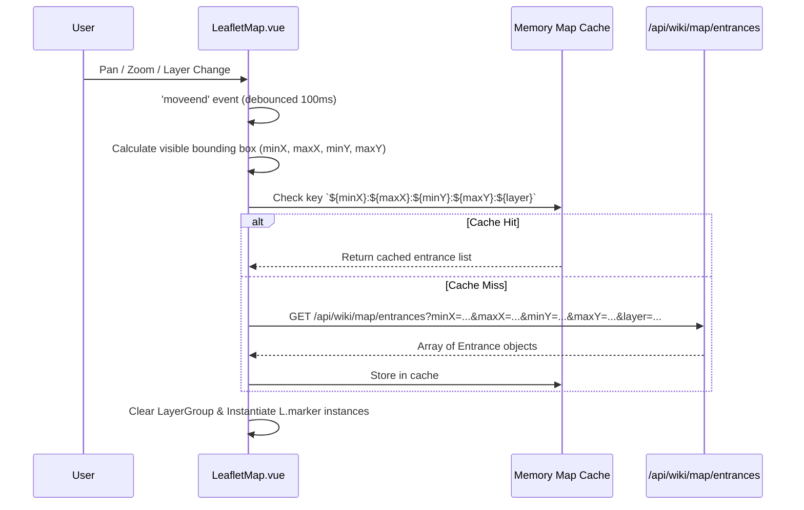

# How the NewDuris Wiki Map is Made (`https://www.newduris.com/wiki/map`)

A comprehensive technical analysis of the architecture, rendering engine, data pipeline, asset generation, and REST APIs powering the interactive Duris MUD world map at `https://www.newduris.com/wiki/map`.

---

## 1. Executive Summary

The NewDuris Wiki Map is an interactive, multi-layer 2D tile-and-image map built on a modern web application stack:

| Component Layer | Technology | Role |
| --- | --- | --- |
| **Frontend Framework** | Vue 3 (Composition API / `<script setup>`), Vite, Tailwind CSS, Radix/Shadcn-Vue | UI framework, state management, HUD controls |
| **Mapping Engine** | **Leaflet.js** (customized for flat 2D Cartesian space) | Pan, zoom, viewport culling, marker management, coordinate projection |
| **Coordinate System** | **`L.CRS.Simple`** with inverted Y-axis | Flat `(X, Y)` grid mapping Duris wilderness room coordinates |
| **Base Map Tiles/Images** | Static RGBA PNGs on CDN (`https://static2.resakse.com/duris/maps/layer-${id}.png`) | High-performance pre-rendered raster layer (4x4 px per room) |
| **Interactive Overlays** | Dynamic SVG/HTML DivIcons (`L.divIcon`) & Tooltips (`L.tooltip`) | Viewport-queried zone entrance markers, hover popups, and zone links |
| **Backend REST API** | `/api/wiki/map/...` endpoints | Continents, layers, bounds, zone entrance queries, and tile metadata |

```mermaid
graph TD
    Client[Browser: Vue 3 / WikiMapView.vue] -->|Mounts| Leaflet[LeafletMap.vue / Leaflet.js]
    Leaflet -->|CRS.Simple + LatLngBounds| ImageOverlay[L.imageOverlay: Layer PNG 1600x1600]
    ImageOverlay -->|Static Asset| CDN[(CDN: static2.resakse.com)]
    
    Client -->|GET /api/wiki/map/layers| API[NewDuris Backend API]
    Client -->|GET /api/wiki/map/continents| API
    Client -->|GET /api/wiki/map/bounds| API
    
    Leaflet -->|moveend: GET /api/wiki/map/entrances| API
    API -->|Zone Entrances in Viewport| Markers[L.marker + L.tooltip + L.popup]
    Markers -->|Click| ZoneDetail[/wiki/zones/:id]
```

---

## 2. Frontend Architecture & Leaflet Integration

### 2.1 View Hierarchy & Routing
- **Route**: `/wiki/map` (Route name: `wiki-map`), registered as a child of `WikiView.vue`.
- **Top-Level Container**: `WikiMapView.vue` (`WikiMapView-BuWObSzX.js`).
- **Core Map Component**: `LeafletMap.vue` (`LeafletMap.vue_vue_type_style_index_0_lang-BK8-tAwu.js`).

### 2.2 Coordinate Reference System (`L.CRS.Simple`)
Duris MUD wilderness rooms operate on a discrete 2D grid `(X, Y)`. Instead of geographic spherical projections (like EPSG:3857 Web Mercator), the map uses `L.CRS.Simple`.

Because Leaflet's native latitude increases upwards (North) while computer graphics / Duris room coordinates increase downwards (South, with `Y=0` at the top/North), the component transforms between Leaflet's LatLng and Duris coordinates using sign inversion:

$$\text{lat} = -Y \quad\iff\quad Y = -\text{lat}$$
$$\text{lng} = X \quad\iff\quad X = \text{lng}$$

In code:
```javascript
function toLat(y) { return -y; }
function toY(lat) { return -lat; }
```

### 2.3 Map Initialization & Bounds
When `LeafletMap.vue` initializes:
```javascript
const centerLng = (bounds.minX + bounds.maxX) / 2;
const centerLat = -(bounds.minY + bounds.maxY) / 2;

const maxBounds = L.latLngBounds(
  [-bounds.maxY - 100, bounds.minX - 100],
  [-bounds.minY + 100, bounds.maxX + 100]
);
const imageBounds = L.latLngBounds(
  [-bounds.maxY, bounds.minX],
  [-bounds.minY, bounds.maxX]
);

const map = L.map(mapContainerEl, {
  crs: L.CRS.Simple,
  center: [centerLat, centerLng],
  zoom: 0,
  minZoom: props.minZoom ?? -2,
  maxZoom: 6,
  maxBounds: maxBounds,
  maxBoundsViscosity: 0.8,
  zoomControl: false,
  attributionControl: false,
  zoomSnap: 0.1,
  zoomDelta: 0.25,
  wheelPxPerZoomLevel: 120
});

// Render static raster base image
const baseOverlay = L.imageOverlay(
  `https://static2.resakse.com/duris/maps/layer-${props.layer}.png`,
  imageBounds
);
baseOverlay.addTo(map);
map.fitBounds(imageBounds);
```

---

## 3. Dynamic Zone Entrances & Viewport Loading

Rather than rendering all zone markers simultaneously, `LeafletMap.vue` uses an event-driven viewport query with client-side caching.



### 3.1 Marker Construction & Interactive Features
For each entrance in the visible bounding box:
```javascript
const markerIcon = showMarkers 
  ? L.divIcon({ className: "zone-entrance-marker", iconSize: [12, 12], iconAnchor: [6, 6] })
  : L.divIcon({ className: "zone-entrance-hidden", iconSize: [1, 1], iconAnchor: [0, 0] });

const marker = L.marker([-entrance.y, entrance.x], { icon: markerIcon });
const cleanName = stripAnsi(entrance.toZoneName || `Zone ${entrance.toZoneNumber}`);

// Permanent zone name label
if (showZoneNames) {
  marker.bindTooltip(cleanName, {
    permanent: true,
    direction: "right",
    offset: showMarkers ? [8, 0] : [0, 0],
    className: "zone-label"
  });
}

// Hover popup with rich info
if (showMarkers) {
  marker.bindPopup(
    `<div class="zone-popup"><strong>${cleanName}</strong><br/>Zone #${entrance.toZoneNumber}</div>`,
    { closeButton: false, className: "zone-popup-container" }
  );
  marker.on("mouseover", () => marker.openPopup());
  marker.on("mouseout", () => marker.closePopup());
  marker.on("click", () => emit("zoneClick", entrance.toZoneNumber, cleanName));
}

layerGroup.addLayer(marker);
```

---

## 4. Map Layers & World Scale

The map supports 3 distinct planar layers corresponding to Duris world definitions:

| Layer ID | Name | Coordinate Bounds | Grid Size | VNUM Range | Formula ($VNUM$) | Image Resolution | File Size |
| :---: | :---: | :---: | :---: | :---: | :---: | :---: | :---: |
| **`0`** | **Surface** | `(0..399, 0..399)` | $400 \times 400$ ($160,000$ rooms) | `500000..659999` | $500000 + (Y \times 400) + X$ | $1600 \times 1600\text{ px}$ | $62.5\text{ KB}$ |
| **`-1`** | **Underdark** | `(0..399, 0..399)` | $400 \times 400$ ($160,000$ rooms) | `700000..859999` | $700000 + (Y \times 400) + X$ | $1600 \times 1600\text{ px}$ | $30.2\text{ KB}$ |
| **`-2`** | **Alatorin** | `(0..99, 0..38)` | $100 \times 39$ ($3,900$ rooms) | `120000..123833` | $120000 + (Y \times 100) + X$ | $400 \times 156\text{ px}$ | $2.4\text{ KB}$ |

### 4.1 Image Resolution & Pixel Density
Every single room in the world grid is represented by an exact **$4 \times 4$ pixel square** in the pre-rendered PNG:
$$\text{Image Width} = (\text{maxX} - \text{minX} + 1) \times 4\text{ px}$$
$$\text{Image Height} = (\text{maxY} - \text{minY} + 1) \times 4\text{ px}$$

- Surface: $400 \times 4 = 1600\text{ px}$ wide, $400 \times 4 = 1600\text{ px}$ high.
- Alatorin: $100 \times 4 = 400\text{ px}$ wide, $39 \times 4 = 156\text{ px}$ high.

---

## 5. Sector Types & Color Palette

The PNG raster images are baked from the MUD's room sector types. The pixel colors directly correspond to the in-game terrain types shown in the frontend legend:

| Sector Type | Color Name | Hex Code | Visual Swatch | % of Surface Map | Typical In-Game Terrain |
| --- | --- | :---: | :---: | :---: | --- |
| `SECT_OCEAN` | Ocean | `#1e3a8a` |  | **64.38%** | Deep ocean waters, impassable without ship |
| `SECT_FIELD` | Field | `#4ade80` |  | **8.90%** | Open plains, grasslands |
| `SECT_MOUNTAIN` | Mountain | `#a16207` |  | **7.76%** | High elevation terrain, peaks |
| `SECT_HILLS` | Hills | `#eab308` |  | **6.84%** | Rolling foothills |
| `SECT_FOREST` | Forest | `#16a34a` |  | **5.82%** | Dense woods, canopy |
| `SECT_WATER_SWIM` | Water | `#3b82f6` / `#22d3ee` |  | **2.42%** | Rivers, lakes, swimmable coastal water |
| `SECT_SWAMP` | Swamp | `#a855f7` |  | **1.87%** | Marshes, bogs |
| `SECT_CITY` | City | `#ffffff` |  | **0.67%** | Major towns and capitals |
| `SECT_FIREPLANE` | Fire / Danger | `#ef4444` |  | **0.63%** | Lava, volcanic regions, fire plane |
| `SECT_DESERT` | Desert | `#fef08a` |  | **0.53%** | Sand dunes, arid wastes |
| `SECT_ROAD` / `INSIDE` | Road / Structure | `#78716c` / `#6b7280` |  | **0.17%** | Paved roads, keeps, fortress walls |
| `SECT_UNDRWLD_WILD` | Underdark | `#581c87` / `#7e22ce` |  | **< 0.05%** | Subterranean caverns |
| `SECT_ARCTIC` | Arctic | `#f1f5f9` |  | **< 0.05%** | Glaciers, tundra, frozen wastes |

---

## 6. Backend REST API Specifications

The frontend communicates with the backend via JSON REST APIs under `/api/wiki/map/`:

### 6.1 `GET /api/wiki/map/layers`
Returns all available world planes:
```json
[
  { "id": 0, "name": "Surface", "description": "The Surface Realm of Duris" },
  { "id": -1, "name": "Underdark", "description": "The Twisting Tunnels of the Durian Underdark" },
  { "id": -2, "name": "Alatorin", "description": "The Depths of Duris" }
]
```

### 6.2 `GET /api/wiki/map/bounds?layer={layerId}`
Returns the coordinate boundaries for the selected layer:
```json
{
  "minX": 0,
  "maxX": 399,
  "minY": 0,
  "maxY": 399
}
```

### 6.3 `GET /api/wiki/map/continents`
Returns the list of continents with calculated center coordinates used by the "Jump to..." dropdown:
```json
[
  {
    "id": 1,
    "name": "Good Continent",
    "nameAnsi": "&+WGood Continent",
    "seedRoomVnum": 546926,
    "centerX": 126,
    "centerY": 117
  },
  {
    "id": 2,
    "name": "Evil Continent",
    "nameAnsi": "&+LEvil Continent",
    "seedRoomVnum": 607066,
    "centerX": 266,
    "centerY": 267
  },
  {
    "id": 3,
    "name": "Ice Crag",
    "nameAnsi": "&+WIce &+CCrag",
    "seedRoomVnum": 521504,
    "centerX": 304,
    "centerY": 53
  },
  {
    "id": 4,
    "name": "Khomani-Khan",
    "nameAnsi": "&+gKhomani-Khan",
    "seedRoomVnum": 608451,
    "centerX": 51,
    "centerY": 271
  }
]
```

### 6.4 `GET /api/wiki/map/entrances`
**Query Parameters**: `minX`, `maxX`, `minY`, `maxY`, `layer`  
Returns all zone entrance exits located within the queried bounding box:
```json
[
  {
    "id": 534,
    "fromRoomVnum": 510179,
    "toRoomVnum": 53891,
    "toZoneNumber": 536,
    "toZoneName": "&+LThe Great &n&+yRealm &+Lof &N&+rDuris&N",
    "direction": "down",
    "x": 179,
    "y": 25
  },
  {
    "id": 535,
    "fromRoomVnum": 511126,
    "toRoomVnum": 52901,
    "toZoneNumber": 529,
    "toZoneName": "&+Wthe Lost Temple of the North&n",
    "direction": "down",
    "x": 326,
    "y": 27
  }
]
```

### 6.5 `GET /api/wiki/map/tiles`
**Query Parameters**: `minX`, `maxX`, `minY`, `maxY`, `layer`  
Provides individual room tile metadata for detailed inspector panels:
```json
[
  {
    "roomVnum": 560150,
    "x": 150,
    "y": 150,
    "z": 0,
    "sectorType": 12,
    "zoneNumber": 5000,
    "zoneName": "The &+CSurface &+yRealm &nof &+rDuris&n",
    "roomName": "&+BTh&+be Wa&+Bte&+brs o&+Bf t&+bhe A&+Bby&+bss&n",
    "continentId": null,
    "isMapRoom": true
  }
]
```

---

## 7. Interactive Controls & User Experience

The Wiki Map UI provides rich browser-native navigation and status reporting:

1. **Layer Switcher**: Seamlessly swaps the image overlay source to `layer-${id}.png`, updates the bounds, and re-queries zone entrances.
2. **"Jump to..." Fast Navigation**: When a continent is selected from the dropdown, calls `map.panTo([-centerY, centerX])` and `map.setZoom(2)`.
3. **Real-Time Coordinate Tracker**: A `mousemove` listener on the Leaflet map projects mouse pointer coordinates to `(Math.round(lng), Math.round(-lat))` and displays `(X, Y)` in the header.
4. **Zoom Gauge**: Computes intuitive zoom magnification percentage using $2^{\text{zoom}} \times 100\%$.
5. **Zoom In / Out / Reset**: Dedicated toolbar buttons to zoom in, zoom out, or reset view (`map.fitBounds(imageBounds)`).
6. **Marker & Label Visibility Toggles**: Checkboxes to toggle red entrance dots (`markers`) and persistent text titles (`zone names`).
7. **Direct Zone Wiki Linking**: Clicking any zone entrance marker invokes `router.push('/wiki/zones/' + toZoneNumber)`, seamlessly routing the user to the corresponding wiki zone guide.

---

## 8. Summary of Map System Implementations across NewDuris

The NewDuris platform actually employs three distinct mapping solutions tailored for specific use cases:

1. **Wiki World Map (`WikiMapView.vue` + `LeafletMap.vue`)**:
   - **Engine**: Leaflet.js with pre-rendered raster overlays + API-driven vector markers.
   - **Purpose**: Global wilderness exploration, continent viewing, finding zone locations.
2. **Frontpage Map Widget (`MapPreviewDisplay.vue`)**:
   - **Engine**: Lightweight embed of `LeafletMap.vue` in headless mode (`hideControls: true`).
   - **Purpose**: Interactive marketing preview on the homepage linking directly to `/wiki/map`.
3. **Web MUD Client In-Game Map (`MudMap.vue` & `PopOutMapView.vue`)**:
   - **Engine**: **Cytoscape.js** graph network visualization + `BroadcastChannel('duris-map-sync')`.
   - **Purpose**: Live tactical room-to-room automapper, visited room tracking, and speedwalk pathfinding during active gameplay.
