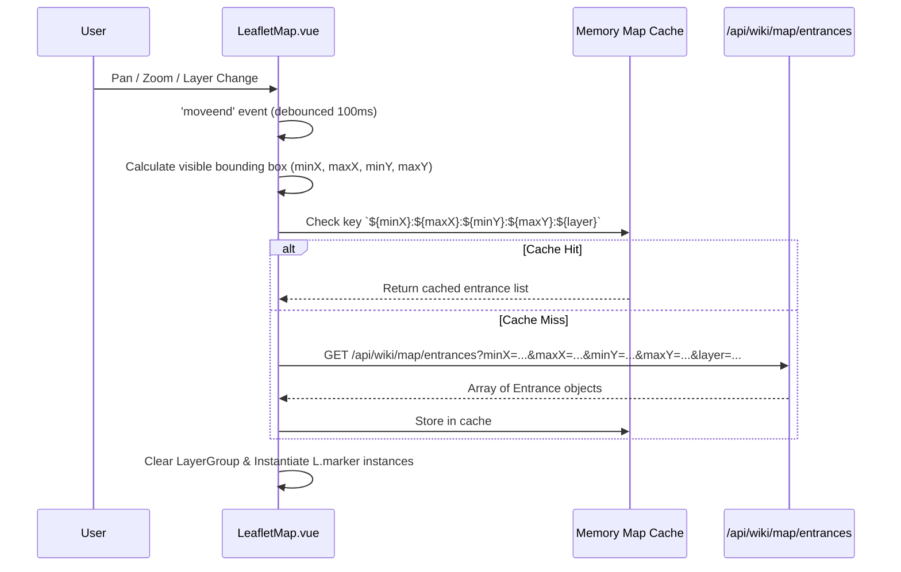

# Duris Website — Recovered Specification & Rebuild Plan

*`https://www.newduris.com` — what it does, how it is built, and what it would take to rebuild it on this codebase. Last updated 2026-08-31.*

---

## 1. Why this document exists

`newduris.com` is **our own** portal for **this** MUD. Its wiki, map, and leaderboards are views onto the world files, the MySQL schema, and the `cycle_mud.sh` / `dms_new` process that this repository builds.

This is a **specification recovered from the deployed artifact**: what the site does, screen by screen and endpoint by endpoint, in enough detail to rebuild it without source.

Two scope notes:

- **Features only. The visual design is not worth preserving** — a rebuild should keep the feature set and throw the styling away.
- **Out of scope by decision:** the forum, the online zone builder, and the admin console. The live site has all three; this document deliberately does not spec them. Everything below covers the player-facing game-data and gameplay surfaces only.

---

## 2. How this specification was recovered

`newduris.com` is a client-rendered SPA — fetching the HTML returns only `<div id="app">`. Everything below was recovered from the shipped bundle and by probing the live API:

- `https://www.newduris.com/` → `/assets/index-DPiYRW_z.js` (530 KB entry chunk) + `/assets/vendor-vue-*.js`.
- Vue Router route table extracted from `path:"…"` literals in the entry chunk.
- 79 lazily-imported view chunks (`./XxxView-<hash>.js`) name every screen in the app.
- ~250 distinct REST endpoints extracted from string and template literals.
- Public endpoints were called directly to confirm response shapes (`/api/site-config`, `/api/frag/leaderboard`, `/api/wiki/objects`, `/api/pvp/events`, …).

---

## 3. Platform architecture

Stack, confirmed: **Vue 3 + Vite + Tailwind**, PWA (`manifest.json`, Workbox service worker), Lucide icons, Leaflet (wiki map), Cytoscape (in-game automapper), a JSON REST backend under `/api`, a WebSocket game bridge at `wss://www.newduris.com/ws`, and a static asset CDN at `static2.resakse.com`.

Runtime config is served by `GET /api/site-config`:

```json
{ "siteTitle": "Duris: Land of Bloodlust", "siteLogoUrl": "…/logo_*.webp",
  "mudHost": "mud.newduris.com", "mudPort": "7777", "mudPortTls": "7778",
  "mudWsPort": "4050", "frontPageHeroEnabled": true, "frontPageContent": "<html…>" }
```

Note `mudWsPort: 4050` — the MUD itself listens for WebSocket clients; the web tier proxies `/ws` to it rather than implementing telnet in Node.

The full route table runs to 79 lazily-loaded view chunks. The in-scope ones are: public site and auth, the `/wiki` game-data browsers, `/play` (web MUD client), `/pvp`, `/frag-leaderboard`, `/auction`, and `/statistics`. Each is inventoried in §4. (The remaining chunks belong to `/forum`, `/builder`, and `/admin`, which are out of scope — see §1.)

---

## 4. Feature inventory

### 4.1 Public site

| Route | Feature | Backing API |
| --- | --- | --- |
| `/` | Front page: hero image/title/subtitle + WYSIWYG-authored HTML body, live map preview widget, server status | `/api/site-config`, `/api/content/news` |
| `/news` | News / announcements (raw MUD-ANSI text, colour-coded client side) | `/api/content/news` |
| `/status` | Server up/down, uptime, who-list | `/api/mud/status` |
| `/login`, `/change-password` | Auth against **in-game accounts** (JWT + refresh) | `/api/auth/login|refresh|me|check|logout|account-exists/:name` |
| `/user/:accountName` | Public account profile: character list, avatar, banner, bio | `/api/…/users/:id/profile`, `/characters` |
| `/guild/:guildName` | Guild profile + guild activity feed | `/api/…/guilds/:name/profile`, `/activity` |
| `/notifications` | Notification centre with unread counts | `/api/notifications`, `/unread-count`, `/:id/read`, `/read-all` |
| `/credits`, `/rules`, `/faq`, `/motd`, `/wizlist` | Static-ish content pages, editable by staff | site-settings store |
| `/changelog` | Site/game changelog with per-user read tracking and an unread badge | `/api/changelog`, `/unread-count`, `/:id/read` |

### 4.2 Wiki (`/wiki`) — the game-data browser

The largest public surface. Access is gated by `GET /api/wiki/access` → `{"accessLevel":"public"}` (so it can be flipped to members-only).

| Sub-tool | What it does | API |
| --- | --- | --- |
| **Zones** | Paginated, searchable list of all 355 zones with min/max level, difficulty, alignment, epic type, room/mob/object counts | `/api/wiki/zones?…`, `/api/wiki/zones/search` |
| **Zone detail** | Zone info, spawn table, and a **per-zone room graph** | `/api/wiki/zones/:n`, `/:n/spawns`, `/:n/map-data` |
| **Objects** | 19,661 objects, filterable by type, wear slot, class, race, affect location, spell effect; each row carries parsed `affects[]` and `spellEffects[]` | `/api/wiki/objects?…` + `/types`, `/slots`, `/classes`, `/races`, `/affects`, `/spell-effects` |
| **Object detail** | Full stat block for a vnum | `/api/wiki/objects/:vnum` |
| **Mobs** | 19,462 mobs, filterable by class, race, act-flags; level, align, gold, exp, zone | `/api/wiki/mobs?…` + `/classes`, `/races`, `/flags` |
| **Mob detail** | Stat block, keyed `(zoneNumber, vnum)` | `/api/wiki/mobs/:zone/:vnum` |
| **World map** | Everything in Appendix A | `/api/wiki/map/*` |
| **Help / Guide** (`/guide`) | Browsable + full-text-searchable in-game help files, grouped into categories (General 1747, Class Skillsets 3, Race 3). Players can **suggest** new/edited help entries (`/guide/suggest`) and track their own submissions (`/guide/my-suggestions`) | `/api/guide/help`, `/help/search`, `/help/:id`, `/categories`, `/suggestions` |

All names come back as raw MUD ANSI (`&+W…&n`) and are parsed/stripped in the browser — the API is a thin projection of game data.

### 4.3 Web MUD client (`/play`)

- Full terminal client over `wss://www.newduris.com/ws`, ANSI rendering, scrollback, command history.
- **Aliases** and **triggers** (heavy presence in the bundle — ~100 references each), persisted in `localStorage`.
- **GMCP** protocol handling. Observed packages the client consumes:
  `Char.Vitals`, `Char.Status`, `Char.Affects`, `Combat.Update`, `Group.Status`, `Room.Info`, `Room.Map`, `Comm.Channel`, `Quest.Status`, `Quest.Map`, `Ship.Info`, `Ship.Contacts`.
  These drive HUD panels: vitals bars, affect timers, group panel, combat tracker, channel-split output, quest tracker, and a ship/naval console.
- **Automapper** (`MudMap.vue`, Cytoscape.js): live room graph built from `Room.Info`/`Room.Map`, visited-room tracking, **speedwalk** pathfinding.
- **Pop-out map** (`/play/map`, `PopOutMapView.vue`) synced to the main window via `BroadcastChannel('duris-map-sync')`.
- Direct-connect fallback to arbitrary `ws://host:port`.
- PWA: installable, with app shortcuts straight to the client.

### 4.4 PvP module

- `/pvp` — feed of PvP kill events. Each event: timestamp, room name + vnum, killer list, victim list (with `died` and `isLeader` flags), like/comment counts.
- `/pvp/:id` — battle detail with **comments**, **likes**, **favorites**.
- `/pvp/stats` — leaderboards by type and period (`7d` / `30d` / `all`), per-player stats, location and player search.
- **Analytics**: timeline, active hours, class-matchup matrix, popular locations, client-stats — all period-scoped.
- Discord push for notable events (staff-triggered on a single event).

### 4.5 Frag leaderboard

`/frag-leaderboard` — ranked list with account name, race, class, level, racewar side, fractional frag totals, `top-gainers` over a window, per-player and per-account views, filterable by race/class.

### 4.6 Auction house

`/auction`, `/auction/:id`, `/auction-history` — listings with search/keyword filters, **bid** and **buy-now**, per-listing bid history, aggregate stats. Mirrors the in-game auction so players can trade from the web.

### 4.7 Statistics

`/statistics/faction-activity` — public, date-parameterised (`?date=YYYY-MM-DD`), with an `available-dates` index. Faction/racewar activity over time.

---

## 5. Rebuild assessment

Short answer: **with the forum, builder, and admin console cut, essentially all of the remaining surface is reachable — and the hard half already exists in this repository.** What is missing is not game-engine work, it is a web tier: one API service and one SPA over data we already store. Dropping the three out-of-scope modules removes the largest chunk of net-new web code (the forum), the riskiest single feature (the builder), and the widest screen count (the admin console) — what is left is a player-facing read tier plus the game client.

### 5.1 What this repo already gives us for free

| Prerequisite | Status here |
| --- | --- |
| WebSocket game transport | **Present** — `src/net/websocket.c`, `ws_handlers.c`, `ws_auth.h`, `listen.c` |
| GMCP | **Present but minimal** — `src/net/gmcp.c` implements `Core.Hello`, `Core.AuthChallenge`, `Client.Info` only |
| MCCP / telnet negotiation / TTYPE / ANSI / unicode | Present (`mccp.c`, `ttype.c`, `ansi.c`, `unicode.c`) |
| MySQL persistence | Present and extensive (`src/sql/`, `migrations/`) |
| Accounts + characters + auth | `accounts`, `account_characters`, `account_ips`, `account_banks` tables |
| PvP event data | `pkill_event`, `pkill_info`, `combat_outcome`, `combat_outcome_participant` |
| Frag leaderboard | `frag_leaderboard` table already materialised |
| Auction data | `auctions`, `auction_bid_history`, `auction_ledger`, `auction_item_custody`, `auction_money_pickups` |
| Guilds | `guilds`, `guild_members`, `guild_ranks`, `guild_transactions`, `guildhalls` |
| Items / ownership | `items`, `item_current_owner`, `item_ownership_ledger`, `item_uid_allocator` |
| Zones / world | `zones`, `zone_touches`, `towns`, `outposts`, plus `areas/` on disk |
| Logs / stats | `log_entries`, `statistics` |
| Help files | `help/` directory + `scripts/parse_help_index.py` |
| Process status | `scripts/cycle_mud.sh`, `scripts/healthcheck.sh` — enough to back the `/status` page's up/uptime reporting |
| **Map image baker** | **Already prototyped** — `areas/dump_map_image.rb` walks `world.wld`, reads each room's sector byte, and renders it. It carries the full 39-entry `SECT_*` table plus per-sector colour and symbol maps |
| **Per-zone room layouts** | **Already present** — `areas/map/*.json` holds hand-laid `{vnum: {x, y}}` room coordinates for 21 zones, which is exactly what the wiki's per-zone room graph (`/api/wiki/zones/:n/map-data`) needs |

The coverage is total because it is the same system: same world files, same MySQL schema, same `cycle_mud.sh` / `dms_new` process (their status payload literally reports a `cycleMudPid` and a `dmsPid`). Rebuilding the portal is not reverse-engineering a third party's product — it is reconstructing a lost web tier over data we already own and ship.

### 5.2 Our world data vs. what the live API serves

| Entity | Live site API | This repo (`areas/`) | Note |
| --- | --- | --- | --- |
| Zones | 355 | **351** (`world.zon`) | Drift of 4 |
| Objects | 19,661 | **19,133** (`world.obj`) | ~97% overlap |
| Mobs | 19,462 | **17,678** (`world.mob`) | ~91% overlap |
| Surface wilderness rooms | 160,000 (`500000..659999`) | **exactly 160,000** | Confirms Appendix A.4 against our own `world.wld` |
| Underdark rooms (`700000+`) | 400×400 grid | **13,587 defined** | Production renders a full grid; our snapshot is sparse — the baker must treat undefined cells as empty rather than assume density |

The Appendix A map spec is therefore a description of **our** grid, and the coordinate formula ($500000 + Y\times400 + X$) resolves correctly against `world.wld` as it stands in this worktree. The row-count drift is snapshot skew between this worktree and production, not a difference in kind.

### 5.3 Feature-by-feature difficulty

| Feature | Difficulty | Why |
| --- | --- | --- |
| Site config / front page / news / static pages | **Trivial** | CRUD over a settings table + a rich-text editor |
| Auth against game accounts | **Easy** | `accounts` table already holds the credential material; issue JWTs from it |
| Frag leaderboard | **Easy** | `frag_leaderboard` is already a materialised table |
| Auction browser | **Easy** | Read-only projection of `auctions` + `auction_bid_history`. Web-side *bidding* is medium — it must go through the game's transactional auction path, not a raw `INSERT` |
| PvP feed + stats + analytics | **Easy–Medium** | `pkill_event` / `combat_outcome*` have everything; analytics are aggregate SQL. Social layer (likes/comments/favorites) is new web-only tables |
| Wiki: zones / mobs / objects browsers | **Medium** | Needs an **exporter**: parse our own `world.zon` / `world.mob` / `world.obj` (or dump from the running server) into indexed web tables, plus a bitflag→name mapping generated from `src/core/defines.h`. Do this once as a build step and the browsers are ordinary paginated queries |
| Wiki world map | **Easy–Medium** | Fully documented in Appendix A, and `areas/dump_map_image.rb` is a working head start — it already extracts per-room sectors from `world.wld` and holds the sector table. Port it to a 4 px/room RGBA PNG baker using the Appendix A.5 palette, add five small endpoints, and the Leaflet front end is a few hundred lines |
| Help/guide browser + suggestions | **Easy** | `help/` + `scripts/parse_help_index.py` already parse it; suggestions are a new table + review queue |
| Web MUD client (terminal, aliases, triggers) | **Medium** | Server side already speaks WebSocket. Client is standard xterm-style work |
| **GMCP HUD panels** | **Medium — the one real engine gap** | The client's panels need `Char.Vitals`, `Char.Status`, `Char.Affects`, `Combat.Update`, `Group.Status`, `Room.Info`, `Room.Map`, `Comm.Channel`, `Quest.*`, `Ship.*`. Our `gmcp.c` sends none of these. Each is a small C emitter at an existing hook point (prompt update, affect apply/wear-off, group change, room enter, channel send) — maybe 400–800 lines total, but it is C work in the game loop and needs care around performance and copyover |
| Automapper + speedwalk | **Medium** | Falls out of `Room.Info`/`Room.Map` once those are emitted; Cytoscape + BFS on the client |
| Discord integration | **Easy** | Webhook POSTs |
| PWA / service worker / pop-out sync | **Trivial** | Manifest + Workbox + `BroadcastChannel` |

### 5.4 What cannot be recovered from the outside

The blocker here is access to the original developer's source, not knowledge of the game. These are the gaps that a black-box read of the shipped bundle leaves:

- **Server-side logic.** Every endpoint's *shape* is recoverable; none of its implementation is. The query behind each analytics view, the auth/permission model, and the auction bid path all have to be rewritten from scratch against our schema.
- **Authenticated payloads.** Anything behind a login was read from client code, not from live responses. Expect field-level surprises.
- **Live site content.** News, MOTD, guild profiles, wiki prose, and the hero/logo art on `static2.resakse.com` live in the portal's own database, not in this repo. If that DB is still reachable it is worth pulling before anything else — it is the one asset that cannot be regenerated from `areas/`. If it is not, that content is re-authorable.
- **Production world snapshot.** Continent seed rooms, zone-entrance tables, and the Appendix A.5 sector percentages come from the running world. Regenerate them from `world.wld`; treat the figures captured here as reference values to validate against, not targets.

### 5.5 Suggested build order

1. **Read-only public tier first** — status, news, frag leaderboard, PvP feed, auction browser. All are direct projections of tables we already have; ships in days, proves the API/deploy shape.
2. **Data exporter** — one tool that walks `areas/` (or dumps from a running server) into `wiki_zones` / `wiki_mobs` / `wiki_objects` / `wiki_rooms`, plus a generated flag/enum registry from `defines.h`. Everything wiki-shaped depends on this, including the map.
3. **Wiki browsers + world map** — highest visible payoff per unit of work once step 2 exists.
4. **GMCP emitters in C** — unlocks the HUD, the automapper, and speedwalk in one go. The only step that touches the game loop.
5. **Web client** around those emitters.
6. **Polish tier** — account and guild profiles, notifications, changelog, statistics.

### 5.6 Bottom line

There is no in-scope feature that is out of reach for this codebase. The wiki, map, leaderboards, PvP module, and auction browser are all ordinary web applications over data this repo already stores. Exactly one item carries real engineering risk: **the GMCP emitter set** — small, but in-engine, and the gate on the whole rich-client experience (HUD, automapper, speedwalk). Everything else is a question of web-development hours. With the forum, builder, and admin console out of scope, the riskiest and largest pieces of the original site are simply not on the list.


---

## Appendix A — The world map, in depth

*This is the original analysis that started the document: a full teardown of the interactive world map at `/wiki/map` — rendering engine, coordinate system, tile generation, and its five REST endpoints. It remains the most completely specified part of the site.*

### A.1 Executive Summary

The NewDuris Wiki Map is an interactive, multi-layer 2D tile-and-image map built on a modern web application stack:

| Component Layer | Technology | Role |
| --- | --- | --- |
| **Frontend Framework** | Vue 3 (Composition API / `<script setup>`), Vite, Tailwind CSS, Radix/Shadcn-Vue | UI framework, state management, HUD controls |
| **Mapping Engine** | **Leaflet.js** (customized for flat 2D Cartesian space) | Pan, zoom, viewport culling, marker management, coordinate projection |
| **Coordinate System** | **`L.CRS.Simple`** with inverted Y-axis | Flat `(X, Y)` grid mapping Duris wilderness room coordinates |
| **Base Map Tiles/Images** | Static RGBA PNGs on CDN (`https://static2.resakse.com/duris/maps/layer-${id}.png`) | High-performance pre-rendered raster layer (4x4 px per room) |
| **Interactive Overlays** | Dynamic SVG/HTML DivIcons (`L.divIcon`) & Tooltips (`L.tooltip`) | Viewport-queried zone entrance markers, hover popups, and zone links |
| **Backend REST API** | `/api/wiki/map/...` endpoints | Continents, layers, bounds, zone entrance queries, and tile metadata |

```mermaid
graph TD
    Client[Browser: Vue 3 / WikiMapView.vue] -->|Mounts| Leaflet[LeafletMap.vue / Leaflet.js]
    Leaflet -->|CRS.Simple + LatLngBounds| ImageOverlay[L.imageOverlay: Layer PNG 1600x1600]
    ImageOverlay -->|Static Asset| CDN[(CDN: static2.resakse.com)]

    Client -->|GET /api/wiki/map/layers| API[NewDuris Backend API]
    Client -->|GET /api/wiki/map/continents| API
    Client -->|GET /api/wiki/map/bounds| API

    Leaflet -->|moveend: GET /api/wiki/map/entrances| API
    API -->|Zone Entrances in Viewport| Markers[L.marker + L.tooltip + L.popup]
    Markers -->|Click| ZoneDetail[/wiki/zones/:id]
```

---

### A.2 Frontend Architecture & Leaflet Integration

#### A.2.1 View Hierarchy & Routing
- **Route**: `/wiki/map` (Route name: `wiki-map`), registered as a child of `WikiView.vue`.
- **Top-Level Container**: `WikiMapView.vue` (`WikiMapView-BuWObSzX.js`).
- **Core Map Component**: `LeafletMap.vue` (`LeafletMap.vue_vue_type_style_index_0_lang-BK8-tAwu.js`).

#### A.2.2 Coordinate Reference System (`L.CRS.Simple`)
Duris MUD wilderness rooms operate on a discrete 2D grid `(X, Y)`. Instead of geographic spherical projections (like EPSG:3857 Web Mercator), the map uses `L.CRS.Simple`.

Because Leaflet's native latitude increases upwards (North) while computer graphics / Duris room coordinates increase downwards (South, with `Y=0` at the top/North), the component transforms between Leaflet's LatLng and Duris coordinates using sign inversion:

$$\text{lat} = -Y \quad\iff\quad Y = -\text{lat}$$
$$\text{lng} = X \quad\iff\quad X = \text{lng}$$

In code:
```javascript
function toLat(y) { return -y; }
function toY(lat) { return -lat; }
```

#### A.2.3 Map Initialization & Bounds
When `LeafletMap.vue` initializes:
```javascript
const centerLng = (bounds.minX + bounds.maxX) / 2;
const centerLat = -(bounds.minY + bounds.maxY) / 2;

const maxBounds = L.latLngBounds(
  [-bounds.maxY - 100, bounds.minX - 100],
  [-bounds.minY + 100, bounds.maxX + 100]
);
const imageBounds = L.latLngBounds(
  [-bounds.maxY, bounds.minX],
  [-bounds.minY, bounds.maxX]
);

const map = L.map(mapContainerEl, {
  crs: L.CRS.Simple,
  center: [centerLat, centerLng],
  zoom: 0,
  minZoom: props.minZoom ?? -2,
  maxZoom: 6,
  maxBounds: maxBounds,
  maxBoundsViscosity: 0.8,
  zoomControl: false,
  attributionControl: false,
  zoomSnap: 0.1,
  zoomDelta: 0.25,
  wheelPxPerZoomLevel: 120
});

// Render static raster base image
const baseOverlay = L.imageOverlay(
  `https://static2.resakse.com/duris/maps/layer-${props.layer}.png`,
  imageBounds
);
baseOverlay.addTo(map);
map.fitBounds(imageBounds);
```

---

### A.3 Dynamic Zone Entrances & Viewport Loading

Rather than rendering all zone markers simultaneously, `LeafletMap.vue` uses an event-driven viewport query with client-side caching.



#### A.3.1 Marker Construction & Interactive Features
For each entrance in the visible bounding box:
```javascript
const markerIcon = showMarkers
  ? L.divIcon({ className: "zone-entrance-marker", iconSize: [12, 12], iconAnchor: [6, 6] })
  : L.divIcon({ className: "zone-entrance-hidden", iconSize: [1, 1], iconAnchor: [0, 0] });

const marker = L.marker([-entrance.y, entrance.x], { icon: markerIcon });
const cleanName = stripAnsi(entrance.toZoneName || `Zone ${entrance.toZoneNumber}`);

// Permanent zone name label
if (showZoneNames) {
  marker.bindTooltip(cleanName, {
    permanent: true,
    direction: "right",
    offset: showMarkers ? [8, 0] : [0, 0],
    className: "zone-label"
  });
}

// Hover popup with rich info
if (showMarkers) {
  marker.bindPopup(
    `<div class="zone-popup"><strong>${cleanName}</strong><br/>Zone #${entrance.toZoneNumber}</div>`,
    { closeButton: false, className: "zone-popup-container" }
  );
  marker.on("mouseover", () => marker.openPopup());
  marker.on("mouseout", () => marker.closePopup());
  marker.on("click", () => emit("zoneClick", entrance.toZoneNumber, cleanName));
}

layerGroup.addLayer(marker);
```

---

### A.4 Map Layers & World Scale

The map supports 3 distinct planar layers corresponding to Duris world definitions:

| Layer ID | Name | Coordinate Bounds | Grid Size | VNUM Range | Formula ($VNUM$) | Image Resolution | File Size |
| :---: | :---: | :---: | :---: | :---: | :---: | :---: | :---: |
| **`0`** | **Surface** | `(0..399, 0..399)` | $400 \times 400$ ($160,000$ rooms) | `500000..659999` | $500000 + (Y \times 400) + X$ | $1600 \times 1600\text{ px}$ | $62.5\text{ KB}$ |
| **`-1`** | **Underdark** | `(0..399, 0..399)` | $400 \times 400$ ($160,000$ rooms) | `700000..859999` | $700000 + (Y \times 400) + X$ | $1600 \times 1600\text{ px}$ | $30.2\text{ KB}$ |
| **`-2`** | **Alatorin** | `(0..99, 0..38)` | $100 \times 39$ ($3,900$ rooms) | `120000..123833` | $120000 + (Y \times 100) + X$ | $400 \times 156\text{ px}$ | $2.4\text{ KB}$ |

#### A.4.1 Image Resolution & Pixel Density
Every single room in the world grid is represented by an exact **$4 \times 4$ pixel square** in the pre-rendered PNG:
$$\text{Image Width} = (\text{maxX} - \text{minX} + 1) \times 4\text{ px}$$
$$\text{Image Height} = (\text{maxY} - \text{minY} + 1) \times 4\text{ px}$$

- Surface: $400 \times 4 = 1600\text{ px}$ wide, $400 \times 4 = 1600\text{ px}$ high.
- Alatorin: $100 \times 4 = 400\text{ px}$ wide, $39 \times 4 = 156\text{ px}$ high.

---

### A.5 Sector Types & Color Palette

The PNG raster images are baked from the MUD's room sector types. The pixel colors directly correspond to the in-game terrain types shown in the frontend legend:

| Sector Type | Color Name | Hex Code | Visual Swatch | % of Surface Map | Typical In-Game Terrain |
| --- | --- | :---: | :---: | :---: | --- |
| `SECT_OCEAN` | Ocean | `#1e3a8a` |  | **64.38%** | Deep ocean waters, impassable without ship |
| `SECT_FIELD` | Field | `#4ade80` |  | **8.90%** | Open plains, grasslands |
| `SECT_MOUNTAIN` | Mountain | `#a16207` |  | **7.76%** | High elevation terrain, peaks |
| `SECT_HILLS` | Hills | `#eab308` |  | **6.84%** | Rolling foothills |
| `SECT_FOREST` | Forest | `#16a34a` |  | **5.82%** | Dense woods, canopy |
| `SECT_WATER_SWIM` | Water | `#3b82f6` / `#22d3ee` |  | **2.42%** | Rivers, lakes, swimmable coastal water |
| `SECT_SWAMP` | Swamp | `#a855f7` |  | **1.87%** | Marshes, bogs |
| `SECT_CITY` | City | `#ffffff` |  | **0.67%** | Major towns and capitals |
| `SECT_FIREPLANE` | Fire / Danger | `#ef4444` |  | **0.63%** | Lava, volcanic regions, fire plane |
| `SECT_DESERT` | Desert | `#fef08a` |  | **0.53%** | Sand dunes, arid wastes |
| `SECT_ROAD` / `INSIDE` | Road / Structure | `#78716c` / `#6b7280` |  | **0.17%** | Paved roads, keeps, fortress walls |
| `SECT_UNDRWLD_WILD` | Underdark | `#581c87` / `#7e22ce` |  | **< 0.05%** | Subterranean caverns |
| `SECT_ARCTIC` | Arctic | `#f1f5f9` |  | **< 0.05%** | Glaciers, tundra, frozen wastes |

---

### A.6 Backend REST API Specifications

The frontend communicates with the backend via JSON REST APIs under `/api/wiki/map/`:

#### A.6.1 `GET /api/wiki/map/layers`
Returns all available world planes:
```json
[
  { "id": 0, "name": "Surface", "description": "The Surface Realm of Duris" },
  { "id": -1, "name": "Underdark", "description": "The Twisting Tunnels of the Durian Underdark" },
  { "id": -2, "name": "Alatorin", "description": "The Depths of Duris" }
]
```

#### A.6.2 `GET /api/wiki/map/bounds?layer={layerId}`
Returns the coordinate boundaries for the selected layer:
```json
{
  "minX": 0,
  "maxX": 399,
  "minY": 0,
  "maxY": 399
}
```

#### A.6.3 `GET /api/wiki/map/continents`
Returns the list of continents with calculated center coordinates used by the "Jump to..." dropdown:
```json
[
  {
    "id": 1,
    "name": "Good Continent",
    "nameAnsi": "&+WGood Continent",
    "seedRoomVnum": 546926,
    "centerX": 126,
    "centerY": 117
  },
  {
    "id": 2,
    "name": "Evil Continent",
    "nameAnsi": "&+LEvil Continent",
    "seedRoomVnum": 607066,
    "centerX": 266,
    "centerY": 267
  },
  {
    "id": 3,
    "name": "Ice Crag",
    "nameAnsi": "&+WIce &+CCrag",
    "seedRoomVnum": 521504,
    "centerX": 304,
    "centerY": 53
  },
  {
    "id": 4,
    "name": "Khomani-Khan",
    "nameAnsi": "&+gKhomani-Khan",
    "seedRoomVnum": 608451,
    "centerX": 51,
    "centerY": 271
  }
]
```

#### A.6.4 `GET /api/wiki/map/entrances`
**Query Parameters**: `minX`, `maxX`, `minY`, `maxY`, `layer`
Returns all zone entrance exits located within the queried bounding box:
```json
[
  {
    "id": 534,
    "fromRoomVnum": 510179,
    "toRoomVnum": 53891,
    "toZoneNumber": 536,
    "toZoneName": "&+LThe Great &n&+yRealm &+Lof &N&+rDuris&N",
    "direction": "down",
    "x": 179,
    "y": 25
  },
  {
    "id": 535,
    "fromRoomVnum": 511126,
    "toRoomVnum": 52901,
    "toZoneNumber": 529,
    "toZoneName": "&+Wthe Lost Temple of the North&n",
    "direction": "down",
    "x": 326,
    "y": 27
  }
]
```

#### A.6.5 `GET /api/wiki/map/tiles`
**Query Parameters**: `minX`, `maxX`, `minY`, `maxY`, `layer`
Provides individual room tile metadata for detailed inspector panels:
```json
[
  {
    "roomVnum": 560150,
    "x": 150,
    "y": 150,
    "z": 0,
    "sectorType": 12,
    "zoneNumber": 5000,
    "zoneName": "The &+CSurface &+yRealm &nof &+rDuris&n",
    "roomName": "&+BTh&+be Wa&+Bte&+brs o&+Bf t&+bhe A&+Bby&+bss&n",
    "continentId": null,
    "isMapRoom": true
  }
]
```

---

### A.7 Interactive Controls & User Experience

The Wiki Map UI provides rich browser-native navigation and status reporting:

1. **Layer Switcher**: Seamlessly swaps the image overlay source to `layer-${id}.png`, updates the bounds, and re-queries zone entrances.
2. **"Jump to..." Fast Navigation**: When a continent is selected from the dropdown, calls `map.panTo([-centerY, centerX])` and `map.setZoom(2)`.
3. **Real-Time Coordinate Tracker**: A `mousemove` listener on the Leaflet map projects mouse pointer coordinates to `(Math.round(lng), Math.round(-lat))` and displays `(X, Y)` in the header.
4. **Zoom Gauge**: Computes intuitive zoom magnification percentage using $2^{\text{zoom}} \times 100\%$.
5. **Zoom In / Out / Reset**: Dedicated toolbar buttons to zoom in, zoom out, or reset view (`map.fitBounds(imageBounds)`).
6. **Marker & Label Visibility Toggles**: Checkboxes to toggle red entrance dots (`markers`) and persistent text titles (`zone names`).
7. **Direct Zone Wiki Linking**: Clicking any zone entrance marker invokes `router.push('/wiki/zones/' + toZoneNumber)`, seamlessly routing the user to the corresponding wiki zone guide.

---

### A.8 Summary of Map System Implementations across NewDuris

The NewDuris platform actually employs three distinct mapping solutions tailored for specific use cases:

1. **Wiki World Map (`WikiMapView.vue` + `LeafletMap.vue`)**:
   - **Engine**: Leaflet.js with pre-rendered raster overlays + API-driven vector markers.
   - **Purpose**: Global wilderness exploration, continent viewing, finding zone locations.
2. **Frontpage Map Widget (`MapPreviewDisplay.vue`)**:
   - **Engine**: Lightweight embed of `LeafletMap.vue` in headless mode (`hideControls: true`).
   - **Purpose**: Interactive marketing preview on the homepage linking directly to `/wiki/map`.
3. **Web MUD Client In-Game Map (`MudMap.vue` & `PopOutMapView.vue`)**:
   - **Engine**: **Cytoscape.js** graph network visualization + `BroadcastChannel('duris-map-sync')`.
   - **Purpose**: Live tactical room-to-room automapper, visited room tracking, and speedwalk pathfinding during active gameplay.

---
