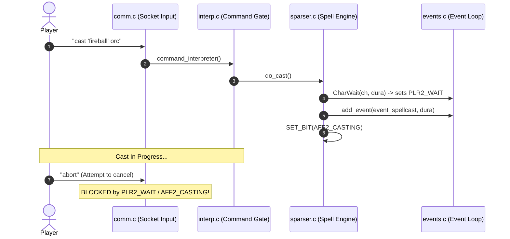
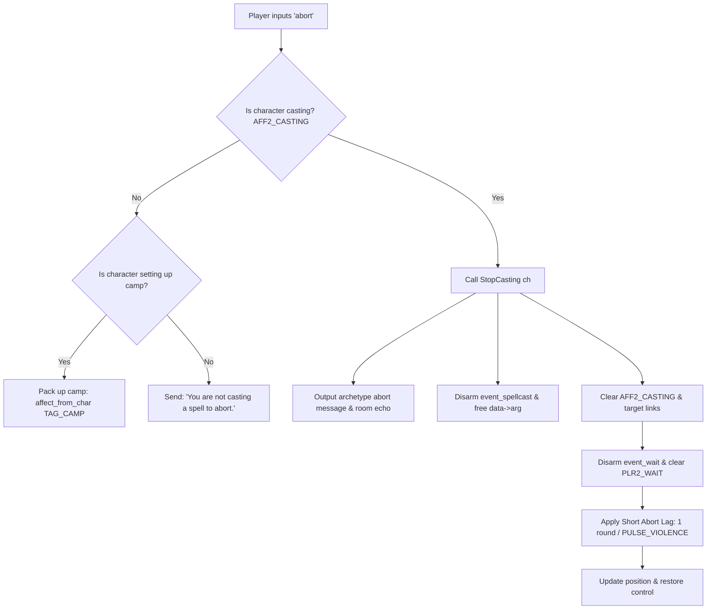

# Spell Abort Command (`abort`) Design & Implementation Plan

- **Date:** August 27, 2026
- **Status:** Planning Complete; Ready for Implementation
- **Target Component:** Core Engine (`src/comm.c`, `src/interp.c`, `src/interp.h`, `src/sparser.c`, `src/prototypes.h`, `tests/async/`)
- **Objective:** Introduce a player-facing `abort` command that allows any character currently casting a spell, praying, or channeling psionic will to cleanly interrupt and cancel their incantation.

---

## 1. Executive Summary & Objective

In DurisMUD, starting a spell locks the player character in a casting state (`AFF2_CASTING`) and wait state (`PLR2_WAIT`). If battlefield conditions shift—such as a friendly target moving out of range, an enemy dying before a long chant lands, or a dangerous mob turning to target the caster—the player currently has no mechanism to voluntarily stop their own cast. The command interpreter intercepts all player commands with `"You're busy spellcasting!"` until the cast completes or is interrupted by external combat disruption (e.g. bash, silence, knockdown).

This project adds a native **`abort`** command allowing casters of all classes (Mages, Clerics, Shamans, Druids, Psionicists, Paladins, Anti-paladins, Bards, etc.) to cancel their active spell in mid-cast, reset their casting state, and regain command control after a short recovery pulse.

---

## 2. Deep Dive: Current Engine Architecture

### 2.1 The Spellcasting Pipeline
When a player initiates a spell (`cast`, `commune`, `pray`, `will`):
1. **Invocation:** `do_cast` or `do_will` in [`sparser.c`](file:///home/aiwithapex/projects/duris/src/sparser.c#L2203) validates targets, costs, reagents, and silencing effects.
2. **Casting State:** `SET_BIT(ch->specials.affected_by2, AFF2_CASTING)` is applied.
3. **Event Registration:** `add_event(event_spellcast, ...)` is scheduled on `ch->nevents` to execute in pulses proportional to `SpellCastTime(ch, spl)`.
4. **Command Gate Lock:** `CharWait(ch, dura)` sets `PLR2_WAIT` on `ch->specials.act2` and schedules `event_wait`.



### 2.2 The Two Architectural Barriers
1. **Input Queue Gate in [`comm.c:1239`](file:///home/aiwithapex/projects/duris/src/comm.c#L1239-L1243):**
   ```c
   if ((!t_ch || (t_ch && (CAN_ACT(t_ch) &&
                (!IS_SET(t_ch->specials.affected_by, AFF_CHARM) ||
                 (point->original))))) &&
       get_from_q(&point->input, comm))
   ```
   `CAN_ACT(t_ch)` evaluates `!IS_SET(t_ch->specials.act2, PLR2_WAIT)`. Because `CharWait` sets `PLR2_WAIT` for the full duration of the chant, `comm.c` holds all player input in `point->input` without dequeuing it until `event_wait` expires.
2. **Casting Guard in [`interp.c:1421`](file:///home/aiwithapex/projects/duris/src/interp.c#L1421-L1436):**
   ```c
   if (IS_AFFECTED2(ch, AFF2_CASTING))
   {
       if (cmd != CMD_PETITION && cmd != CMD_RETURN)
       {
           send_to_char("You're busy spellcasting!\r\n", ch);
           return;
       }
   }
   ```
   Even if a command reached `command_interpreter`, only `petition` and `return` are whitelisted; all other inputs are rejected.

### 2.3 Existing Abort Infrastructure (`StopCasting`)
The engine already contains a robust, multi-class interruption handler in [`sparser.c:show_abort_casting`](file:///home/aiwithapex/projects/duris/src/sparser.c#L1160-L1199) and [`StopCasting`](file:///home/aiwithapex/projects/duris/src/sparser.c#L1201-L1207):
* **Class-Specific Flavor Text:**
  * **Arcane (Mage/Sorcerer/Necromancer/etc.):** `"You abort your spell before it's done!"` / `"$n stops invoking abruptly!"`
  * **Psionicist / Mindflayer:** `"You abort your mental image before it has become reality!"` / `"$n's face flushes white for a moment."`
  * **Divine / Natural (Cleric/Druid/Shaman/Paladin):** `"You abort your prayer before it's done!"` / `"$n stops chanting abruptly!"`
* **Resource Cleanup:**
  * Iterates `ch->nevents`, frees any allocated `spellcast_datatype.arg` payload strings.
  * Disarms `event_spellcast` from `ch->nevents`.
  * Removes `AFF2_CASTING`.
  * Clears target room/world tracking links (`LNK_CAST_ROOM`, `LNK_CAST_WORLD`).

---

## 3. Detailed Design & Mechanics

### 3.1 Command Specifications
* **Command Word:** `abort`
* **Minimum Position:** `STAT_RESTING + POS_PRONE` (consistent with `CMD_PETITION` so sitting/resting/knocked casters can still abort).
* **Minimum Level:** `0` (available to all players).
* **Trust Level:** `0`.
* **Log Flag:** `LOG_NORMAL`.
* **In-Battle Usability:** `TRUE` (enabled during active combat).

### 3.2 State Transitions on `abort`



### 3.3 Resource Consumption Rules
* **Spell Slots & Mana:** In Duris, `use_spell(ch, spl)` is called only at the *completion* of `event_spellcast`. Aborting early preserves the spell slot and unspent mana.
* **Lag / Recovery Penalty:**
  * To prevent zero-cost macro spamming (e.g. aborting at 95% chant completion to bait reactions with zero cooldown), an abort will apply a fixed recovery lag of **1 combat pulse (`PULSE_VIOLENCE`, ~2.5 seconds)** via `CharWait(ch, PULSE_VIOLENCE)`.
  * This is significantly shorter than full multi-round cast recovery but prevents instant recast abuse.

---

## 4. Implementation Steps & File Modifications

### Step 1: Define Command Constants in `src/interp.h`
Add `CMD_ABORT` to the command enumerations:
```c
/* File: src/interp.h */
#define CMD_ABORT 875
```

### Step 2: Register Command in `src/interp.c`
1. Add `"abort"` to `const char *command[]`:
   ```c
   "abort",
   ```
2. Whitelist `CMD_ABORT` in the `AFF2_CASTING` check ([`interp.c:1423`](file:///home/aiwithapex/projects/duris/src/interp.c#L1423)):
   ```c
   if (IS_AFFECTED2(ch, AFF2_CASTING))
   {
       if (cmd != CMD_PETITION && cmd != CMD_RETURN && cmd != CMD_ABORT)
       {
           send_to_char("You're busy spellcasting!\r\n", ch);
           ...
           return;
       }
   }
   ```
3. Register command binding in `assign_command_pointers()` ([`interp.c`](file:///home/aiwithapex/projects/duris/src/interp.c#L2500)):
   ```c
   CMD_Y(CMD_ABORT, STAT_RESTING + POS_PRONE, do_abort, 0, TRUE);
   ```

### Step 3: Allow Input Dequeue During Casting in `src/comm.c`
Update the descriptor input pump condition ([`comm.c:1239`](file:///home/aiwithapex/projects/duris/src/comm.c#L1239-L1243)):
```c
/* File: src/comm.c */
if ((!t_ch || (t_ch && ((CAN_ACT(t_ch) || IS_AFFECTED2(t_ch, AFF2_CASTING)) &&
            (!IS_SET(t_ch->specials.affected_by, AFF_CHARM) ||
             (point->original))))) &&
    get_from_q(&point->input, comm))
```
*Rationale:* When `AFF2_CASTING` is active, input is dequeued into `command_interpreter`. `interp.c:1423` guarantees that any command *other* than `abort`, `petition`, or `return` will immediately be rejected with `"You're busy spellcasting!"` without side effects, while allowing `abort` to reach `do_abort`.

### Step 4: Declare Prototype in `src/prototypes.h`
```c
/* File: src/prototypes.h */
void do_abort(P_char, char *, int);
```

### Step 5: Implement `do_abort` in `src/sparser.c`
```c
/* File: src/sparser.c */
void do_abort(P_char ch, char *argument, int cmd)
{
    if (!IS_ALIVE(ch))
        return;

    if (IS_AFFECTED2(ch, AFF2_CASTING))
    {
        /* 1. Cancel spell event, clear links, remove AFF2_CASTING, show flavor message */
        StopCasting(ch);

        /* 2. Disarm full casting wait timer */
        disarm_char_nevents(ch, event_wait);
        REMOVE_BIT(ch->specials.act2, PLR2_WAIT);

        /* 3. Apply standard abort recovery delay (1 combat pulse) */
        CharWait(ch, PULSE_VIOLENCE);

        if (ch->in_room != NOWHERE)
            update_pos(ch);

        return;
    }

    /* Fallback: Support aborting camping setup */
    if (IS_AFFECTED(ch, AFF_CAMPING))
    {
        send_to_char("You quickly pack up your things and move on.\r\n", ch);
        act("$n stops setting up camp.", TRUE, ch, NULL, NULL, TO_ROOM);
        affect_from_char(ch, TAG_CAMP);
        return;
    }

    send_to_char("You are not casting a spell to abort!\r\n", ch);
}
```

### Step 6: Add Documentation & Help Entry in `lib/information/help.wld` / `areas/`
Add help text entry:
```
ABORT

Syntax: abort

The abort command allows a spellcaster or psionicist to voluntarily interrupt
and cancel a spell or power while in the middle of chanting or focusing.

Aborting a spell avoids consuming spell slots or mana for the canceled spell,
but incurs a brief recovery delay before another action can be taken.
```

---

## 5. Verification & Testing Strategy

### 5.1 Automated Async Contract Test (`tests/async/test_spell_abort_command.py`)
A new test script following the repository's async testing standard (`tests/async/run_spell_abort_command.sh`):

| Test Case | Scenario | Expected Behavior |
| :--- | :--- | :--- |
| **TC-01** | `abort` while casting Mage spell | `StopCasting()` fires; `"You abort your spell before it's done!"` displayed; `AFF2_CASTING` cleared; `event_spellcast` disarmed. |
| **TC-02** | `abort` while chanting Cleric/Shaman prayer | `"You abort your prayer before it's done!"` displayed; `LNK_CAST_ROOM` links cleared. |
| **TC-03** | `abort` while focusing Psionic will | `"You abort your mental image before it has become reality!"` displayed. |
| **TC-04** | Recovery Lag Verification | `event_wait` from original cast duration is replaced with short `PULSE_VIOLENCE` wait. |
| **TC-05** | Non-abort commands during cast | Commands like `look`, `flee`, `cast` continue to be blocked with `"You're busy spellcasting!"`. |
| **TC-06** | `abort` while not casting | Displays `"You are not casting a spell to abort!"` without mutating character state. |
| **TC-07** | `abort` while setting up camp | Aborts camping setup cleanly (`TAG_CAMP` removed). |

### 5.2 Build & Code Quality Check
* Build verification with `make -C src` ensuring zero compiler errors or warnings.
* Code formatting verification using `./scripts/format.sh --check`.

---

## 6. Risk Assessment & Mitigations

| Risk | Impact | Mitigation |
| :--- | :--- | :--- |
| **Input Flood during Cast** | Minor CPU overhead if player spams commands while casting | `comm.c` pops one line per pulse per descriptor; `interp.c` rejects non-whitelisted commands immediately in early branch before any allocations or database lookups. |
| **Memory Leak in Pending Spell Data** | Memory growth over time | `show_abort_casting()` walks `ch->nevents`, frees `data->arg`, and cleans up all dynamic memory prior to event disarming. |
| **Target Link Inconsistencies** | Dangling pointers in room/world target links | `StopCasting()` explicitly calls `clear_links(ch, LNK_CAST_ROOM)` and `clear_links(ch, LNK_CAST_WORLD)`. |
