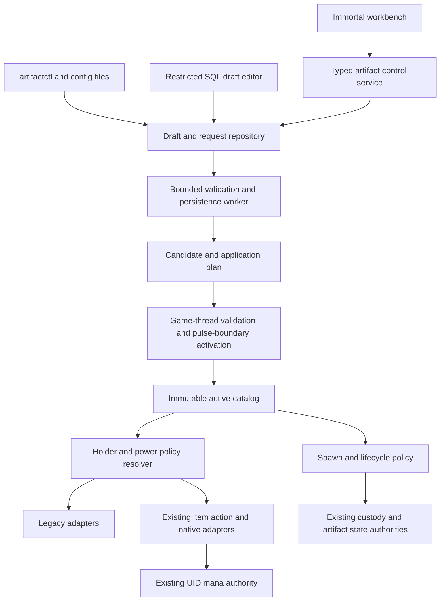

# Artifact control implementation specification

Status: implementation contract and roadmap, 2026-09-18. This PR implements the first self-contained pilot slice (catalog model, atomic file publication, admin/CLI workflow, modern routing bridge, and migration 0029). The remaining requirements below describe the follow-on work needed before every legacy load and instance-state path is catalog-owned. Baseline: `440248b17eecc3517229a48a4946cf6c0a33ffa5`.

Read alongside [source research](ARTIFACT_CONTROL_PLAN.md), [operator flows](ARTIFACT_CONTROL_OPERATIONS.md), [implementation work packages](ARTIFACT_CONTROL_WORK_PACKAGES.md), and [goal handoff](ARTIFACT_CONTROL_GOAL.md). This specification and operator contract supersede tentative design choices in the research document. The research remains the baseline evidence.

## 1. Required end state and boundaries

R01. One catalog describes every source-inventory artifact, unique, and ioun, including native callback, dynamic bindings, classification, powers, and acquisition evidence. Artifacts introduced later are validated into the same catalog.

R02. All catalogued items have centrally controlled classification/lifecycle/placement policy and truthful diagnostics. Legacy-only adapters remain selectable and visible. No unreviewed power is automatically rewritten. The complete delivered new-mode roster includes Avernus, Tsunami, mirrored ioun, necroplasm, Mayhem, Symmetry, packed/random weapon adapters, devices/wonder, and typed Studio abilities. Unsupported variants on other artifacts must be rejected, not silently emulated. Future adapters extend the same interfaces.

R03. Immortals can use a polished in-game workbench to search, inspect, draft, edit, preview, validate, publish, inspect outcomes, and roll back. The workbench covers load points, timers, balance, behavior variants, holder policy, and supported base prototype overrides. It is not just an output dump or a raw JSON editor.

R04. A standalone CLI supports the same operations without game login. Human-editable versioned configuration can be imported/exported. Both running-server and stopped-server workflows are defined.

R05. A restricted database operator can edit drafts and submit requests from a SQL client without game login. SQL changes receive the same semantic validation and runtime application checks as UI/CLI changes. Arbitrary root modifications to authoritative game-state tables are outside the safe interface; the supplied restricted account cannot make them.

R06. Support template defaults, placement policy, per-UID pinned variants, and holder-following variants. Players, wild NPCs, and player-controlled NPCs have explicit policy. Classic and revised behavior can coexist on supported instances without creating another scarcity allowance.

R07. Preserve UID/custody, logical uniqueness, expiry/binding, cooldown obligations, paid reserve, and exact single-power ownership across transfer, mode switch, reload, copyover, death, recovery, and rollback.

R08. Deploy additive schema changes through the existing immutable migration and runtime-compatibility process; support MySQL 8.0, MariaDB 10.11, and flat-file primary. Update backup/restore/lifecycle manifests. Never introduce a second fallback authority.

R09. Publish atomically with revision checks, durable audit, bounded work, crash recovery, clear error states, and no gameplay-thread database/file operations. Prove behavior with real runtime/UI/CLI/SQL journeys and meaningful fault tests.

R10. Deliver all planned operator documentation, baseline import/export, compatibility diagnostics, resource-safe rollback, and an evidence ledger. Prototype overrides requiring restart must still be authorable through all three interfaces and explicitly scheduled, not silently ignored.

Non-goals for this implementation: inventing redesigned powers for the remaining legacy-only artifacts; arbitrary executable Lua/SQL/C++ in configuration; private DurisStudio UI implementation; production deployment; live balance approval. Public Studio contract integration and its tests are required. These exclusions do not excuse omitting controls for existing legacy artifacts.

## 2. Architecture and dependency rules

Proposed files compile as C++20 following repository conventions:

| Module | Files under `src/artifact/` | Contract |
| --- | --- | --- |
| Pure model | `artifact_catalog_model.{h,c}` | Strict parse, canonical encoding/hash, typed values, semantic cross-references not requiring a live world. No game globals or SQL. |
| Capabilities | `artifact_adapter_registry.{h,c}` | Stable adapter/power IDs, supported variants, allowed fields, limits, command/event ownership, NPC requirements. Function pointers originate in compiled registration only. |
| Resolution | `artifact_policy.{h,c}` | Pure policy resolution from immutable definition and context; explanation with provenance. |
| Repository | `artifact_control_repository.{h,c}` | Drafts, submissions, revisions, head, audit, leases/fences; SQL and flat-file implementations. |
| Runtime | `artifact_control_runtime.{h,c}` | Worker orchestration, validation receipts, durable publication, request/result cache, boot recovery. |
| Game bridge | `artifact_control_game.{h,c}` | Game-thread world validation and safe activation, no blocking I/O; consumes prepared candidate. |
| Spawn | `artifact_spawn.{h,c}` | Uniform fresh-acquisition authorization, logical-family reservation, placement/provenance and existing reset integration. |
| Lifecycle | `artifact_lifecycle.{h,c}` | Pure expiry/feed/binding/war calculation with adapters to existing authoritative transactions. |
| Instance state | `artifact_instance_policy.{h,c}` | UID mode/provenance/revision and typed state operations; separate from reserve and custody ownership. |
| Cooldowns | `artifact_cooldown.{h,c}` | Stable semantic UID/power cooldown obligations; game-thread cache plus existing persistence worker boundary, no per-hit SQL. |
| UI | `artifact_admin.{h,c}`, `artifact_admin_session.{h,c}` | Commands, menus, pagination, draft session and permission checks. |

Retain `src/item/item_actions*`, `artifact_mana*`, and existing artifact adapters as execution/resource services. Extract native constants/selection boundaries incrementally. Retain existing artifact/guild and item-custody repositories; do not replicate their state in the catalog repository. Reuse scheduler, worker, checksum, protected file, and operation-ID facilities after checking their current contracts.

Define typed results: `ok`, `not_found`, `invalid`, `unsupported`, `forbidden`, `conflict`, `busy`, `unavailable`, `requires_restart`. Unknown/error state must never collapse to `legacy` or `not_owned`. Separate routing result (`legacy`, `modern`, `suppress`) from execution result. C++ APIs accept typed structs, not unvalidated command text or SQL.

## 3. Catalog shape, identities, and limits

Use `lib/artifacts/catalog.json` as the tracked authoring index, with relative `definitions/*.json`, `balances/*.json`, `lifecycles/*.json`, and `placements/*.json`. Import resolves the tree into a self-contained canonical bundle. Live servers execute a published bundle from their configured authority, not loose edited source files. Reject path escape, symlink escape, duplicate object keys, unknown fields, duplicate IDs, NaN/infinity, fractional integer fields, and unexpected schema versions. Do not execute file paths, shell fragments, or function names from content.

Canonical IDs are lowercase ASCII `[a-z][a-z0-9_.-]{0,63}`. Existing vnums remain integers validated against the actual world. UID uses the existing physical UID type and is never allocated by a configuration editor. Revision counters are unsigned 64-bit with explicit exhaustion rejection. JSON transport encodes revisions/UIDs as decimal strings to avoid rounding in clients; gameplay quantities below use bounded integers.

Initial parser ceilings: 8 MiB per resolved bundle, 4096 definitions, 16384 placements, 32 powers per definition, 16 variants per definition, 16 aliases/forms per family, 2048 bytes per message, nesting depth 32. A plain long description can use the existing stricter world-text limit. These are safety bounds, not performance claims; reject over-limit candidates before publication.

Required top-level resolved bundle fields: `schemaVersion` integer 1; `definitions`, `balanceProfiles`, `resourceProfiles`, `lifecycleProfiles`, `placements` arrays; `compatibility` with world digest, adapter-contract digest, and imported property digest. Publication revision/hash/actor belong in the publication envelope and must not be trusted from authored content.

### 3.1 Artifact definition

| Field | Type and behavior |
| --- | --- |
| `id`, `vnum`, `displayName` | Stable ID; actual prototype vnum; display only, escaped on output. |
| `classification` | `major`, `unique`, `ioun`; import precedence faithfully and report divergent old call sites before normalization. |
| `uniquenessFamily` | Stable ID shared by variants/forms/aliases; logical maximum initially 1 for imported singleton artifacts unless evidence establishes otherwise. |
| `legacyBinding` | Read-only imported callback/dynamic binding evidence and source references, not executable text. |
| `lifecycleProfile` | Existing profile ID. |
| `defaultVariant` | Supported variant ID. |
| `holderPolicy` | `player`, `wildNpc`, `controlledNpc` maps; `controlledNpc` initially inherits player. |
| `variants` | IDs mapping to compiled adapter ID, balance profile, and explicit owned power IDs. No two handlers may own one power/trigger selection. |
| `powerPolicy` | Per-power enable/suppress choice; base passives and native aftermath listed independently from magical activation. |
| `prototypeOverrides` | Typed base dice, weight, hit/damage/armor affects and approved flags, constrained by item type. No raw `value[]` write interface. Unsupported field is reported explicitly. |
| `prototypeApply` | `futureInstances` or `restart`; imported defaults do not modify live items. Active worn-item stat mutation is not part of ordinary hot publication. |
| `messages` | Reviewed message templates with a fixed escaped token vocabulary, no interpreter commands. |

A vnum can belong to only one definition; variants do not allocate extra vnums. Additional prototype aliases require explicit family membership and capability support. Changing classification, family, adapter binding, UID semantics, or structural prototype flags on an existing family is `requires_restart` plus a reviewed migration plan. Unsupported legacy powers remain read-only in the power editor with exact source/capability explanation, while supported balance fields and lifecycle/placement remain editable. Do not pretend a new numeric key controls code that never reads it.

### 3.2 Balance and resource profiles

`balanceProfiles`: `id`, `adapterId`, `resourceProfile` (nullable reference ID), `powers` map keyed by stable power ID. `resourceProfiles`: `id` (authoring ID), `nativeProfileId` (decimal string, stable numeric identity used by existing mana service), `resourceRevision` (decimal string), `capacityMilliunits`, `regenMilliunitsPerSecond`, `passiveFloorMilliunits`. Import existing native IDs (normally vnum for native pilots), never allocate them by hashing a name or silently replace an enrolled UID's profile. Distinct authoring IDs cannot conflict over one numeric identity. Registry descriptors declare every supported field, current/default value, unit, range, and hot-reload effect. Implement meaningful fields for all delivered pilots, not only a global damage multiplier.

- Chance: exact rational `{numerator, denominator}`, 0 <= numerator <= denominator <= 1,000,000; retain old random draw ordering for imported compatibility profiles. Do not introduce extra rolls in legacy mode.
- Spell power: fixed integer 0–60 or a named compiled formula with bounded parameters. No expression evaluator. Effects that currently exceed those bounds need explicit adapter-specific descriptors and tests.
- Damage/heal caps: nonnegative integer up to the adapter's arithmetic-safe bound; retain damage flags, legal-target checks, and actual-damage healing semantics.
- Cooldown: integer milliseconds 0–604800000, rounded only at an explicitly documented legacy seconds boundary. This field is distinct from windup and artifact expiration.
- Windup/progress: integer pulses subject to the existing foundation bounds. Default import preserves eight pulses where currently used. Nova requires its existing minimum. Reactive interception rejects nonzero windup.
- Target count: bounded integer 1–4096 and never bypasses permission checks.
- Costs: integer mana milliunits; explicit per-power cost/multiplier. Device charges/ink retain their own resource type.
- Resource profile: stable ID, monotonic resource revision, capacity, regen milliunits/second, passive floor; validate against both existing mana limits and narrower adapter limits. New rows start empty. No catalog field sets current reserve.

One logical artifact uses the same paid resource identity across holder variants. Capacity/rate changes settle old rate and clamp without filling. Rollback creates a new resource revision carrying old parameters; it never republishes a lower resource revision. `resourceRevision` is independent of catalog revision; unchanged resources retain their revision. Validate the complete profile binding graph before modifying the live mana profile registry.

### 3.3 Lifecycle profile

Fields: `initialLifetimeSeconds`, `maxRemainingLifetimeSeconds` (0–31536000; 0 means disabled only through an explicit `expiryEnabled=false`, not an accidental infinite timer); `bindingSwitchSeconds`; `lootAllowanceSeconds`; `feedSecondsPerEpic`; typed per-event rational multipliers; `maxFeedSecondsPerEvent`; `multipleArtifactPolicy`; `warBurnFraction`; `equipmentLimitPolicy`.

Import ten-day lifetime, effective feeding coefficients, difficulty dial behavior, recent-frag rules, and exact integer truncation from active execution. Do not use dead property values as defaults. Profile edits affect future acquisition or future feed calculations; they do not extend existing deadlines. Retroactive timer changes use an explicit instance-state request with preview and expected state revision. Multiple-artifact grouping must preserve current categories until intentionally revised.

Maintenance intervals become typed deployment policy with validated bounds: expiry polling 1–300 seconds, bind polling 1–3600 seconds, wars polling 1–86400 seconds, bounded batch count 1–256. Import existing intervals; scheduler reschedule must not run duplicate jobs. Job intervals are not per-item power cooldowns.

### 3.4 Placement

Fields: `id`, `artifactId`, `enabled`, `trigger` (`boot`, `zoneReset`, `manual`), `zoneVnum`, typed `destination` (room, mob reset identity+room+equip slot, or container reset identity), exact `effectiveChance`, `maxLive`, `conditions`, `behaviorSelection`, `postLootSelection`, `sourceResetRef` during import.

Use stable reset-entry IDs; mob vnum alone is ambiguous where the same mob loads in multiple rooms or instances. Conditions may reference a small compiled list of existing reset dependencies, not arbitrary script expressions. Preserve previous-command success and parent-container semantics. A placement change affects future fresh spawns; it does not teleport an existing artifact. `G` versus `E`, AI capability, and actual equipped state are visible in preview.

Import nominal chance plus the legacy halving rule and display the effective result. Once authoritative placement data owns the final chance, apply it exactly once and bypass only the old chance halving for that migrated placement. Continue all other eligibility gates. Do not double-run a catalog load plus its old `.zon` entry.

## 4. One authority, three authoring interfaces

Bootstrap setting `ARTIFACT_CONTROL_BACKEND=sql|flatfile` must match the server persistence mode; default is derived from that mode. `ARTIFACT_CONTROL_STATE_DIR` applies only to flat-file authority. These are startup settings, not hot properties or UI-editable values. Config files are import/export material on both backends, not a second runtime source. No precedence rule that silently overwrites newer database publication with an old checked-in file is permitted.

Before initial import, the server remains in legacy-import mode and reports `CATALOG_NOT_INITIALIZED`; operators can inspect source compatibility but cannot accidentally enable new powers. Once initialized, missing/corrupt authority is an error, not permission to revert every item to legacy. Running servers retain the last validated in-memory revision if config storage is unavailable, while blocking publication and any state operations needing durable acceptance. On startup, an initialized but unreadable/invalid authority prevents opening the game listener; the explicit offline recovery tool must repair it. Do not silently use a stale exported bundle.

All interfaces call equivalent operations: create draft; save draft with expected generation; validate; submit immutable candidate; request publish with expected active revision; inspect status; create rollback draft. Dry-run is default for CLI instance-state mutations. Database authoring never updates live custody/mana/expiry directly.

### 4.1 SQL data model

New additive tables (names fixed by this contract; precise DDL uses current repository charset conventions):

| Table | Required columns/invariants |
| --- | --- |
| `artifact_config_draft` | UUID `draft_id` PK, `base_revision` BIGINT UNSIGNED, `generation`, `document` LONGTEXT, `author_principal`, `reason`, `created_at`, `updated_at`; JSON validity and 8 MiB limit; writable only while mutable. |
| `artifact_config_submission` | UUID `submission_id` PK; draft ID/generation, expected base revision, immutable document/hash, authenticated submitter, action (`validate`, `publish`, `activateOnBoot`), timestamps. Append only; validated procedures copy locked draft content. |
| `artifact_config_result` | Submission ID PK, status, structured diagnostics, proposed/published revision, applied boot ID, `scheduled_for_boot`, intended world/adapter digests, timestamps. Runtime-owned mutable result, monotonic transition checks. |
| `artifact_config_revision` | Monotonic revision PK, parent revision, submission ID UNIQUE, canonical document, SHA-256, schema/world/adapter digests, author/reason/time. Immutable after insert. |
| `artifact_config_head` | Singleton key 1, durable current revision/hash, fencing epoch. Runtime/maintenance publisher only; compare-and-swap. |
| `artifact_config_audit` | Monotonic event ID, operation/submission ID, principal, action, old/new revision, outcome, reason, timestamp. Append only, indexed by request/revision. |
| `artifact_instance_policy` | UID PK, artifact/family ID, expected-state revision, pinned/follow selection, placement ID, origin provenance, last applied catalog revision, tombstone. Does not own reserve or physical custody. |
| `artifact_ability_cooldown` | Composite PK UID + semantic power ID, state revision, accepted operation/token ID, UTC accepted time/deadline, duration, settlement clock floor, tombstone. Updates cannot shorten an already accepted obligation; duplicate operations are idempotent. Reuse an existing equivalent authority if verified; never persist a second competing deadline. |
| `artifact_control_request` | UUID operation ID PK, typed operation/payload, expected instance revision and catalog revision, actor, reason, time; append only. No raw SQL operation. |
| `artifact_control_result` | Operation ID PK, status/result/error, state revision, timestamps; runtime-owned. |
| `artifact_control_lease` | Singleton service lease, owner/boot ID, fencing epoch, lease deadline; prevents online/offline publishers or two server processes racing. |

Use InnoDB. LONGTEXT plus `JSON_VALID` and runtime strict parsing gives a common MySQL/MariaDB representation; do not depend on identical JSON binary storage or MySQL-specific JSON schema functions. Server validation also rejects duplicate keys even when SQL accepts them. Verify transaction isolation, FK/unique constraints, JSON validity enforcement, and row-size limits on both engines. Reserve or integrate an existing equivalent lease/command table only if it satisfies this exact contract and document that mapping; avoid redundant authorities.

Expose read-only views `artifact_config_status_v` and `artifact_control_status_v`. Provide stored procedures `artifact_draft_create`, `artifact_draft_replace`, `artifact_draft_submit`, `artifact_request_submit`, with expected-generation checks and bounded input. Restricted operators may edit their authorized draft rows using ordinary SQL and increment generation, then call submit. A trigger increments/enforces generation and stamps authenticated principal/time so direct UPDATE cannot bypass conflict detection. Submitted bytes are copied and immutable; later draft edits cannot change queued work. Use a registered principal map keyed by actual authenticated SQL account, not an operator-supplied author string or definer `CURRENT_USER()` alone. Cross-owner draft editing requires publisher role.

Accounts: config reader (SELECT safe views); config editor (own drafts/procedure calls); config publisher (publish request procedure); state operator (typed instance requests); runtime service (runtime-owned tables). Existing game credentials may be broad; restricted operator examples must use separately scoped accounts. No UPDATE/DELETE grant on revision/head/result/mana/custody/artifact tracking tables. Root can circumvent database grants; do not claim arbitrary root SQL can be made safe.

### 4.2 Flat-file equivalent

Protected domain under configured state root: `artifact-control/drafts/`, `submissions/`, `revisions/`, `results/`, `instances/`, `audit/`, `HEAD`, and service lock. Same schemas, hashes, IDs, state machine, generation checks, and limits as SQL. Atomic temp-write/fsync/rename and directory fsync follow the existing proven primitive. Store submission/audit/result transaction groups in a recovery journal so a crash between files is replayable. One writer lock; offline tool refuses while server lock is held. The CLI can enqueue through the bounded atomic inbox while server owns the writer; it never rewrites HEAD. No database is required for a flat-file deployment.

## 5. Publication protocol and recovery

States: `QUEUED -> VALIDATING -> REJECTED | CONFLICT | READY_RESTART | PREPARED -> COMMITTED -> APPLIED`. `FAILED_RETRYABLE` carries last stable phase and retry identity, not a new request. A validate-only request ends `VALIDATED`, never publishes. `READY_RESTART` alone is not scheduled: only an explicit `activateOnBoot` request sets `scheduled_for_boot`; allow at most one scheduled candidate for a given head, with explicit cancellation/replacement and audit. Result pages distinguish durable committed head from running applied revision. `APPLIED` means running process acknowledged the exact revision/hash. After restart the boot receipt establishes application again.

1. Atomically snapshot draft generation into submission with expected head. Reusing an operation ID with identical bytes returns the prior result; different bytes returns conflict.
2. Worker validates strict structure, bounds, capabilities and diffs. It reads current head and constructs candidate immutable objects. It does not touch game objects.
3. Game thread validates candidate against a versioned world/adapter snapshot, current profile bindings and supported transitions in bounded batches. Validation produces an application plan and digest. Revalidate the snapshot epoch before commit. Catalog-wide rollback/resource revisions are computed here, not guessed by SQL.
4. Acquire service publication slot and enter a bounded admission barrier for affected artifact families: reject new affected powers/spawns and queue/reject affected admin state changes with `CONFIG_APPLYING`. Ordinary movement/death/custody continue; cancellation hooks still work. Before irreversible configuration effects, worker persists revision+audit+CAS head+COMMITTED result in one transaction. If commit fails, release barrier with old catalog and no costs/parameters changed.
5. Following durable commit, game thread atomically swaps the validated catalog/profile registry at a pulse boundary and cancels affected actions. No allocation/fallible validation in this final swap: prepare complete registries first. Old immutable definitions live until their users retire. Source-linked form cleanup runs in bounded queued batches under the affected-family barrier. Each native callback is identity-safe. If unrecoverable application failure occurs, retain suppression for affected families and expose an error; never claim APPLIED or run mixed definitions.
6. Mark runtime applied receipt through worker, then release barriers. Readers can see `COMMITTED/applying` until the result write succeeds; gameplay can use the applied immutable revision, and status shows any delayed acknowledgement. Retry the same receipt without reapplying gameplay effects.

Only one publication at a time. Multiple requests from one base: one wins; others return `CONFLICT` and require three-way rebase. Rebase auto-merges non-overlapping fields, presents overlaps, and never silently last-writer-wins.

Barrier timeout before durable commit: abort after 2 seconds and retain old state. After commit, bounded cleanup may exceed that interval: publish status reports count and suppresses affected families until safe; watchdog at 10 seconds raises an operator error and stops further publication. Never automatically revert durable head in response to a timeout. A committed revision is replayed at boot before gameplay. Startup builds the whole runtime registry from head and does not restore pending item actions.

If world/prototype/adapter changes need restart, online publish returns `READY_RESTART` without modifying head. `activateOnBoot` registers a scheduled candidate against the current head; boot validates the actual new binary/world and commits it before listening. Any intervening head change causes conflict. Offline activation requires no active lease, the intended binary/world validator, and the same CAS/audit contract. On preflight failure retain previous head and report exact diagnostics. Structural state migration must be completed before activation rather than encoded as surprise cleanup.

Lease: renew every 5 seconds, 30-second expiration; all head/state publication writes include current fencing epoch. Stale publishers fail even after lease expiry/reacquisition. Runtime rechecks lease before admission to managed state operations; lease loss suppresses new affected stateful actions. This supplements existing server single-writer deployment, not permission to run two game worlds on one state store.

Worker bounds: config poll every 2 seconds, queue 128, at most one candidate building/applying, diagnostics capped at 100 errors per candidate, result/audit writes bounded per cycle. Game validation/cleanup batches at most 32 instances or 1 ms per pulse, whichever first. No per-hit SQL or file scan. Index source UID and active definitions using existing indexes where available; avoid adding a second full object-list scan for every proc. Measure realistic workloads before increasing caps.

## 6. Holder, variant, and power resolution

Resolver inputs: immutable catalog revision, definition ID, UID metadata, custody/controller role, source slot, placement policy, event/power ID, deployment suppression. Role is `player`, `wildNpc`, `controlledNpc`; use effective controlling player through charm/pet/possession/master chain with cycle/depth protection. Immortality does not silently select a different profile; explicit authorized testing override is required.

Order: emergency suppression > explicit permitted instance pin > still-applicable placement override > holder rule > artifact default. Resource/eligibility/legality validation follows mode selection and cannot select another mode on failure. Explain output returns the chosen source, every overridden rule, unsupported exclusions, and effective config revision.

On transfer/controller change: cancel pending actions; invalidate accepted source identities; remove source-owned grants; retain UID, timers, binding, reserve, legacy-energy state, and all still-running cooldown obligations; choose new mode; apply appropriate allowed form contributions. Do not adopt unrelated player affects. Apply current legal-target checks again at release. A copyover restores no pending action, but preserves UID policy/cooldowns/resource authority.

Pin creation and changes are durable typed instance operations. If an operator asks to change a live UID while it transfers or expires, use expected state revision/custody generation and return conflict. Ordinary holder-following resolution is derived, so it requires no database write on every hit. Stored provenance is assigned on fresh creation and retained; looting can end placement override according to `postLootSelection` without discarding provenance.

Legacy and modern variants share stable cooldown semantic IDs (e.g. `tsunami.tap`, `tsunami.wave`) for cross-mode obligations. Import active native timestamps; use a monotonic timer while running and persisted UTC deadlines plus clock-backward protection across restart. Changing cooldown config does not shorten an already accepted cooldown. Extend Studio cooldown persistence through the same typed UID/ability service for catalog-managed powers. On uncertain time/state, suppress until validated rather than refresh. Do not erase cooldowns when switching mode.

Cooldown durability must have an explicit measured admission contract. For paid managed powers, enqueue cooldown persistence with the accepted action using the same UID/token and start the same oldest-unacknowledged clock as resource admission; enforce a shared maximum two-second window, not two sequential independent windows. Missing/failed cold reads suppress admission. Recovery combines the acknowledged resource/cooldown records conservatively; inconsistent or unknown readiness suppresses until reconciled. Acknowledged cooldowns survive restart; crash loss of unacknowledged admission is bounded and reported alongside the existing mana crash-refund contract. Tests distinguish clean restart, durable-ack crash, and crash inside that bound. Do not claim synchronous durable-before-effect or absolute zero crash refund. For zero-cost managed powers use the same cooldown worker admission bound. Configuration and explicit instance-state operations themselves require durable commit before becoming effective, as specified above.

New-mode depletion never falls back to legacy. Explicit legacy selection is an operator balance decision and retains native eligibility. Unconverted curses, equipment penalties, and harmless presentation continue only where the power-ownership map says so. Disabled/suppress mode cannot bypass an item curse or remove a native penalty merely to improve equipment.

NPC AI: register per-power `manual`, `passive`, `reactive`, or `npcAutomatic` capability. Automatic active abilities use existing NPC pulse/AI, select a legal target, and call the same admission function once per configured decision interval (minimum 1 second) with no extra instant effect. Busy attempts do not spin/retry per frame. Charmed/controlled NPC behavior follows player policy. Default preserves existing NPC behavior; new automatic activation is opt-in. Display inventory/equipment requirements and missing AI activation separately.

No NPC mana refill on equip/load/loot. Initially retain empty per-UID enrollment and elapsed regeneration. Boss encounter resources beyond physical mana are a future distinct feature and cannot be silently introduced in this implementation. The UI must warn if a chosen NPC configuration has no immediately usable resource and show estimated regeneration time.

## 7. Acquisition, scarcity, and lifecycle integration

Every fresh acquisition route obtains a typed family reservation before exposing the object: active zone resets including table-based loads, scripted/proclib/Studio loads, special-procedure rewards, `load obj`, the new spawn tool, and replacements. Recovery has a separate restore operation validating an already-authorized UID; it does not consume fresh chance or allocate another logical instance.

Perform a source inventory of callers of `read_object`/instantiation. Inspection temporary prototypes must not reserve scarcity or create mana/state. Do not place a global singleton check inside `read_object` without creation-purpose context; research found admin inspection paths instantiate temporary objects. Replace ambiguous creation APIs incrementally with `purpose=preview|fresh|restore` and require a typed acquisition token before custody publication.

Family reservation persists with operation ID and UID through existing custody transaction facilities. If none can represent the reservation atomically, add a dedicated family-state row/file with unique family+slot and a journaled transfer to custody; specify retry/recovery before implementation. Creation followed by failed custody establishment releases only its own provisional reservation. Destroyed/tombstoned instances cannot be replayed as fresh objects. A failed ownership lookup is `unavailable`, never permission to spawn.

Initial import matches active reset command identity and disables only its redundant artifact loader once the new placement delegates into that reset event. Preserve mob creation, dependency chains, zone age, equipment ordering, and non-artifact loot. Replacing a load location does not remove the existing artifact or change its expiry; show this in the diff. Explicit recall/poof-and-replace is a separate state operation, not a config side effect.

State controls required: show/set/add/subtract expiry; reset binding; choose instance variant; spawn at permitted destination; poof; suppress/resume powers; rollback catalog. Each has a preview, expected revisions, actor/reason, operation ID, durable result, and exact permissions. Timer operations must maintain the existing artifact/guild domain projections through one authoritative transition. Do not update `artifacts` without updating the transactional domain where required. Avoid writable reserve commands in the normal workbench; resource-profile changes are supported, arbitrary mana grants are not required.

## 8. Compatibility, import, and transition

Import must capture effective deployed properties, actual built world, native assignment configuration, and existing typed Studio definitions. The checked-in source inventory is a starting point, not evidence of live values. Produce a per-artifact compatibility report: category, lookup precedence, load routes, power ownership, configurable versus hard-coded fields, native timers, resource identity, and persistence rules.

Capture baseline hashes and stable reset identities. Unsupported dynamic binding or unresolved indirect load is an explicit diagnostic blocking migration of that route; retain it under a declared legacy adapter until accounted for. All 169 templates must appear, including unavailable/templates-only/placeholders. No fabricated powers or invented load points.

Old `itemActions.*` and `artifact.*` controls become compatibility projections for catalog-owned fields. Once catalog ownership is enabled, direct `properties set` for those keys returns a pointer to the artifact workbench; it does not create a second authority. Keep a separate startup/runtime emergency suppression gate that can only suppress, never enable. During staged adoption, each definition has exactly one owner (`legacyProperties` or `catalog`), visible in inspection, with validated cutover. Category gates affecting noncatalogued ordinary devices continue to operate through their existing path until the shared adapter control bridge is migrated.

Rollback publishes a new revision with previous behavior values and fresh monotonic definition/resource revisions. It does not rewind UIDs, timer state, grants, custody, or mana. A malformed config never triggers rollback to free legacy powers. Old-binary rollback requires compatible schema and state qualification; runtime configuration rollback must work without dropping tables.

Migration number is assigned from current manifest head at implementation time; baseline currently ends at 0028. Do not preassign a number that can conflict with other work. Update immutable apply/verify checksums, runtime compatibility manifest, compiled schema contracts, lifecycle manifest, backup inclusion, restore validation, and tests discovered through current manifest consumers. All migrations are additive and replayable/verified using repository conventions.

## 9. Required observable outcomes

`artifact control status` and CLI/SQL views expose backend, initialized flag, durable head/hash, runtime applied revision/boot ID, scheduled activation, active request, queue depth, barrier/cleanup count, last successful poll, last validation/publication error, and storage/lease health. All timestamps UTC plus user-friendly duration. Do not expose credentials or resource reserves to mortals/public messages.

Audit config revisions and instance operations with authenticated principal and reason. Do not log full secret-bearing environment or raw general SQL. Operator-facing errors carry stable codes and field paths: `UNKNOWN_ARTIFACT`, `UNSUPPORTED_VARIANT`, `INVALID_UNIT`, `RESOURCE_REVISION_REQUIRED`, `WORLD_MISMATCH`, `STALE_BASE`, `SCARCITY_CONFLICT`, `INSTANCE_MOVED`, `STORAGE_UNAVAILABLE`, `RESTART_REQUIRED`. Include human-readable correction and retain invalid drafts for repair.

Completion is defined by [the work-package evidence matrix](ARTIFACT_CONTROL_WORK_PACKAGES.md), not by schema presence or passing source-string tests. Every interface must demonstrate accepted, rejected, conflicted, and recovered operations against actual runtime integration.
