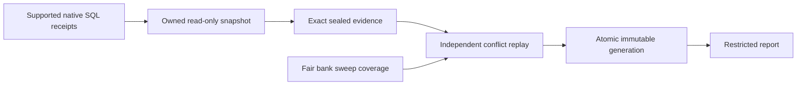

# Canonical earned-reward compatibility

This implements the narrow telemetry seam in [#490 section 4](https://github.com/Community-Duris/Duris/issues/490#4-independent-audit-and-reward-projection), formerly #487. Independent **reward projection definition 2** counts supported native economic events once across accounting roots, compatibility ledgers and linked receipts. It retains exact evidence, publishes immutable generations, and exposes uncertainty through restricted reports. The existing reward projection definition 1 and balance rollup definitions 1–9 keep their meanings and published generations.

**Locally qualified, 2026-10-07:** the complete maintained command with the compatible tools image passes **116/116 phases** on MariaDB 10.11.14 and MySQL 8.0.46 in source-stable run `ea5be3761214`. Supported native bank, wallet/pile and auction paths qualify source-to-restricted-readback compatibility. The entire accounting feature and accepted telemetry expansion remain unfinished.

## Supported authority and comparisons

| Selected native SQL source | Meaning in definition 2 | Required evidence |
| --- | --- | --- |
| Typed bank quest issuance | Known earned currency, in copper | Native EAI1 intent/EAP1 plan, indexed effects/postings, exact quest source claim, compatibility currency row and completed inbox result |
| Typed bank deposit/withdraw | Custody transfer; excluded from earnings | Same-root balanced wallet/bank legs and exact native receipts |
| Typed chaos starter bank grant | Opening supply; excluded from earnings | Exact deterministic source/lifetime claim and issuance legs |
| Typed wallet/pile, change-making, pile split/merge, peer and recipient transfer roots | Custody transfer; excluded from earnings | Exact root, deterministic COIN children, wallet/pile receipts, item references and lifecycle claims |
| Money claim backed by timed native auction settlements | Custody transfer; excluded from earnings | Entire ordered source-operation/slot allocation inventory, every settlement dependency, pending-claim and wallet legs, compatibility rows and completed results |

The root's economic wallet lifetime is distinct from its native player locator. Currency event identity uses a stable root key with participant PID zero, including quarantines. Beneficiary PIDs and exact native intent remain in private evidence; changing a beneficiary cannot create a second event for the same root. A source adapter must establish parent, child and participant equivalence from native references. Equal names, amounts or timestamps cannot establish it.

These comparisons apply to the supported events selected in a retained generation. A known earned sum excludes unknown/conflicted events; its coverage counts remain part of the result. It is not a total for unobserved history. Transfers and opening supply remain visible without entering earned sums. Currency, epic, frag, equipment and observed XP are separate units. Enum availability is not source-route qualification.

Unsupported origins, correction/refund/administrative owners, epic/frag/equipment and committed-XP authority remain unavailable or provisional. Bid refunds, other auction pending-claim origins and item claims need their own qualified inspectors. Observed XP cannot acquire committed earned authority. Native currency award dates and dated account/controller bindings are unavailable: published date, account, controller and registry fields are NULL, with explicit unknown counts. Capture times are freshness labels, not award dates. The qualified dated observed-XP portfolios in definition 9 remain separate and unchanged.

## Evidence pipeline



The external adapters in `canonical_reward_source.py`, `canonical_reward_coin_source.py` and `canonical_reward_auction_source.py` own read-only repeatable-read consistent snapshots. They check InnoDB sources, explicit columns, native lengths/counts and linked fan-out before fetching bounded payloads. All receipt queries in a cut share that snapshot. A malformed physical key, unexpected dependency, encoding/hash disagreement, connection failure or capacity refusal discards the cut. Explicit quarantine retains bounded receipt disagreements as unknown events with NULL amounts.

`canonical_reward_retention.py` seals exact selected operations, physical source keys, normalized payload bytes and digests atomically in three private tables. SQL guards bind digests to bytes and prevent mutation of sealed evidence. Recovery checks the whole cut and reconstructs authority from retained native receipts, rather than trusting saved totals or current player holdings. A cut is complete for its exact selection and source snapshot; future commits remain provisional, even for an empty selection.

`canonical_reward_reconciliation.py` provides bounded native-bank discovery over 256 operation-ID prefixes. Each pass freezes its visible upper key as a traversal bound, never a commit watermark. Each invocation visits one fair slot; failures preserve the prefix cursor/upper bound and still rotate the slot. Successful progress and an immutable step commit together after retained replay. Later lower-sorting commits can be recovered on subsequent passes. Neither a timestamp, an ID, a finite overlap nor one completed round proves complete history.

Before source capture, the journal independently replays the prefix's prior retained cut. Missing or corrupt evidence records a retention gap, preserves source progress, rotates fairly and prevents native capture for that dispatch. Health exposes visited/unvisited prefixes, active passes, failures, latest immutable steps, exact attempt/capture labels and retention gaps. Source backlog and retention floor remain unknown; no pruning acknowledgement is issued.

`canonical_reward_conflicts.py` searches all visible sealed cuts for exact physical-source payload variants inside one owning retained snapshot. It retains every conflicting digest and invalidates affected amounts. It shares verified lookups only by table/key/excluded digest within that snapshot, reserving cache cost and seeking again on a later transaction. It does not choose a winning payload. Batch derivation merges original authority before applying global witnesses so quarantine-first and valid-first selections agree with independent generation replay.

`canonical_reward_publication.py` binds an explicit cut selection, exact conflict witnesses and optional native-bank sweep evidence to a generation. It independently replays the native evidence before sealing and publication. Exact overlapping cuts yield one event while retaining their source references. Events, derived health/coverage and the completion marker publish in one transaction. Independent readers cannot see partial publication. Later conflicts or repaired retention improve a new generation; older generations keep their original evidence and uncertainty.

Optional sweep health is frozen in the same retained snapshot as the selected rewards. Restricted public readback validates its 257 rows: one state and 256 prefixes. These observations validate metadata coverage and the selected dependencies; they do not validate every historical source payload or authorize pruning. Bank sweep health cannot qualify wallet/pile or auction history. Their discovery, backlog and retention-floor coverage remain unavailable.

## Commands and roles

Run the external command from the repository root:

```text
python3 -m scripts.telemetry.canonical_reward capture --route bank --operation EXACT_ROOT_32_HEX
python3 -m scripts.telemetry.canonical_reward capture --route wallet-pile --operation EXACT_ROOT_32_HEX
python3 -m scripts.telemetry.canonical_reward capture --route auction --operation EXACT_CLAIM_32_HEX
python3 -m scripts.telemetry.canonical_reward stage --generation EXACT_GENERATION_32_HEX --cut EXACT_CUT_64_HEX
python3 -m scripts.telemetry.canonical_reward publish --generation EXACT_GENERATION_32_HEX
python3 -m scripts.telemetry.canonical_reward report --generation EXACT_GENERATION_32_HEX
```

Replace placeholders with exact nonzero identifiers. Repeat `--operation` for a bounded capture selection and `--cut` for a bounded generation selection. `stage --scan EXACT_SCAN_32_HEX` optionally freezes native-bank sweep coverage. Explicitly initialize that scan through `CanonicalRewardJournal(project_factory).initialize(scan_id)`, then call `canonical_reward_reconciliation.reconcile_once(scan_id, source_factory, project_factory)`. It advances one durable fair slot per invocation, with a shared monotonic deadline checked around connector calls. Connector/server timeouts also bound blocking calls; the API is cooperative and does not independently kill a caller's process. The command does not silently create or infer a scan.

`capture --quarantine` retains bounded receipt disagreements without assigning earned authority. Physical, connection, shape and capacity failures still refuse the whole cut. Capture returns its exact sealed cut ID and provisional coverage, without raw payloads. Capture and retention share the command deadline. A lost retention reply exposes the cut identity for verification; a killed capture may leave an unpublished sealed cut. Recapture cannot duplicate canonical earnings because publication reconciles exact event identity and retained variants.

| Principal | Connection namespace | Authority |
| --- | --- | --- |
| Source/capture | `TELEMETRY_REWARD_SOURCE_DB_*` | Native SELECT; private retained-cut SELECT/INSERT and column-scoped UPDATE of the seal flag |
| Projection/reconciliation | `TELEMETRY_REWARD_PROJECT_DB_*` | Private retained replay, journal and generation work; publication writes; no native accounting-table access |
| Report | `TELEMETRY_REWARD_REPORT_DB_*` | Complete public coverage/events/health SELECT only; no native/private evidence or writes |

Each namespace supplies HOST, PORT, USER, PASSWD and DATABASE through the existing connection/TLS/tunnel validation. Passwords are environment-only. Game `DB_*` credentials are not a fallback. A killable worker enforces the command deadline; after an ambiguous stage/publication result, retry the exact same generation and selection to reconcile its durable state.

## Maintained bounds

| Boundary | Limit or meaning |
| --- | --- |
| Whole invocation / whole command | Budget at most 10 seconds, shared by linked operations; API checks the deadline around connector calls, CLI has an outer killable worker |
| Cut or generation reservation | Existing 32 MiB; no partial result after refusal |
| Exact canonical source record | 8,192 bytes; unsupported larger records refuse |
| Source-row reservation | 12,288 bytes per row |
| Receipt SELECT | At most 2,000 returned rows; explicit columns and keyset/identity predicates |
| Receipt page | Eight SELECT statements, with owning snapshot and length/count preflight |
| Bank page | At most 666 roots; one fair prefix per reconciliation invocation |
| Wallet/pile page | At most 128 selected roots and supported native record/ancestry versions |
| Auction page | One claim, at most 128 native settlement sources; 129-source preflight refuses |
| Retained conflict lookups | At most 2,000; cache entry reserves 512 bytes; no cross-transaction reuse |
| Bulk write | At most 64 rows and 512 KiB combined exact payload per statement |
| Generation selection | 1–256 exact cuts, subject to shared byte/reference budgets |
| Published sweep coverage | Exactly 257 rows, read with reward rows under one joint budget |

Auction allocation capture and its actual-query diagnostic force the existing claim index `idx_economic_pending_claim_consumed`. Qualification requires a ref/range/const access path on both engines. Bank diagnostics include the real upper-bound discovery subquery and full effect columns; wallet/pile diagnostics include the actual root/inbox and child/inbox/currency/item joins. Diagnostic output excludes query parameters and private identities/payloads.

The native 128-source auction proof uses one item per sale, including a zero-fee settlement. It does not qualify every maximum-cardinality item/blob combination. Three full maximum-size cuts exceed the unchanged generation budget and must refuse; two cuts, including quarantine, remain publishable. Native source-removal tests are owned-fixture fault injections that preserve critical recovery inboxes; they do not authorize operational history pruning.

## Schema and preservation

Registered migrations 0073/0074/0075 add 13 protected tables: three retained-source stores, three sweep stores and seven private/public generation, event and health stores. All six immutable histories append them after the exact 75-step progression prefix and end at 78 migrations. Runtime/lifecycle inventories include 295 tables. The new stores inherit protected retention/disclosure and recovery/export policy; sealed migrations and existing budgets remain unchanged.

Measured head fingerprints are `bac802366618685dbdd3a3c6c5f74cb259fc8cdee97eefddf32dd3e6a7f371d3` for MySQL and `cbfb5aff196718c0c88242b34688e7d51e031ca6ce65c2f55282fcdd7d4698ac` for MariaDB. Six-history convergence, old receipt prefixes, guarded reruns, native migration-session failure/exclusion handling, shell/compiled boot and type/trigger/history/state/expression tampering are qualified by the registered-history runs. Final integrated evidence belongs to the complete command below.

The qualified battle implementation `5a10f19f2`, progression implementation `cf82f7ad5`, ordinary live PvP duration path, earlier definitions and published generations remain preserved. PR #677 is already integrated. This projection adds no gameplay reward/XP writer, accounting activation, automatic balance repair or universal progression score.

## Complete qualification and measured evidence

```text
python tests/async/qualify_telemetry_controls.py --disposable
```

For a verified compatible local image, append `--tools-image duris-telemetry-control-tools:local`; omit it for the maintained tools build. The command owns isolated Docker namespaces, databases, synthetic accounts and dedicated principals, without reading `.env`, using an existing server or exposing a host-facing listener. Full delivery requires both supported engines; `--engines` is for focused diagnosis.

The command builds the server, checks formatting, runs focused regressions and ASan/UBSan, measures callback/transport/report budgets, and qualifies all six registered histories on each engine. It runs native bank then wallet/pile journeys in one shared schema, separate native 2/128/129-source auction schemas, guarded schema reruns/verifiers, native writer/storage/runtime and preserved actual-server battle/progression journeys. See [CONTROL_QUALIFICATION.md](CONTROL_QUALIFICATION.md) for the maintained gameplay runbook.

Run `ea5be3761214` passes all **116 phases**: 32 focused programs (including 107 reward regressions across seven suites), server build/format, feature and native-owner ASan/UBSan, runtime/lifecycle contracts, existing performance guards, six registered histories per engine, guarded reward-schema reruns, native bank/coin/auction journeys and the preserved actual-server battle/progression journeys. The run uses the command above with `--tools-image duris-telemetry-control-tools:local`.

Receipt: `bin/tests/duris-controls-ea5be3761214/qualification.json`, SHA-256 `c25189f88b1eb5d161446386ec754c98aaf1f20edd37eaed396b1bf220463c4e`. Qualification source SHA-256 `347fda2e5185a7bd07e44dc581915b090147ac6b359bfad262760de7a65b4277` stayed unchanged throughout the run. The separately frozen 6,131-file/250,980,288-byte source snapshot matches at completion; final evidence changes only the four telemetry documentation files. The tools image is `sha256:74b699976165c15fc29cf92b9c2dbefcdbca35505a08efc84d14bf644cbf6d5b`. All owned resources were removed; production/staging access is false.

Both engines independently qualify five selected native bank roots with 100 copper earned, 1,000,000,000 copper of starter opening supply excluded and three transfers. The later lower-sorting 17-copper commit is recovered by a subsequent fair sweep and published. Global retained conflicts invalidate the earlier affected amount without choosing a winning payload. Native coin publication retains seven transfers and one unknown/conflicted event, with zero earned events, across drop/pickup, change, split/merge, peer and recipient paths. Auction claims backed by 2 or 128 native settlements retain custody only; zero-fee evidence is included at the larger boundary. The 129-source claim refuses after four preflight SELECTs, including the actual capture CLI, with no partial retention/publication. Both engines qualify the required claim index with bounded `ref`/`range`/`const` access.

| Engine | Bank capture seconds / source rows | Bank health reservation / traced Python peak bytes | Coin generation reservation / traced Python peak bytes | Auction 128 capture max seconds / rows | Auction 128 generation reservation / traced Python peak bytes | Auction 129 traced Python peak bytes |
| --- | --- | --- | --- | --- | --- | --- |
| 10.11.14-MariaDB-ubu2204 | 0.006817 / 39 | 10,245,056 / 3,611,376 | 2,915,584 / 1,752,346 | 0.343650 / 1287 | 31,670,848 / 21,952,800 | 169,358 |
| 8.0.46 | 0.139293 / 39 | 10,245,056 / 4,026,493 | 2,915,584 / 3,663,305 | 0.366823 / 1287 | 31,670,848 / 24,006,203 | 2,050,826 |

Both 128-source cuts reserve 15,818,784 bytes each; two-cut generations reserve 31,670,848 bytes. Three full maximum-source cuts refuse without a partial generation. Each native sweep journey covers multiple separately bounded invocations; fixture/helper elapsed totals are not single-command latency.

| Measured native stage | Worst p99 / p99.9 / maximum, ns |
| --- | --- |
| `off` | 57 / 81 / 401,858 |
| `control_capture_encode` | 558 / 6,983 / 23,179 |
| `native_pending_watch_pulse` | 190,125 / 545,571 / 1,354,333 |
| `native_result_begin_finish` | 14,976 / 40,117 / 242,606 |
| `native_progression_cached_presence` | 15,656 / 29,287 / 270,887 |
| `native_progression_mutation_refresh` | 41,899 / 110,928 / 290,937 |
| `native_progression_observation` | 15,561 / 50,673 / 291,021 |
| `producer_clock_pair` | 2,833 / 15,319 / 48,951 |

The result/progression benchmark passes 75 profiles across five stages at 50/200/256 admitted sessions, five repetitions and 4,096 samples per profile. Control capture has 30 profiles and paired-clock sampling has two sanitized profiles. Existing p99 1 ms / p99.9 5 ms guards pass; callback heap/crypto allocation is zero. The synthetic transport/report gate also passes. Maximums are reported separately from percentile guards. Fixed control state is 213,048 bytes, watch state remains within 256 KiB and progression spans remain 256 within 128 KiB. SQL/Telnet and production load are excluded from these benchmark callbacks.

Actual-server journeys on both engines use binary SHA-256 `55c8212e2d25da0d3ae5b9ed46407030b93c8c1e38eee50da09d999aa609b85a` with native save tracing disabled. They preserve ordinary solo/group PvP prefixes, reviewed battle/outcome evidence, native XP/rested/group decisions, switching/overlap, independent player-store save/readback, copyover and private-writer outage/recovery. Their source windows and uncertainty remain part of the receipts; the short exposure-qualified XP decision window does not establish a whole-fight or population rate.

| Actual-server engine | Ten telemetry-off save round trips: median / max, ms | Ten telemetry-on/status-present save round trips: median / max, ms |
| --- | --- | --- |
| mariadb | 2004.421 / 2005.323 | 2004.594 / 2004.945 |
| mysql | 2003.963 / 2005.311 | 2004.483 / 2004.938 |

These are whole client-visible save round trips including authoritative persistence, Telnet/test-client scheduling and read windows. They are controlled-host observations, not isolated server save CPU timings or production latency guarantees.

| Engine | Native bank report SHA-256 | Native coin report SHA-256 |
| --- | --- | --- |
| mariadb | `297f32af54ce49841344c48236cdf3435e3b41609d85dd0263a21f44f3d6ad51` | `9ce3eb51dac1cd66b9c0cc59527d762c643b3865038c365abbf7cdc0b811890e` |
| mysql | `414c4ea16cfae5bfdbe61f88f078165a096712465973baf7c7d63c6570b59f51` | `29e3c1c950854454d1c4b76dd54392f9dbabe2bd3e6a84244bee22981dafa492` |

Native ASan/UBSan binary SHA-256 values: `canonical-native-bank`: `268b76440b463e404c6c62f05ae6fb45edc78346eeb1a8151d97b941bfa0ca49`; `canonical-native-coin`: `2aa21958d44c66895f4b7f1a702ceb779f79033e3063d65a606224f34b04d5d2`; `canonical-native-auction`: `7b0e7c58b43d824a2bbf253f933e23440221a7cefd4673b4f7c8e1ee768d0b04`.

Native owner fixtures establish the supported transaction and receipt boundary. Listing/bid/player prerequisites are synthetic fixture setup; those fixtures do not establish complete commerce gameplay admission or original item issuance. The actual-server phases separately preserve the prior battle/progression qualification. Traced Python allocations and reserved bytes exclude process RSS and database memory. Small controlled-fixture timings are not population estimates or production-load qualification. TSan is explicitly unrun on this host; no full burn-in is claimed.

## Remaining dependencies

The narrow seam supports known selected currency issuance and prevents bank/wallet/pile/auction custody from inflating earnings. It supports exact replay, overlap/conflict handling, delayed native bank commit recovery, durable progress and visible uncertainty through restricted published readback.

Other native reward origins, flatfile authority, complete accounting audit/route admission, complete history/retention coverage and dated currency portfolios remain unavailable or outside this seam. A capture label or current membership cannot supply a missing historical account/controller link. The full accounting tracker #490 and telemetry tracker #258 stay open, PR #683 stays draft, and all seven final #258 requirement lines remain verbatim and unchecked.

The next telemetry dependency is distinct PvE attempt identity, reviewed objective results, historical participation/recovery effort, PvP interruptions and exact supported committed-reward linkage. That supplies the denominator needed for reward per attempt and per covered effort, including unsuccessful/censored runs. The four complete balance suites, prevention/faction exposure gaps and statistical exports remain unfinished.

## Historical qualification records

Earlier receipts are scoped evidence; the current complete gate above supersedes them for delivery.

| Record | Result and scope |
| --- | --- |
| `canonical-reward-registration-78-serial-20261007.json` | Six registered histories/78 migrations/295 tables, exact prefixes and boot/tamper/rerun qualification on MySQL 8.0.46 and MariaDB 10.11.19; SHA-256 `bf9eacfabf323d78f2e9dbe525a2bbda80354ae303c6cd0ba8664db7761d4c30` |
| Complete run `7c852c090134` | Failed after 55 phases at shared-schema native coin setup; resources removed. Receipt SHA-256 `a0d4b9c8fa689adfc2ee2318764c328f029528e9cd15de3540cd45e8bd516081` |
| Shared-schema reproduction `991b6ab1453a` | Expected-failure proof: native player ID 3 differed from wallet mapping lifetime ID 4. The native owner correctly rejected the fixture's mistaken authority key. Both fixture keys now query the exact mapping; no sequence or retained-state reset was introduced |
| Focused repaired sequence `cba84c0383d4` | MariaDB bank/coin passed; overall run exited 1 at MySQL conflict staging. Its initially saved `running` label is not a passing result. Quarantine-first cut ordering exposed a batch-versus-independent-replay metadata mismatch |
| Focused final MySQL sequence `cf8389320b8b` | Native bank then repaired coin passed after batch derivation merged original authority before applying all witnesses. Capture/stage/publish/report, delayed 17-copper publication, conflict/health/retention and restricted roles passed; resources removed. Receipt SHA-256 `47552c330c4b5a7e124d981e438c09507f6b37ec5818d5dcd36311689795d2ff` |
| Complete run `7619229d2f47` | Failed at phase 116, MySQL gameplay: 115 prior phases passed, including both engines' native reward paths and MariaDB gameplay. Receipt SHA-256 `da78816c4f2aeb61e93f720073f404173214dfba6df86325023242ecc31d6650`; resources removed. A completed level 11–12 stage had interval-quality uncertainty and an 8,769,138-usec coverage gap after the unchanged 64-segment-per-minute fixture budget exhausted. No full-stage time was qualified |
| Focused MySQL gameplay repair `a0abd4a1e108` | Focused progression regression and the complete actual-server gameplay/publication journey passed after verifying one current/maximum NPC HP for every progression fight. One full stage and one short connected-time rate cell qualified; misses, uncertain fight windows, older generations and all original assertions remain retained. Native gameplay took 1,195.110 seconds; resources removed. Receipt SHA-256 `43ccf22acedc5a0315655493ae3f3f85752d08a0743ddbe0430eee4b15b07580` |
| Complete run `2b91edd66b76` | Failed at MariaDB character creation/camping after 81 passing phases, including all MariaDB native reward paths and SQL preservation. The sixth camp save failed and shutdown exceeded its unchanged 30-second limit; resources removed. Receipt SHA-256 `9eab68dd73b00c34d898ba0dba5b4c0ce1db89e2531a6e6d7ad9f2cdba8fb0d1`. The cause remains unresolved; no complete qualification is claimed |
| Focused traced MariaDB diagnosis `8b795f1accb3` | Full actual-server journey passed in 878.828 seconds, including ten character creations/camps, six progression generations, one qualified full stage and a short decision-exposure rate cell. Original save failure did not reproduce; source SHA-256 `de1fcf79688f171c3ec2885a1ee535b670e44281ec9e18992617246a400e099b`; receipt SHA-256 `84469b4fed25d815f1eb230be10285b8e4db7ea939bd3e315c28fb5953e24e38`; resources removed. Save tracing was enabled for this diagnostic run |
| Complete run `c22c3214dc52` | Failed at MariaDB 128-source auction native-source pruning after 66 passing phases. A three-second administrative DELETE timed out; rollback and role cleanup then encountered the closed connection. The exact table and timeout cause remain unknown. Receipt SHA-256 `78b959bce7d242400f4251615d25d0dfcc8e728ad387211e3bc1197ab1a23bac`; resources removed; no complete qualification is claimed |
| Focused auction pruning diagnosis `ba0b73de5f20` | Both native 128-source journeys passed against the same frozen source and sanitized binary, including capture/retention/conflicts/restricted publication and replay after native pruning. Seven DELETEs per engine retained the three-second deadline: maximum 91.340 ms on MariaDB and 4.945 ms on MySQL. Original timeout did not reproduce; no repair is claimed. Receipt SHA-256 `7f3703ef3bb182d6e372e217217a4ba409256ff5fe930084e87785e3f18eeb05`; source SHA-256 `347fda2e5185a7bd07e44dc581915b090147ac6b359bfad262760de7a65b4277`; resources removed |

The quarantine-order regression fails on the former implementation and passes for both valid-first and quarantine-first ordering after the repair. It preserves every witness and NULL conflict amounts without changing source queries or budgets. The bank helper also retains its completed capture-CLI flag when adding retention measurements; that repair changes qualification evidence only.

The MySQL gameplay failure's exact retained source was replayed offline for diagnosis. The milestone NPC had one current HP but a larger maximum HP, so regeneration prolonged the fight and repeated native damage XP exhausted its segment budget. The maintained journey now verifies one current and maximum NPC HP before every progression fight, using native staff prerequisite commands. Awards and level thresholds still follow ordinary combat; misses, context cuts and unknown intervals remain retained. A focused regression preserves NULL full-stage times for a completed stage with both a flagged interval and an uncovered tail. The full-stage qualification assertion, 64-segment cap, report definitions and gameplay producer code are unchanged.

The dated [battle delivery](BATTLE_RESULTS.md#qualified-local-delivery-2026-10-05) and [progression delivery](PROGRESSION_CONTEXT.md#qualified-local-delivery-2026-10-06) retain their original scope and measurements.

The character-creation save failure remains recorded without an inferred cause or claimed repair. Failure capture now includes the player persistence log outside `logs/log`, and native save tracing is optional. The complete delivery run above uses default tracing disabled. No persistence/gameplay C++ path, save/shutdown deadline or qualification assertion changed.
