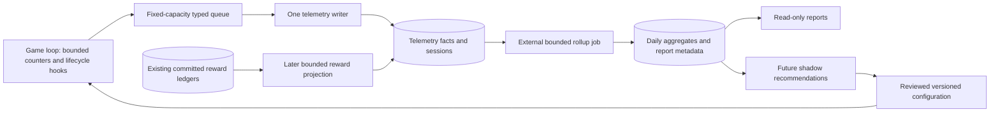

# Telemetry storage and access design

Design review: 2026-09-12. Source baseline: `20fb9c15d77a321cb39d7f89b384adc3571d24ff`. Companion to the source audit summarized in #258.

Status: proposed architecture, not implemented or benchmarked. No production database/version/topology was inspected. Performance numbers below are proposed test budgets and workload arithmetic, not observed capacity. This review deepens and narrows T2/T3/T8/T9 in the audit.

## Decision

Start with dedicated `telemetry_*` InnoDB tables in the existing logical game database, one bounded telemetry writer with one explicitly budgeted private connection, and an external report/rollup command with at most one additional connection. Reuse verified database configuration, connection/session initialization, immutable migrations, lifecycle inventory, and diagnostic conventions. Keep the telemetry queue, retries and failure handling independent of authoritative persistence.

Keep the first release limited to session/playtime facts, effective configuration identity, and two deliberate rollups. Extend with typed progression and encounter summaries only when their questions are ready. Existing reward ledgers remain the authority for rewards. Telemetry is allowed to lose bounded observational detail, but must disclose gaps. A telemetry failure must never cause a save failure, gameplay fence, or synchronous fallback.

There is no design that proves literally zero slowdown on shared hardware. This design removes direct waiting from the pulse loop, bounds CPU/memory/write amplification, and makes shared-database interference measurable. If the measured storage headroom is insufficient, move the same telemetry writer/schema to a separate MySQL/MariaDB instance. A second schema on the same instance improves organization and permissions but does not provide CPU, buffer-pool, redo, disk or replication isolation.

## Why the current boundaries matter

| Existing implementation | Verified behavior | Design implication |
|---|---|---|
| `src/sql/sql_pool.h:24` | Default four connections, maximum sixteen; acquisition waits up to 2,000 ms | A routine analytics borrower can occupy capacity required by gameplay persistence. Do not solve that by simply increasing the shared pool. |
| `src/player/player_snapshot_repository.c:727` | Player snapshot application borrows from that pool | Worker-thread SQL can still delay saving, even without a synchronous game-thread query. |
| `src/sql/sql.c:1031` | Common factory verifies runtime configuration and establishes connections; documented connect/read/write timeouts are ten seconds | Reuse the security/session contract, but explicitly own the telemetry connection and its lifecycle. Socket timeouts are not a general query-time or shutdown guarantee. |
| `src/persistence/critical_command_coordinator.c:537`, `critical_command_journal.c:396` | Acceptance invokes journal append and `fsync`; operations have entity fences and recovery obligations | High-frequency observations do not belong in the critical-command lane. That would give analytics the failure semantics of money and ownership. |
| `src/player/player_save_worker.h` | Coalesced snapshots, PID/revision ordering, journal acceptance and retained results | Analytics history is not a player snapshot component. Coalescing would erase history or require incompatible special cases. |
| `src/persistence/maintenance_scheduler.h`, `.c` | One worker, twelve registered jobs, bounded row/time budgets and durable continuation state | Use the scheduling discipline as a model. Large rollup scans should not share the worker with auctions, world balancing or other maintenance. A budget checked between operations cannot preempt an already slow SQL statement. |
| `src/persistence/persistence_queue.h` | Legacy string/large-payload compatibility queues | Do not expand pipe-delimited SQL compatibility messages into the new analytics protocol. |
| `src/persistence/critical_outbox.c:176` | Delivery updates one destination/dedupe result and row status; it is part of critical delivery/draining | This is not an independent analytics subscription log. Reusing a delivered flag as analytics progress would mix responsibilities. |

Only the telemetry worker may use its `MYSQL*`; no pool release API accepts ownership of that handle. If the worker cannot connect, it remains degraded and retries with capped backoff. It never borrows the main handle or falls back to `sql_persistence_connection()`.

## Alternatives and when they become justified

| Choice | Benefit | Cost/failure coupling | Decision |
|---|---|---|---|
| Add counters to `player_data` | Very small code/schema change | Hot gameplay row writes, no time history, dirty/revision ownership confusion, old context disappears | Only repair existing compatibility playtime here. Do not put analytics into saves. |
| Dedicated tables on current instance | Existing tools, joins, backups, schema workflow; least operational change | Shared I/O, redo, memory, disk capacity and backup footprint | Recommended initial deployment after a load gate. |
| Separate schema on current instance | Grants and namespace separation | Same physical contention; additional migration/lifecycle/backup namespace handling | Optional administrative choice, not a performance fix. |
| Separate MySQL/MariaDB instance | Isolates analytics storage/write/read load if resources are separate | More operations, credentials, monitoring and cross-store reward reconciliation | First physical-isolation upgrade when warranted. Same instance on the same saturated disk is insufficient. |
| Read replica | Moves expensive read CPU/I/O to replica hardware | Writer load remains on source; replication is extra work; lag and consistent export boundaries matter | Consider when reports, rather than ingest, become the bottleneck. Never read lagged telemetry for immediate gameplay decisions. |
| File/SQLite spool then another database | Local outage buffering | Another durable representation, quota, checksums, recovery, two-stage delivery and lifecycle rules | Defer. Explicit observation gaps are simpler for the first release. |
| Redis/Redis Streams as initial history store | Existing optional Redis integration | Adds another durability/retention/delivery path to an already mixed system | Keep presence/cache separate. Not needed for this write rate. |
| Columnar warehouse/time-series service plus broker/CDC | Broad, long-history analytical capability | New service, schema semantics, ingestion, recovery and monitoring stack | Reconsider only after a measured workload exceeds the bounded relational design. |
| Offline columnar file exports | Isolates occasional exploratory reads | Export freshness, file lifecycle, reproducibility and access controls | A reasonable later option for human studies before adopting a permanent warehouse. |

The last four are architectural tradeoff judgments, not product performance comparisons. No product benchmark or procurement evaluation was performed.

## Data flow and ownership



The arrow from reviewed configuration to the game represents the existing authorized configuration/application boundary, not SQL access from combat. There is no gameplay dependency on the analytics query path.

Keep source code under one small `src/telemetry/` module: types/runtime, queue-worker, SQL repository and health. A small external `scripts/telemetry_rollup` entry point owns report production. Those are proposed boundaries, not an invitation to create a reusable event bus, multi-backend ORM, routing framework or dynamic plugin system.

Expose a narrow typed API such as session enter/state-change/end, update counters, bounded pulse flush, and health copy. Producers pass fixed-size values or bounded arrays; no SQL, JSON strings, player pointers, arbitrary filenames or callback closures cross the queue. Keep enums and schema versions explicit. The worker never walks live character/group/world state.

## Capture and delivery contract

Use elapsed monotonic time for duration; UTC timestamps identify reporting time. Maintain exclusive connection/engagement categories, with combat/travel/etc. as clearly defined context. Capture gameplay dimensions at observation time. Precompute stable configuration IDs when configuration changes, rather than hashing the configuration per event.

Tentative default: seal a contextual interval at sixty seconds, a meaningful dimension transition, session exit, or UTC day boundary. Do not seal on every room movement, attack, or command. Level/class/faction/zone/config changes matter; many room changes within the same zone do not. Flush cohorts in staggered pulse slots so 200 characters do not all serialize at once.

Bound the number of context segments per player per minute. If transitions exceed the cap, record aggregate duration with a `context_overflow/unknown` classification for the remainder of the window. Preserve connected/active counters where possible, but do not attribute merged time to a guessed zone/class. Otherwise a command loop, teleport loop or unstable classifier can turn a low-volume design into a flood.

Use immutable sealed intervals with stable producer identity and monotonic record sequence. Retrying preserves the same key and payload. Store absolute cumulative session counters in periodic session checkpoints; checkpoints only advance on a newer revision. This permits recovery of a session's total from a later observation after an earlier checkpoint was lost. It does **not** reconstruct missing historical zone/class/context intervals. Reports show total session time and attributable interval coverage separately.

An in-process queue acceptance means retained in bounded RAM, not durable. The worker's successful SQL commit is the telemetry durability boundary. No main-thread disk append or `fsync`. If process exit/crash occurs first, queued observations can be lost. The twenty-minute missing context during a DB outage is not necessarily recoverable just because later session totals recover.

The first version uses no disk spool. On saturation, retain a small reserved capacity for session/control/checkpoint records and drop new detail records while incrementing counters; control capacity is also finite. Within each class preserve original ordering, and never overwrite a worker-owned record. Keep the exact queue ownership algorithm simple and tested: a preallocated SPSC ring fits the single game-thread producer and one writer. Additional producers must marshal through that owner or use a separately reviewed queue contract. A lock-free label alone proves neither bounded work nor correctness.

When the queue cannot admit an interval, sequence-gap and coverage metadata must survive when capacity returns. For process death before that metadata is emitted, mark the previous boot/session tail unclosed rather than claiming complete coverage. Telemetry-disabled periods are explicit. Gameplay and its existing critical audit behavior continue independently.

## Write path: one owner, small transactions, predictable retry

Open one writer-owned connection through the verified factory. Count it explicitly in the connection budget instead of quietly increasing pool demand. Initially use the same resolved database target; supporting an independent endpoint later requires an explicit role-aware connection configuration, target allow-list, credential/session verification and lifecycle inventory. Do not copy connection bootstrap code or bypass existing environment safeguards.

Flush when the oldest queued record reaches a latency limit, the row limit is reached, or the byte limit is reached. Candidate starting points are 64–128 rows, 64 KiB, or 2 seconds, whichever comes first. At low traffic, a tiny batch every two seconds is fine. At 200 players, minute intervals average only 3.33 rows/second. Waiting to accumulate a huge batch would add unnecessary latency.

Within one short transaction, insert interval facts and monotonically apply relevant session checkpoints. Prepare/bind values; reuse a small set of statement/batch shapes or repeated prepared inserts inside the transaction. Measure whether multi-row statements materially help before adding elaborate SQL generation. MySQL explicitly recommends multi-row inserts to reduce round trips. Keep durability settings unchanged for the existing gameplay database. [MySQL bulk insert guidance](https://dev.mysql.com/doc/refman/8.4/en/optimizing-innodb-bulk-data-loading.html)

Retry the entire immutable batch after rollback or an ambiguous commit, using the same record keys. On duplicates, verify identity/content consistency and leave previously committed values unchanged. Do not use `REPLACE` or additive replay such as `active_ms = active_ms + incoming_ms`. Do not blanket `INSERT IGNORE` validation errors. A malformed record should be isolated with bounded work, classified and counted; it must not hold an otherwise valid queue indefinitely. Store only bounded diagnostic metadata, not arbitrary player payload dumps.

Keep one unresolved transaction attempt per writer. Reconnect and reconcile ambiguity before issuing later batches. Use capped backoff with jitter and a maximum reconnect rate. Catch-up has a token/rate budget: draining hours of backlog at maximum speed immediately after a database outage would compete with recovery of player saves.

Short rows and batches reduce lock duration, but time limits need precise meaning. The existing ten-second network deadlines do not guarantee a query finishes within ten seconds or that shutdown can complete within a smaller timeout. Query cancellation differs between MySQL and MariaDB; isolate supported timeout behavior in the SQL boundary and test the exact server/client combinations. MariaDB documents statement-time limits and their caveats. [MariaDB statement cancellation](https://mariadb.com/docs/server/ha-and-performance/optimization-and-tuning/query-optimizations/aborting-statements)

Copyover/shutdown should request a best-effort final flush within an agreed budget, then follow a tested worker cancellation/connection-close strategy. Never detach a thread that may still touch freed game/process state or call an unbounded `join()` and call it best effort. If bounded in-process teardown cannot be demonstrated with the connector, an external collector is a possible later architecture change; it is not solved by a configuration timeout alone. Telemetry must not add a new requirement that rejects a valid game shutdown because observations were not durable.

## Small initial schema and indexes

Start with six conceptual tables; migrate only the subset needed by each vertical slice. All names below are proposals.

| Table | Ownership and grain | Initial indexing direction |
|---|---|---|
| `telemetry_session` | Writer-owned current projection per stable logical character session; scoped PID/account key, entry/end/reason, latest checkpoint revision/counters, completeness | Compact surrogate primary key; unique logical session identity; `(season_id, pid, started_at)` for scoped history |
| `telemetry_interval` | Writer-owned immutable contextual interval; event identity, session identity/reference, occurrence endpoints, integer durations, dimensions, config/policy versions and quality flags | Increasing `BIGINT` ingestion primary key; unique `(producer_id, record_seq)`; `(session_id, interval_start)` only if drilldown needs it |
| `telemetry_config` | Immutable effective build/content/property/classifier identity; bounded documented representation, no secrets | Compact primary key; unique fingerprint including version/namespace |
| `telemetry_player_day` | Rollup-owned observed character/account contribution per UTC day and relevant reporting dimensions | Primary key beginning `(season_id, day, ...)` chosen for actual queries; no index for every field |
| `telemetry_cohort_day` | Rollup-owned population/content cohort counters, measured duration and coverage | Primary key beginning `(season_id, day, metric_version, cohort dimensions...)`; limited report-driven secondary indexes |
| `telemetry_rollup_state` | One row per rollup definition: version, committed input watermark, coverage/rebuild generation, last successful run | Primary key by rollup/version; tiny table |

Use fixed integer durations such as milliseconds and numeric domain identifiers. Avoid floating-point accumulation for time/currency. Preserve separate occurrence and ingestion timestamps. Keep compact immutable context columns on intervals instead of joining old events to current `player_data`. Use a restricted analytics subject key; avoid copying IP, names, chat or equipment/log blobs. Account linkage needs an explicit historical policy and lifecycle handling.

An integer ingestion ID gives append locality and a compact clustered primary key. InnoDB secondary indexes also store the primary key, so a wide composite primary key can multiply index space. Keep replay identity in one unique secondary index. This is a sensible starting choice, subject to realistic measurements. [MySQL clustered and secondary indexes](https://dev.mysql.com/doc/refman/8.4/en/innodb-index-types.html)

Do not add a raw-table index on every dashboard filter. Rollup ingestion scans by primary-key range; dashboards filter small aggregate tables. If a raw time-range backfill is frequent, add `(interval_start, ingest_id)` after measuring its plan/cost. Each extra index has a write/storage cost. Avoid JSON for frequently aggregated dimensions and an entity-attribute-value design such as one row per metric per second. A bounded versioned config document is a reasonable exception to fixed columns.

Do not put foreign keys from observational facts to live `player_data`, accounts, critical inbox or item ownership tables. Those create coupling to live row existence, deletes/restores and possibly locking behavior. Validate scoped identities at capture, and use the lifecycle manifest for subject processing. Within analytics, enforce only relationships that fit out-of-order arrival and retention; retaining an explicit logical session identity allows a missing session-open record to remain a classified gap rather than rejecting all subsequent facts. Dedupe keys and reconciliation tests remain mandatory.

No partitioning in the first migration. It complicates unique keys, foreign keys, retention and migration compatibility before the volume is measured. MariaDB requires all partition-expression columns in every unique key, and partitioned tables cannot contain or be referenced by foreign keys. A later time partition design must make retries carry the original immutable partition date; otherwise a retry could escape dedupe. [MariaDB partitioning limitations](https://mariadb.com/docs/server/server-usage/partitioning-tables/partitioning-limitations)

Use approved small deletion batches off-peak if retention requires them before partitioning is justified. Do not run an unbounded delete of a season or month on the shared instance. The current lifecycle policy has pending retention decisions: this design proposes mechanisms, not permission to activate purging. Stop admitting additional telemetry before its storage budget threatens shared database free space; a separate disk quota or separate instance provides a harder boundary than a delayed software alarm.

## Rollups and reporting access

Run an explicit external report job, initially scheduled outside the game process. It processes small keyset pages, commits state after each bounded unit, and sleeps/yields between units as configured. Keep SQL and definitions versioned in this repository; avoid database triggers, stored scheduler events, or a second parallel ORM/migration system. An administrator command reads cached health or a prepared report; it never executes a raw historical aggregation in the pulse loop.

Do not update shared daily/global counters from every gameplay event. That creates hot rows and duplicates time on retries. The report job owns rollup writes. For an append-only interval stream, aggregate only a successfully processed input page and advance the rollup cursor in the **same transaction** as those aggregate changes. A crash commits both or neither. If commit acknowledgement is lost, reread the cursor before repeating additions.

The initial telemetry ingestion stream has one sequential writer. That is an important correctness invariant: with ambiguity resolved before the next batch, a committed ingestion watermark can describe a stable prefix. If multiple writers or import jobs are introduced, re-evaluate this contract. Auto-increment allocation is not a general commit-order guarantee. Never reuse this simple cursor assumption for existing multi-worker gameplay ledgers.

Illustrative bounded raw read:

```sql
SELECT ingest_id, session_id, interval_start, active_ms, connected_ms,
       season_id, level_band, zone_vnum, config_id, quality_flags
FROM telemetry_interval
WHERE ingest_id > ? AND ingest_id <= ?
ORDER BY ingest_id
LIMIT 1000;
```

Those are conceptual column names, not executable migration output. Enforce bounds on rows, bytes, duration and concurrency. No `OFFSET` pagination over growing history. Use plain nonlocking reads; no `FOR UPDATE` on gameplay rows for analytics. Read-only access still consumes CPU/I/O. The game connection contract uses READ COMMITTED, under which each statement gets a fresh snapshot; wrapping several queries in a transaction does not magically produce one stable snapshot. [MySQL consistent reads](https://dev.mysql.com/doc/refman/8.4/en/innodb-consistent-read.html)

Reports carry definition version, last processed input watermark, occurrence-time coverage and late/gap status. A high ingestion watermark is not a claim that all events that occurred before a clock time have arrived. Store integer sums/counts and divide at report time; calculate XP/hour as total credited XP divided by total eligible hours. Do not average per-player ratios without deliberately choosing player-weighted analysis. Distinct account counts are non-additive across days/cohorts, and account concurrent session duration requires interval union rather than sum. Retain enough per-subject grain for the requested reports or label approximate metrics explicitly.

Histograms or a dedicated later per-session/per-level fact can support medians/percentiles. Sums alone cannot reproduce a median, and daily distinct counts cannot reproduce a monthly distinct count. Choose the first reports before finalizing rollup keys. This prevents a large cube of every class/race/level/zone/group/rested/boon combination that is expensive and mostly empty.

Rebuild into a new generation/version and switch a small report pointer after completion. Never truncate live report tables while dashboards are reading. Rebuild historical definitions only while the necessary detail remains retained; a rollup-only archive cannot support arbitrary future reclassification.

Initial reporting role: SELECT on documented aggregate views/tables, no gameplay writes or unrestricted live raw access. A separate rollup role writes only its aggregates/state and reads necessary facts. On the shared instance, permit one bounded job/query at a time and cache common reports. A dedicated role requires integration with the verified connection configuration; do not hide alternate credentials inside scripts. Keep exact engine/version timeout controls explicit.

Ad hoc multi-season exploration runs against a qualified replica or offline export once needed. A separate reporting process alone does not isolate database I/O. MySQL recommends measuring source/replica read/write behavior empirically to determine useful scaling. [MySQL replication FAQ](https://dev.mysql.com/doc/refman/8.4/en/faqs-replication.html)

## Integrating existing rewards without building a second transaction system

There are two data classes: observational time/activity (bounded best effort), and committed rewards/outcomes (recoverable from existing authority). They may share report dimensions, but must not share an invented claim of lossless capture.

For the first session release, do not change currency/epic transactions or outbox semantics. For the reward release, make an external, bounded, idempotent projection from existing committed outcome/ledger tables. A live hint carrying an operation ID can improve freshness, but it is only a hint. A missed callback or full telemetry queue must not erase the ability to reconstruct the reward later.

Each projected fact has a unique `(source_kind, operation_id, participant_or_entry_index)` key and preserves the source's economic semantics. Read selected columns, not full inbox payloads or equipment logs. Existing ledgers establish the committed amount; available historical context is not invented from current player rows. Missing modifier/session context is unknown.

Important trap: transaction A can allocate ID 100 and remain uncommitted while B allocates 101 and commits. A reader that saves 101 as its exclusive forever cursor will miss 100 when A later commits. A timestamp can have the same problem. An overlap window catches ordinary delays, but any finite window is not a proof of complete delivery.

Use a fast recent-window projection plus **fair, paginated reconciliation across retained source ranges** at a bounded rate. Dedupe projected identities and revisit historical ranges in successive sweeps. Treat results as provisional until the relevant completeness policy is satisfied. Reconciliation requires source retention long enough for sweeps, no destructive source pruning ahead of acknowledgement, and range predicates/indexes that do not cause repeated full scans on the primary. Arbitrarily late arrivals can be found on later sweeps, but a completed sweep does not prove future transactions cannot arrive behind it.

If a future requirement needs a strong finalized commit position or reconciliation grows too expensive, choose an explicit commit-ordered export/CDC design as a separate issue. Do not pretend the current outbox's delivery status already implements that independent analytics consumer. Do not add dual writes to every gameplay transaction merely to make a dashboard fresher.

## Capacity model and proposed load gates

With a sixty-second base interval and continuously connected population:

| Characters | Base interval rows/second | Base interval rows/day | With eight total contextual intervals/minute |
|---:|---:|---:|---:|
| 50 | 0.83 | 72,000 | 6.67 rows/sec; 576,000/day |
| 200 | 3.33 | 288,000 | 26.67 rows/sec; 2,304,000/day |
| 1,000 stress case | 16.67 | 1,440,000 | 133.33 rows/sec; 11,520,000/day |

The last column is a proposed capped context-volume scenario, not an expected load. Session checkpoint upserts, lifecycle events, indexes and future progression/encounter facts add work. At 200 characters, one checkpoint upsert/minute adds roughly another 3.33 row updates/second. Measured concurrency and actual segment counts should drive retention and capacity.

At an illustrative 300–800 bytes per interval, 288,000 intervals are 86–230 MB/day of row payload; 2.3 million are 0.69–1.84 GB/day. Indexes, InnoDB overhead, redo/binlog, backup copies and replication add to this. The claim that base write rate is modest is workload arithmetic; it does not prove a busy existing database has headroom.

Candidate initial budgets to tune in an isolated representative environment:

- Preallocated queue: 8,192 records, maximum 512 bytes/record plus explicit overhead; approximately 4 MiB payload. At 3.33 records/sec this nominally covers 41 minutes; at 26.67/sec about 5 minutes, before checkpoints/control traffic. Size for burst bounds, not a promise of outage duration.
- One writer connection and at most one external rollup connection; account for them in server connection limits. One in-flight write batch, no unbounded worker spawning.
- Batch bounds: 64–128 rows, 64 KiB, oldest record 2 seconds. Rate-limit catch-up separately from ordinary ingest.
- Capture target: less than 0.5 ms aggregate telemetry work at the p99 pulse for a 200-player workload; bounded per-pulse work and no allocation/I/O surprises. This is a proposed acceptance target, not an established threshold.
- End-to-end target: no more than an agreed small regression (starting proposal 5%) in p99 command response and player-save/critical acknowledgement latency, with absolute latency budgets also enforced. A percentage alone is unreliable near zero or with a noisy baseline.
- Healthy-path telemetry visibility target: under 10 seconds at normal load; dashboards may refresh every 5–15 minutes. Missing these targets should degrade telemetry, not gameplay.

Measure telemetry off, capture-only, capture+write, capture+write+rollup, worst-case bounded context churn, slow DB, DB down, reconnect/catch-up, disk pressure, ambiguous commits, copyover and shutdown. Include realistic combat/autosave/auction/critical traffic and enough history that indexes no longer trivially fit in memory. Record CPU, allocation counts, queue pressure, DB connection waits, lock waits, physical I/O, redo/binlog growth, p95/p99/p99.9 pulse and gameplay latency, save/critical backlog, and report plans. Warm and cold runs and matched workload repetitions matter.

If capture alone fails, simplify capture before moving databases. If rollups hurt gameplay, relocate/throttle reporting. If inserts or shared storage pressure hurt gameplay, move the telemetry sink to genuinely separate resources. Increasing worker count does not create disk headroom.

## Keeping the future balance controller simple

The balance evaluator reads a published report generation with explicit coverage, sample size, effective configuration and expiry. It proposes a bounded parameter change. The game consumes an accepted versioned configuration through its typed boundary, holds it in memory, and uses its existing fallback if the proposal is absent or expired. No SQL query, aggregate join or remote API belongs inside combat/payout calculation.

The recommendation record must refer to the exact report generation and policy version. Human review can explain the decision, replay can reproduce it, and rollback can restore the previous configuration. Keep the observation pipeline and command path one-directional until this deliberately scoped application step. Otherwise a failure in analytics can become a feedback loop in gameplay.

## Changes to the issue plan

1. **T1 stays separate:** fix compatibility playtime within its existing persistence owner and test it. Telemetry must not become the authority that makes player saving correct.
2. **T2 becomes an architectural contract:** adopt explicit loss/coverage semantics, typed grains, scoped identity, the single-writer rule and role/lifecycle ownership. Choose first reports before designing indexes/rollups.
3. **T3 first slice is smaller:** one RAM queue, one private connection, one writer, session/interval facts, no spool/broker/CDC, no shared-pool borrowing. Include database degradation and bounded teardown tests. Connection-role support and grants must be explicit, not an accidental fifth pooled borrower.
4. **T4/T5 land with reconciliation:** prove session totals and interval coverage separately under drops/restarts; enforce segment caps.
5. **T8 runs outside the game:** versioned paginated rollups, atomic cursor updates and restricted prepared reports. Performance gate includes report load and retained history.
6. **T6 adds reward projection deliberately:** no per-outcome critical pipeline refactor in the initial playtime work. Document late commits, fair reconciliation, and provisional completeness before reporting authoritative reward/hour metrics.
7. **Defer physical split, replica, partitioning and spool:** each requires a measured reason or a new explicit reliability requirement. Keep the sink boundary clean enough to change placement without changing gameplay producers.

The two open technical decisions before implementation are the precise active-time classifier and the performance/loss budgets accepted for the first release. They can be proposed and tested without selecting a new database product or rewriting persistence.
